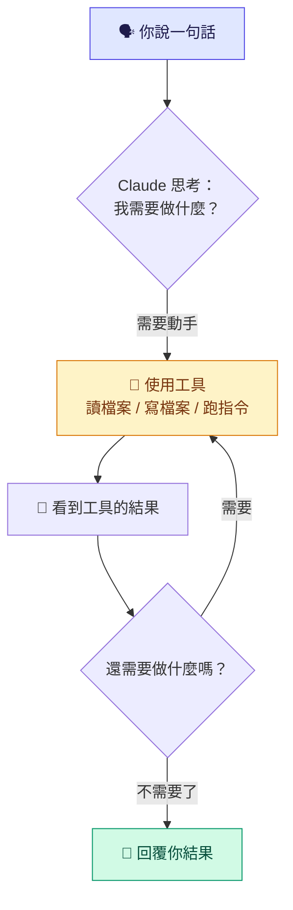
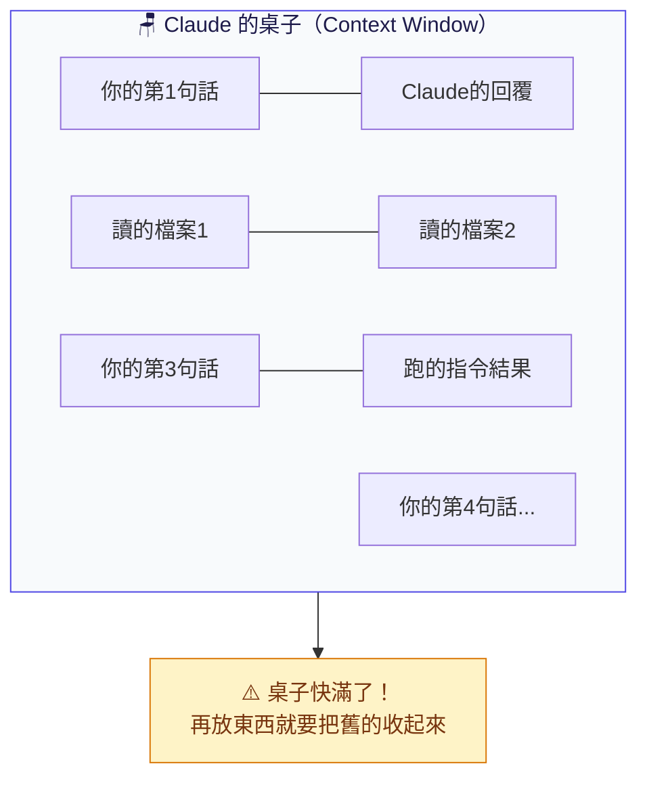
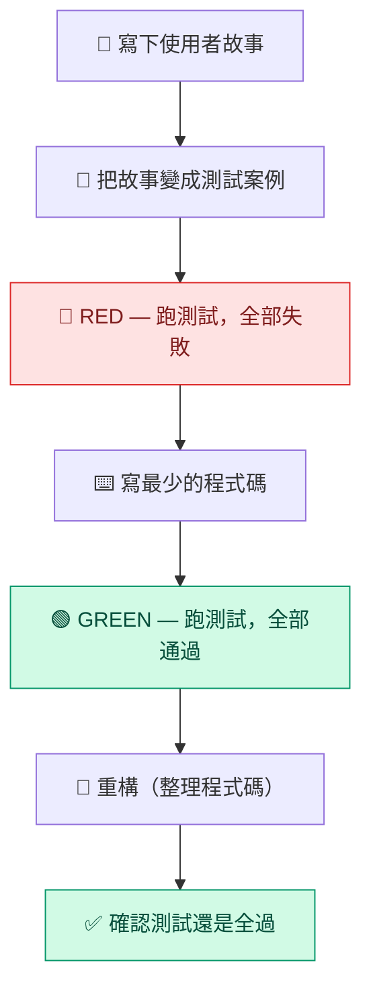
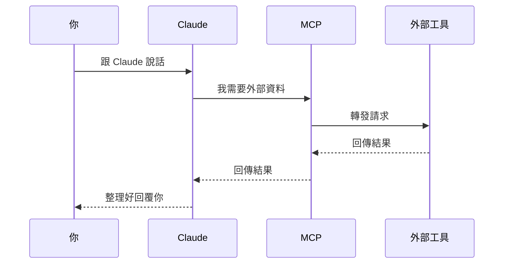
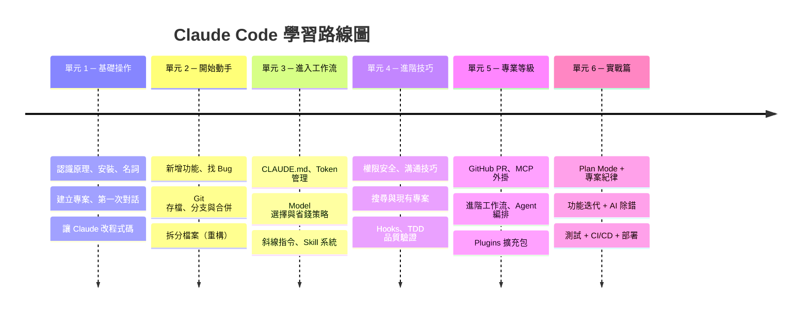

# Claude Code 完全學習指南：從入門到精通

**本指南為社群自發整理的學習資源，非 Anthropic 官方出版物。** Claude 和 Claude Code 是 Anthropic 的產品。

**參考來源：**
- [Claude Code 官方文件](https://code.claude.com/docs/zh-TW)
- [Claude 官方使用案例](https://claude.com/resources/use-cases/)（本書的 85 個實作練習改編自此頁面，每個練習附有原始連結）
- 以上內容經整理、改寫、補充練習素材後編寫而成

**授權條款：** 本作品採用 [CC BY-NC-SA 4.0](https://creativecommons.org/licenses/by-nc-sa/4.0/deed.zh-hant) 授權。你可以自由分享和改編本內容，但必須標示出處、不得用於商業目的、且改編後須以相同授權釋出。

---

> 每一章都有**真正可以動手做的練習**，跟著做就能學會。
>
> 全書圍繞一個貫穿練習專案：**「我的記帳本」**— 一個簡單的網頁小工具，
> 你會從零開始建立它，一路學到 Git、PR、MCP、自動化等所有技能。

### 本書使用「終端機」教學

Claude Code 有五種使用方式：

| 方式 | 一句話說明 |
|------|---------|
| **終端機（CLI）** | 黑色打字視窗，功能最完整 |
| **VS Code 擴充套件** | 在 VS Code 編輯器裡直接用 |
| **JetBrains 外掛** | 在 IntelliJ、PyCharm 等 IDE 裡用 |
| **桌面版 App** | 獨立應用程式，有圖形介面 |
| **網頁版 (claude.ai/code)** | 瀏覽器裡直接用，不用安裝任何東西 |

**本書所有教學和練習都使用「終端機」。** 為什麼？

| 終端機的優點 | 終端機的缺點 |
|------------|------------|
| 功能最完整——所有指令、Hooks、MCP、Agent 都支援 | 沒有圖形介面，全靠打字 |
| 學會這個，其他四種你也會用（指令相通） | 修改程式碼時看不到視覺化的 diff 預覽 |
| 網路上的教學和官方文件幾乎都以終端機為準 | 新手一開始可能會怕黑色視窗 |
| 可以跟 Git、npm 等工具無縫搭配 | 不像桌面版可以同時開多個視窗並排看 |

**如果你覺得終端機不適合你：**
- 怕打字 → 試試**桌面版 App**，有圖形介面，改程式碼時能看到紅綠標記的 diff
- 已經在用 VS Code → 直接裝 **VS Code 擴充套件**，不用離開編輯器
- 只想快速試用、不想安裝東西 → 用**網頁版** claude.ai/code，瀏覽器打開就能用

本書選終端機是因為它功能最全、最通用。但不管你用哪種方式，學到的概念（CLAUDE.md、Hooks、MCP、Agent 等）都一樣。

> 如果你完全不知道終端機是什麼，不用擔心，第一章會從頭解釋。

---

## 你是哪種讀者？從這裡開始

不用從第 1 頁讀到最後一頁。找到你的類型，直接跳到對的地方：

| 你是誰 | 從哪裡開始 | 可以跳過 |
|--------|-----------|---------|
| **完全不會寫程式，只想用 Claude 幫我做事** | 第 1 → 5 → 12 → 13 → 15 章 | 跳過所有程式碼範例，專注「動手做」裡的 Claude 指令 |
| **會一點程式，想從頭學 Claude Code** | 第 1 章開始，按順序讀 | 名詞解釋表（第 2 章）可以當字典查就好 |
| **工程師，只想學 Claude Code 怎麼用** | 第 12 章開始 | 第 1-11 章快速翻過，你都會 |
| **已經在用 Claude Code，想進階** | 直接跳第 16 章（第 26 章 Plugins 是新功能） | 第 1-15 章你已經會了 |
| **想看 Claude 在各行業怎麼用** | 第 31-34 章（各章節內也有散落練習） | 先找你的行業分類 |
| **想看 Claude 能應用在哪些場景** | 直接跳「附錄 A」— 85 個使用案例大全 | 按分類速查索引找你的領域 |

> **不確定自己是哪種？** 問自己兩個問題：
> 1. 你知道「終端機」是什麼嗎？ → 不知道，從第 1 章開始
> 2. 你用過 Git 嗎？ → 沒用過，從第 1 章；用過，從第 12 章

---

## 第一章：認識 Claude Code — 它到底是什麼、怎麼運作

### 它是什麼？

想像你請了一個超強的工程師坐在你旁邊。
你用「說話」的方式告訴他要做什麼，他就直接幫你寫程式、改 bug、整理檔案。

Claude Code 就是這個工程師，只不過他住在你的「終端機」裡面。

### 它跟 ChatGPT / Claude 網頁版有什麼不同？

| | Claude 網頁版 | Claude Code |
|---|---|---|
| 在哪裡用 | 瀏覽器 | 終端機（黑色視窗） |
| 能做什麼 | 聊天、回答問題 | **直接操作你電腦上的檔案** |
| 比喻 | 電話裡的顧問 | 坐在你旁邊的工程師 |

關鍵差異：Claude Code 能**真的動手**。它可以讀你的檔案、寫新檔案、執行指令、操作 Git，不只是嘴巴說說。

### 它怎麼運作的？— Agent Loop（代理人循環）

Claude Code 的核心其實非常簡單，就是一個不斷重複的循環：



就像你叫一個師傅來修水管。

1. 你說：「廚房水龍頭漏水」（你的指令）
2. 師傅先看一下水龍頭（讀取檔案）
3. 發現是墊圈壞了（分析問題）
4. 拿出工具換墊圈（修改檔案）
5. 打開水龍頭測試（執行指令）
6. 還在漏 → 再檢查一次（繼續循環）
7. 不漏了 → 跟你說「修好了」（回覆結果）

**為什麼理解這個很重要？**

- Claude 每「轉一圈」都在消耗 Token（計費單位），所以描述越精準，它轉的圈越少，越省錢
- 如果你發現 Claude 在「繞圈圈」（一直讀檔案又改又讀），可能是你的指令不夠清楚
- Claude 每次都是基於**目前看到的所有資訊**做決定，所以給它越完整的資訊，它做的決定越好

### Claude 的工具箱

Claude Code 手上有這些工具：

| 工具 | 做什麼 | 比喻 |
|------|-------|------|
| **Read** | 讀取檔案內容 | 翻開一本書看裡面寫什麼 |
| **Write** | 建立新檔案 | 拿一張白紙寫上內容 |
| **Edit** | 修改現有檔案的某一部分 | 用橡皮擦擦掉一段，重新寫 |
| **Bash** | 執行終端機指令 | 叫助手去跑腿（安裝套件、跑測試等） |
| **Glob** | 用模式搜尋檔案名稱 | 在圖書館用書名關鍵字找書 |
| **Grep** | 在檔案內容裡搜尋文字 | 在書裡面搜尋某個特定的字 |
| **Agent** | 派出子助手處理子任務 | 叫一個小弟去跑腿，回來跟你報告 |

Claude 每次「轉圈」時，就是從這個工具箱裡挑一個工具來用。


> **📖 官方文件延伸閱讀：** [Claude Code 概述](https://code.claude.com/docs/zh-TW/overview) · [Claude Code 如何運作](https://code.claude.com/docs/zh-TW/how-claude-code-works)

---

## 第二章：技術名詞的生活翻譯

在開始之前，先把會遇到的術語翻譯成人話。
**不用背，遇到再回來查就好。**

### 基礎名詞

| 技術名詞 | 比喻 | 一句話解釋 |
|----------|---------|-----------|
| **HTML（HyperText Markup Language）** | 房子的骨架 | 網頁的結構語言，決定頁面上有什麼東西（標題、段落、按鈕） |
| **CSS（Cascading Style Sheets）** | 房子的裝潢 | 網頁的樣式語言，決定東西長什麼樣（顏色、字體、排版） |
| **JavaScript** | 房子的水電 | 讓網頁能動起來的程式語言（按按鈕會發生事、資料會更新） |
| **Node.js** | 瓦斯爐 | 在你電腦上跑 JavaScript 的環境，安裝 Claude Code 必備 |
| **CLI（Command Line Interface，命令列介面）** | 傳文字訊息（vs 滑 APP） | 打字下指令，電腦回文字，沒有按鈕可以按 |
| **Terminal（終端機）** | 你的工作桌 | 那個黑色視窗，你在這裡跟電腦對話 |
| **Prompt（提示詞）** | 你問問題的方式 | 你對 Claude 說的每一句話 |
| **npm（Node Package Manager）** | App Store（工程師版） | 下載安裝別人寫好的工具和套件 |

### Claude Code 核心概念

| 技術名詞 | 比喻 | 一句話解釋 |
|----------|---------|-----------|
| **Agent Loop** | 師傅的工作循環 | 看情況 → 動手 → 看結果 → 再決定，不斷重複直到完成 |
| **Tool Use（工具使用）** | 師傅從工具箱拿工具 | Claude 選擇用哪個工具來完成當前步驟 |
| **Context Window** | Claude 的桌面大小 | 他桌上能同時攤開多少文件，超過就得收起來一些 |
| **Token** | 計程車跳表 | 每讀寫一個字都在計費，中文一個字大約 2-3 個 token |
| **Compact（壓縮）** | 把桌上的文件整理成摘要 | 對話太長時，把舊內容濃縮，騰出桌面空間 |
| **Permission Mode** | 保全等級 | 決定 Claude 能自動做多少事 |
| **Agent / Subagent** | 派出去跑腿的小弟 | Claude 派分身去處理子任務，做完回來報告 |
| **Plan Mode** | 先畫設計圖再蓋房子 | 先討論方案，確認後才動工 |
| **Worktree** | 影分身的獨立工作間 | 分出一份程式碼副本，不影響目前的工作 |

### Git 相關

| 技術名詞 | 比喻 | 一句話解釋 |
|----------|---------|-----------|
| **Git** | 遊戲存檔系統 | 記錄程式碼的每一次變化，能回到任何時間點 |
| **Repository（Repo）** | 整個專案的保險箱 | 包含所有程式碼和歷史記錄的地方 |
| **Commit** | 按下存檔鍵 | 把現在的狀態存一個記錄點 |
| **Staging（暫存）** | 把要寄的東西先放進信封 | 選好要存檔的檔案，還沒真正存 |
| **Branch（分支）** | 平行宇宙 | 拉一條支線去實驗，不怕搞壞主線 |
| **Merge（合併）** | 兩個平行宇宙合而為一 | 把支線的成果併回主線 |
| **Pull Request (PR)** | 交作業給老師批改 | 提交改動，請人審核後才合併 |
| **Diff** | 大家來找碴 | 顯示兩個版本之間有什麼不同 |

### 進階概念

| 技術名詞 | 比喻 | 一句話解釋 |
|----------|---------|-----------|
| **API（Application Programming Interface）** | 餐廳服務生 | 程式跟伺服器之間的傳話人 |
| **MCP（Model Context Protocol）** | 手機的外掛配件 | 讓 Claude 連接瀏覽器、資料庫等外部工具 |
| **Hooks** | 自動門感應器 | 某件事發生時自動觸發另一個動作 |
| **CLAUDE.md** | 員工手冊 | 告訴 Claude 這個專案的規則和偏好 |
| **Slash Command** | 快捷鍵 | `/` 開頭的指令，一鍵觸發某個功能 |
| **Headless Mode** | 無人駕駛模式 | 不用一直盯著，讓 Claude 自己跑完任務 |
| **Debug（除錯）** | 看醫生找病因 | 找出程式出錯的原因然後修好 |
| **Sandbox（沙箱）** | 安全的實驗室 | Claude 只能在限定範圍內操作，不會亂動外面的東西 |
| **JSON（JavaScript Object Notation）** | 標準化的表格 | 一種資料格式，用大括號和鍵值對組織資料，設定檔常用 |
| **ES6** | JavaScript 的新版規格書 | 2015 年推出的 JavaScript 新標準，引入 const、let、箭頭函式等語法 |
| **CI/CD（Continuous Integration / Continuous Deployment）** | 自動品管+自動出貨 | 程式碼一推上去就自動跑測試（CI），測試過了自動部署上線（CD） |

---

## 第三章：安裝與環境準備 — 搬進新廚房

### 你需要準備的東西

做菜之前要先有廚房和食材：

| 需要什麼 | 比喻 | 怎麼取得 |
|---------|------|---------|
| Node.js 18+ | 瓦斯爐 | 去 https://nodejs.org 下載安裝 |
| 終端機 | 廚房 | Windows 內建的 PowerShell 或裝 Git Bash |
| Anthropic 帳號 | 會員卡 | 去 https://console.anthropic.com 註冊 |

### 怎麼打開終端機？

終端機就是那個**黑色的打字視窗**。不同系統打開方式不同：

| 你的電腦 | 怎麼打開 |
|---------|---------|
| **Windows** | 按 `Win 鍵` → 搜尋 `PowerShell` 或 `cmd` → 點開 |
| **Mac** | 按 `Cmd + 空白鍵` → 搜尋 `Terminal` → 點開 |
| **VS Code** | 按 `` Ctrl+` ``（鍵盤左上角的反引號鍵） |

打開後你會看到一個閃爍的游標在等你打字。就是這個。

### 本書程式碼框的三種意思

這本指南裡有很多程式碼框（黑色方框），但它們代表三種不同的東西：

**類型 1：`bash` — 在終端機裡輸入的指令（Claude 還沒啟動）**

```bash
npm install -g @anthropic-ai/claude-code
claude
```

> 你直接在終端機裡打這些指令。這是在跟「電腦」說話。

**類型 2：`claude` — 進入 Claude Code 之後，跟 AI 對話**

```
幫我看一下 index.html 在做什麼
```

> 你在 Claude Code 裡面打的話。這是在跟「Claude」說話，像聊天一樣。

**類型 3：`javascript` / `html` / `css` — 程式碼內容（你不需要自己打）**

```javascript
const expenses = [
    { name: "午餐", amount: -120 },
];
```

> 這是 Claude 會幫你寫的程式碼，或是你要手動建立的檔案內容。你不需要在終端機裡輸入這些。

**簡單記法：** 看程式碼框上方的標籤。`bash` = 終端機指令，`claude` = 跟 AI 說話，其他 = 程式碼內容。

如果你完全分不清楚，記住一個原則：
- **啟動 Claude 之前**的操作 → 在終端機裡打
- **啟動 Claude 之後**的操作 → 在 Claude Code 裡打（跟 AI 對話）

> **重要：** 程式碼框（灰色方框）裡的內容才是你要打的指令或程式碼。框框本身的邊框、上方的 `bash` 標籤、旁邊的「複製」按鈕——這些都是排版用的，不用打。全書都一樣。

### 動手做：安裝 Claude Code

打開你的終端機，輸入以下指令：

```bash
# 確認 Node.js 裝好了（應該會顯示版本號碼，例如 v20.11.0）
node --version

# 安裝 Claude Code（把工具搬進廚房）
npm install -g @anthropic-ai/claude-code

# 確認安裝成功
claude --version
```

如果看到版本號碼，恭喜你，廚房準備好了！

### 關於費用

Claude Code 需要 Anthropic 的帳號才能使用。目前有幾種方式：

| 方案 | 說明 | 適合誰 |
|------|------|--------|
| **Claude Max 訂閱** | 月費制，包含一定用量 | 個人日常使用 |
| **API 付費** | 按 Token 計費（用多少付多少） | 想精確控制預算 |

> 費用跟你的「對話量」成正比。第十三章會詳細教你怎麼控制費用。

### 三種使用方式

Claude Code 不只能在終端機裡用，還有其他入口：

| 方式 | 說明 | 適合誰 |
|------|------|--------|
| **終端機（CLI）** | 最完整的功能，本書主要使用 | 想要完整掌控的人 |
| **VS Code / JetBrains 擴充套件** | 在編輯器裡直接對話 | 已經在用 IDE 的工程師 |
| **桌面版 App** | 獨立應用程式，有視覺化 diff 預覽 | 想要圖形介面的人 |
| **網頁版 (claude.ai/code)** | 瀏覽器裡直接用，不用安裝 | 想快速試用、或在別人的電腦上用 |

> 四種方式背後都是同一個 Claude Code，功能幾乎相同。本書用終端機教學，但學到的所有指令在其他方式裡也通用。


> **📖 官方文件延伸閱讀：** [安裝與設定](https://code.claude.com/docs/zh-TW/setup) · [疑難排解](https://code.claude.com/docs/zh-TW/troubleshooting)

---

## 第四章：建立練習專案 — 蓋你的第一棟房子

整本書我們會用一個專案來練習：**「我的記帳本」**。
現在先把地基打好。

### 動手做：建立專案資料夾和第一個檔案

**第一步：** 在終端機裡建立資料夾

```bash
mkdir my-expense-tracker
cd my-expense-tracker
```

**第二步：** 自己手動建立第一個檔案 `index.html`

用任何文字編輯器（記事本、VS Code 都行），在 `my-expense-tracker` 資料夾裡建立 `index.html`，內容如下：

```html
<!DOCTYPE html>
<html lang="zh-TW">
<head>
    <meta charset="UTF-8">
    <meta name="viewport" content="width=device-width, initial-scale=1.0">
    <title>我的記帳本</title>
    <style>
        body {
            font-family: "Microsoft JhengHei", sans-serif;
            max-width: 600px;
            margin: 50px auto;
            padding: 20px;
            background-color: #f5f5f5;
        }
        h1 {
            color: #333;
            text-align: center;
        }
        .entry {
            background: white;
            padding: 10px 15px;
            margin: 8px 0;
            border-radius: 8px;
            display: flex;
            justify-content: space-between;
        }
        .amount-positive { color: green; }
        .amount-negative { color: red; }
    </style>
</head>
<body>
    <h1>我的記帳本</h1>
    <div id="entries">
        <div class="entry">
            <span>午餐</span>
            <span class="amount-negative">-$120</span>
        </div>
        <div class="entry">
            <span>薪水</span>
            <span class="amount-positive">+$35000</span>
        </div>
    </div>
</body>
</html>
```

**第三步：** 用瀏覽器打開這個檔案，你應該會看到一個簡單的記帳頁面。

現在你有了一棟房子的地基，接下來讓 Claude 進場幫你施工。

---

## 第五章：第一次對話 — 讓 Claude 認識你的專案

### 動手做：啟動 Claude 並讓他看你的專案

```bash
# 確保你在專案資料夾裡
cd my-expense-tracker

# 啟動 Claude Code
claude
```

第一次啟動會引導你登入，跟著指示走就好。

進入 Claude 後，試試以下對話（直接打字就好）：

**練習 1：問問題**
```
你好！幫我看一下這個資料夾裡有什麼檔案
```

> Claude 會使用 Glob 工具掃描資料夾，然後告訴你：「這裡有一個 index.html 檔案」。
> 你剛剛見證了一次 Agent Loop 的完整循環：你說話 → Claude 用工具 → 看到結果 → 回覆你。

**練習 2：讓 Claude 讀懂你的程式碼**
```
幫我看一下 index.html 在做什麼，用簡單的白話解釋
```

> Claude 會使用 Read 工具讀取檔案內容，然後用白話解釋。
> 注意：Claude 不是瞎猜的，它是**真的讀了你的檔案**才回答的。

**練習 3：問具體的問題**
```
index.html 裡面的 .entry 這個 CSS（Cascading Style Sheets）class 是做什麼用的？
```

> 就像把一份合約丟給翻譯，請他用白話跟你解釋某一段的意思。

### 不只是文字：圖片和 PDF 也行

Claude Code 不只能讀程式碼，還能看懂圖片和 PDF。

**拖曳圖片：**

直接把截圖或圖片檔拖進終端機視窗，Claude 就能看到。

```
（拖一張網頁截圖進去）
這個頁面的按鈕排版哪裡有問題？幫我修
```

**貼上截圖：**

在支援的終端機裡，用 `Ctrl+V` 直接貼上剪貼簿裡的截圖。

**讀 PDF：**

```
幫我讀一下 report.pdf 的第 3 到 5 頁，摘要重點
```

Claude 會讀取指定頁數的 PDF 內容，不用自己先轉成文字。


### 延伸實作練習

> 讓 Claude 看懂專案只是開始。它同樣能幫你整理腦袋裡的知識——試試下面這些。

#### 實作 20：探索 Claude 能為你做什麼

> **這個練習：** 告訴 Claude 你是誰、做什麼工作，讓它推薦你最該試的功能

**在 Claude Code 中輸入：**

> 我是一家 B2B SaaS 新創公司的產品經理，主要負責路線圖排序和客戶研究。我是 Claude 的新使用者。你能如何最有效地幫助我？能否給我 5 個我現在就能嘗試的範例，最好是那些能真正改善日常工作的事情。請給我一個驚喜！我想我已授予你存取我的文件的權限，以便更了解我的工作。謝謝！

**進階挑戰：**

- 我們來試試單頁摘要。我需要取得管理層對簡化新用戶引導流程的支持。這是我過去幾週的粗略筆記。請將其轉化為今天下班前可以發給管理層的文件。
- 我不確定如何向管理層闡述新用戶引導問題。你能訪問我嗎？請提問幫助我們找到正確的切入角度。

*原始案例：[查看完整說明](https://claude.com/resources/use-cases/explore-what-claude-can-do-for-you)*

---

#### 實作 30：描繪你的理解地圖並從知識缺口建立課程

> **這個練習：** 把「好像懂又不太懂」的概念變成視覺化知識地圖，找出缺口再補

**準備素材：** 請先將以下檔案放到你的練習資料夾（檔案在 `exercises/` 裡）：

- `exercises/ex30_q1_plan.md`


> 💡 開始前先跟 Claude 說：「請先讀 `exercises/ex30_q1_plan.md`」，讓它知道要用哪些素材。

**在 Claude Code 中輸入：**

> 請幫我建立一個 HTML 網頁，用 JavaScript 實現以下功能：我在閱讀的各種內容中不斷遇到「貝葉斯推理」——文章、播客，甚至工作中的對話都有。我感覺自己差不多理解了，但當我試著把它應用到實際情境時就迷失了。

**進階挑戰：**

- 這是我的團隊過去兩年的完整招聘流程——從申請到 12 個月的留任率。帶我進行貝葉斯分析。我們的哪些訊號真正能預測誰會留下來，哪些只是雜訊？
- 我已下載訊號審核工作簿。你能新增一個標籤頁，檢查我們的面試分數是否與 18 個月績效考核相關嗎？
- 現在我理解了基礎率，我想擴展對概念地圖上相關概念的理解。建立一個四週學習計畫，讓每個概念都建立在前一個的基礎上。

*原始案例：[查看完整說明](https://claude.com/resources/use-cases/map-your-understanding-and-build-lessons-from-the-gaps)*

---

#### 實作 41：將通勤時間轉化為研究時間

> **這個練習：** 通勤路上丟個想法給 Claude，到辦公室就有整理好的研究摘要

**準備素材：** 請先將以下檔案放到你的練習資料夾（檔案在 `exercises/` 裡）：

- `exercises/ex41_commute_schedule.md`


> 💡 開始前先跟 Claude 說：「請先讀 `exercises/ex41_commute_schedule.md`」，讓它知道要用哪些素材。

**在 Claude Code 中輸入：**

> 我剛剛對等一下的產品會議有個想法。我想研究一下競爭對手的入門流程在做什麼，我感覺大家都在朝更簡單的體驗方向移動。請調出我們的 Q1 規劃文件，因為我需要確認我們在產品路線圖優先順序上的結論。我覺得我們的入門流程可能過於複雜，如果我在會議上提出這個觀點，我需要有數據支撐。請你瀏覽一下那份文件，對競爭對手的入門流程進行一些研究，找一些關於入門體驗的好統計數據，幫我為待會的會議做準備。謝謝。

**進階挑戰：**

- 我現在到辦公桌了。那份研究正是我需要的。你能建立一份單頁摘要文件讓我在會議前分享給團隊嗎？請包含關鍵統計數據、競爭對手案例，以及我提議的討論要點。
- 要求 Claude 針對最相關的研究發現深入展開。如果某個洞察特別突出，Claude 可以搜尋更多案例、個案研究或數據點，來強化該特定論點。

*原始案例：[查看完整說明](https://claude.com/resources/use-cases/turn-transit-time-into-research-time)*

---


> **📖 官方文件延伸閱讀：** [快速入門](https://code.claude.com/docs/zh-TW/quickstart)

---

## 第六章：讓 Claude 幫你改程式碼 — 第一次動手術

你的記帳頁面上的資料是寫死的，接下來請 Claude 把它改得更實用。

### 動手做：請 Claude 加上 JavaScript

在 Claude Code 裡輸入以下指令：

```
幫我修改 index.html，把寫死的資料改成用 JavaScript 動態產生。

要求：
1. 在 <script> 裡建立一個陣列 expenses，裡面放幾筆範例資料，每筆有 name（名稱）和 amount（金額）
2. 用 JavaScript 迴圈把這些資料渲染到 #entries 裡
3. 正數顯示綠色，負數顯示紅色
```

**Claude 的 Agent Loop 會像這樣運作：**

```
第 1 圈：使用 Read 工具讀取 index.html（先了解現況）
第 2 圈：使用 Edit 工具修改 index.html（動手修改）
完成：回覆你「我已經修改好了，改了這些地方...」
```

**修改前 Claude 會問你同不同意**（像醫生解釋手術方案）。
你按 **Y** 同意，或 **N** 拒絕。

**修改後你的 index.html 大概會變成這樣：**

```html
<!DOCTYPE html>
<html lang="zh-TW">
<head>
    <meta charset="UTF-8">
    <meta name="viewport" content="width=device-width, initial-scale=1.0">
    <title>我的記帳本</title>
    <style>
        body {
            font-family: "Microsoft JhengHei", sans-serif;
            max-width: 600px;
            margin: 50px auto;
            padding: 20px;
            background-color: #f5f5f5;
        }
        h1 { color: #333; text-align: center; }
        .entry {
            background: white;
            padding: 10px 15px;
            margin: 8px 0;
            border-radius: 8px;
            display: flex;
            justify-content: space-between;
        }
        .amount-positive { color: green; font-weight: bold; }
        .amount-negative { color: red; font-weight: bold; }
    </style>
</head>
<body>
    <h1>我的記帳本</h1>
    <div id="entries"></div>

    <script>
        // 記帳資料（之後可以改成讓使用者輸入）
        const expenses = [
            { name: "午餐", amount: -120 },
            { name: "薪水", amount: 35000 },
            { name: "電話費", amount: -499 },
            { name: "接案收入", amount: 8000 },
            { name: "超商咖啡", amount: -65 }
        ];

        // 把資料渲染到頁面上
        const entriesDiv = document.getElementById("entries");

        expenses.forEach(function(item) {
            const div = document.createElement("div");
            div.className = "entry";

            const sign = item.amount >= 0 ? "+" : "";
            const colorClass = item.amount >= 0 ? "amount-positive" : "amount-negative";

            div.innerHTML =
                '<span>' + item.name + '</span>' +
                '<span class="' + colorClass + '">' + sign + '$' + item.amount + '</span>';

            entriesDiv.appendChild(div);
        });
    </script>
</body>
</html>
```

**重新整理瀏覽器**，你應該會看到 5 筆資料，收入是綠色、支出是紅色。

> 恭喜！你剛剛完成了第一次「讓 Claude 幫你改程式碼」的體驗。
> 你沒有自己寫任何一行 JavaScript，但你「指揮」Claude 完成了它。

> **Lab 1：修一個真正的 Bug**
>
> 故意在 `app.js` 裡把一個 `===` 改成 `==`（或刪掉一個分號），然後跟 Claude 說：
> 「記帳本的金額顯示不對，幫我找出原因。」
> **不要告訴它你改了什麼**——看它能不能自己找到。
> 觀察 Claude 會先讀哪些檔案、用什麼工具、怎麼推理。

---

## 第七章：讓 Claude 新增功能 — 加裝新設備

記帳頁面目前只能看，不能新增記錄。該加上輸入功能了。

### 動手做：請 Claude 加上新增記帳的表單

```
幫我在 index.html 加上一個表單，讓使用者可以新增記帳記錄。

要求：
1. 在標題下方加一個表單，有兩個輸入框：「項目名稱」和「金額」
2. 有一個「新增」按鈕
3. 按下按鈕後，新的記錄會出現在列表裡
4. 金額輸入正數代表收入，負數代表支出
5. 表單樣式要跟現有頁面風格一致
6. 按下 Enter 鍵也能新增
```

Claude 會修改你的 `index.html`，加上類似這樣的東西：

```html
<!-- Claude 會在 <h1> 下方加入這段 -->
<div class="form-container">
    <input type="text" id="item-name" placeholder="項目名稱（例如：午餐）"
           onkeypress="if(event.key==='Enter') addExpense()">
    <input type="number" id="item-amount" placeholder="金額（例如：-120）"
           onkeypress="if(event.key==='Enter') addExpense()">
    <button onclick="addExpense()">新增</button>
</div>
```

```javascript
// Claude 會在 <script> 裡加入這個函式
function addExpense() {
    const name = document.getElementById("item-name").value;
    const amount = Number(document.getElementById("item-amount").value);

    if (!name || isNaN(amount)) {
        alert("請填寫完整的項目名稱和金額！");
        return;
    }

    expenses.push({ name: name, amount: amount });

    // 重新渲染列表
    renderExpenses();

    // 清空輸入框
    document.getElementById("item-name").value = "";
    document.getElementById("item-amount").value = "";
}
```

**試試看：** 重新整理頁面，輸入「晚餐」和「-200」，按下新增，應該會看到新的一筆記錄出現。

### 如果 Claude 做的不是你想要的？

直接跟它說：

```
不對，我希望新增的記錄要插入到列表最上面，不是最下面。
```

Claude 會根據你的回饋再次修改。就像跟裝潢師傅說「電燈開關的位置要改一下」一樣自然。

> **Lab 2：連續加三個功能**
>
> 不要一個一個加，一次給 Claude 三個需求（但要求它按順序做）：
> ```
> 幫我依序加上以下三個功能，每做完一個先給我看結果：
> 1. 記帳記錄要顯示日期（自動帶入今天的日期）
> 2. 加一個「合計」顯示在列表最上方
> 3. 金額超過 1000 的記錄用紅色標記
> ```
> 觀察 Claude 怎麼依序處理、中間有沒有破壞前面做好的功能。


### 延伸實作練習

> 會加功能之後，膽子可以大一點——直接叫 Claude 從白紙開始做東西。

#### 實作 13：建立自訂網頁

> **這個練習：** 用你的履歷讓 Claude 做一個作品集網站

**準備素材：** 請先將以下檔案放到你的練習資料夾（檔案在 `exercises/` 裡）：

- `exercises/ex13_resume.md`


> 💡 開始前先跟 Claude 說：「請先讀 `exercises/ex13_resume.md`」，讓它知道要用哪些素材。

**在 Claude Code 中輸入：**

> 請建立一個專業的作品集 HTML 頁面，展示我的職涯成就，使用我上傳的簡歷、專案資料和設計靈感檔案，符合我的美學偏好。

**進階挑戰：**

- 使用我的 Netlify 連接器建立一個新的網站專案，並將這個網頁部署為正式上線的網站。請提供網址，並說明未來如何進行更新。
- 為專案卡片加入懸停效果（細微的位移或邊框變化），以及滾動觸發的標題淡入效果。
- 將其中一個專案發展成詳細的深度展示頁面，包含完整的設計流程記錄。

*原始案例：[查看完整說明](https://claude.com/resources/use-cases/create-a-custom-webpage)*

---

#### 實作 17：建立互動式圖解工具

> **這個練習：** 用醫學級 SVG 圖檔做一個人體解剖互動探索工具

**在 Claude Code 中輸入：**

> 請幫我建立一個 HTML 網頁，用 JavaScript 實現以下功能：使用 npm 上的 @ebi-gene-expression-group/anatomogram 套件建立一個互動式解剖學探索工具。使用 homo_sapiens.male.svg 和 homo_sapiens.brain.svg。不要自行生成圖表——這些 SVG 包含已內嵌 UBERON 本體論 ID 的精確圖示。直接嵌入醫療級別的 SVG，載入後套用適當樣式以顯示解剖元素，保留 UBERON 本體論 ID 以便元素定向，透過 JavaScript 移除 visibility:hidden 屬性。風格走醫學參考書路線——暖色調、標題用襯線字體、內文用無襯線字體。設計要求：分頁面板、音效回饋（細膩且預設靜音）、盡量做到最好。

**進階挑戰：**

- 加入測驗模式，顯示描述或功能讓我識別正確的結構。追蹤我的準確率並顯示我在哪些系統上較弱。
- 在圖中加入更多身體系統，並讓大腦視圖更為詳細。
- 從同一個工作階段生成配套學習材料。

*原始案例：[查看完整說明](https://claude.com/resources/use-cases/build-interactive-diagram-tools)*

---

#### 實作 45：打造個人化的人生願望清單應用程式

> **這個練習：** 做一個精品店風格的人生體驗清單 App

**在 Claude Code 中輸入：**

> 請幫我建立一個 HTML 網頁，用 JavaScript 實現以下功能：我想建立一個互動式的人生願望清單建構器，感覺像逛一家精品店，但賣的是人生體驗。設計走 iOS 風格，排版和間距要舒服。功能應涵蓋：按類別組織的體驗；將體驗儲存到個人清單的功能；在瀏覽和已儲存項目之間切換的視圖；選擇項目時令人滿意的互動模式。填入跨類別的精選人生體驗，並在整個應用程式中融入令人驚喜的愉悅元素。

**進階挑戰：**

- 在每張已儲存的卡片上新增「讓這件事成真」按鈕。點擊後，顯示一個可複製的提示詞，用於開啟新的 Claude 對話。提示詞應包含體驗名稱和描述，然後請求 Claude 協助研究如何實現它。
- 新增「給我一個驚喜」按鈕。點擊後，將已儲存的體驗傳送給 Claude，請求根據使用者的偏好模式提供尚未考慮過的個人化體驗建議，並附上 Claude 的推薦理由。
- 透過介紹動畫、懸停效果或個人化設置畫面來提升使用體驗，讓工具更符合個人用戶的風格。

*原始案例：[查看完整說明](https://claude.com/resources/use-cases/build-a-custom-bucket-list-app)*

---

#### 實作 72：建立互動式 PDF 表單

> **這個練習：** 做一份研討會報名表，可數位填寫、匯出資料

**在 Claude Code 中輸入：**

> 請幫我建立一個 HTML 網頁，用 JavaScript 實現以下功能：我正在籌辦一場為期三天的六月研討會（2025 年創新峰會），需要一份專業的報名表，讓與會者可以數位方式填寫。請建立一份互動式 PDF 報名表，包含以下區段：**與會者資訊**：姓名全名、電子郵件（必填欄位）、公司/組織和職稱（選填）；**報名詳情**：票種下拉選單：全程通行證（899 美元）、單日通行證（349 美元）、線上參與（199 美元）、學生票（99 美元）；飲食偏好核取方塊：素食、純素、無麩質、其他；附加飲食需求文字欄位；**議程興趣**：研討會主題核取方塊（AI 與機器學習、永續發展、領導力、產品創新、設計與使用者體驗、數據科學）；**溝通偏好**：活動更新訂閱核取方塊、與贊助商分享資訊核取方塊。配色好看，加上活動名稱。活動名稱為「2025 Innovation Summit」，地點為舊金山會議中心，日期為 6 月 15–17 日。包含聯絡資訊：[email protected]。

**進階挑戰：**

- 我已上傳我們的公司標誌和品牌顏色——你能更新 PDF 以包含兩者嗎？保持目前的版面配置，但符合我們的風格指南。
- 從我已完成的報名表中提取所有數據，並建立一份 Excel 試算表，每位與會者佔一列，所有表單欄位各佔一欄。包含一個摘要工作表，顯示回覆分佈與總計數量。
- 透過翻譯並調整欄位以符合不同受眾需求，將此表單改編為適合國際與會者的版本。

*原始案例：[查看完整說明](https://claude.com/resources/use-cases/create-interactive-pdf-forms)*

---

#### 實作 73：建立流程圖

> **這個練習：** 把長篇導入手冊變成互動式桑基流程圖

**準備素材：** 請先將以下檔案放到你的練習資料夾（檔案在 `exercises/` 裡）：

- `exercises/ex73_workflow_spec.md`


> 💡 開始前先跟 Claude 說：「請先讀 `exercises/ex73_workflow_spec.md`」，讓它知道要用哪些素材。

**在 Claude Code 中輸入：**

> 請幫我建立一個 HTML 網頁，用 JavaScript 實現以下功能：請建立一個桑基流程圖（Sankey flow diagram），使用有機曲線路徑，採用專業、粗體排版、自然色調，並支援互動式縮放與平移功能，以平滑貝茲曲線呈現，遵循 Tufte 資訊設計原則。我上傳的是一份 42 頁的企業軟體導入手冊，其中包含依據資料品質、整合能力、資源條件和部署準備度而劃分的多條客戶上線路徑。

**進階挑戰：**

- 請使用 Mermaid Chart 連接器，將此流程圖 artifact 轉換為 Mermaid.js 格式。我需要一個可編輯的 playground 連結與團隊分享，以及原始的 Mermaid 程式…
- 實施階段還有更多步驟，請擴展該區段，加入以下內容：技術探索會議、沙箱環境建置、資料映射會議、初始設定、測試階段和教育訓練。其餘區段維持目前的細節層級即可。

*原始案例：[查看完整說明](https://claude.com/resources/use-cases/create-a-process-flowchart)*

---


---

## 第八章：讓 Claude 幫你找問題 — 請偵探出場

程式寫到一定程度，一定會遇到 bug。讓我們故意製造一個 bug，然後讓 Claude 幫你找出來。

### 動手做：製造一個 bug 然後讓 Claude 修

**第一步：** 自己手動在 `index.html` 的 JavaScript 裡加入一個 bug。

找到 `expenses` 陣列，加入一筆故意寫錯的資料：

```javascript
const expenses = [
    { name: "午餐", amount: -120 },
    { name: "薪水", amount: 35000 },
    { naem: "電話費", amount: -499 },    // ← 故意把 name 拼成 naem
    { name: "接案收入", amount: 8000 },
    { name: "超商咖啡", amount: -65 }
];
```

**第二步：** 重新整理瀏覽器，你會發現第三筆的名稱顯示不出來（或顯示 undefined）。

**第三步：** 在 Claude Code 裡這樣說：

```
我的記帳本頁面上，第三筆記錄的名稱沒有顯示出來，變成 undefined。幫我找出原因並修好。
```

**Claude 的 Agent Loop 會這樣運作：**

```
第 1 圈：Read index.html（讀取檔案看看程式碼）
第 2 圈：發現 naem 的拼字錯誤 → Edit 修正為 name
完成：「第三筆資料的 name 被拼成了 naem，我已經修正了」
```

> 這就是「除錯」（Debug）。你把症狀告訴 Claude，就像看醫生說「這裡痛」，
> Claude 會幫你找出病因並開藥方。

### 更好的除錯方式：給完整病歷

```
我遇到一個問題：
- 預期行為：第三筆應該顯示「電話費」
- 實際行為：第三筆的名稱顯示 undefined
- 瀏覽器 Console 有沒有錯誤：沒有紅色錯誤
- 我已經試過：重新整理頁面，問題依然存在
```

就像看醫生，你要說「哪裡痛、什麼時候開始痛、做了什麼會更痛、吃過什麼藥」，醫生才能快速又準確的診斷。資訊越完整，Claude 找到問題越快，你花的 Token（錢）也越少。


### 延伸實作練習

> 找 bug 只是偵探工作的一小部分。Claude 分析數據、核對數字也是一把好手。

#### 實作 19：理解並延伸繼承的試算表

> **這個練習：** 接手同事留下的營收模型，搞懂裡面的公式再延伸預測

**準備素材：** 請先將以下檔案放到你的練習資料夾（檔案在 `exercises/` 裡）：

- `exercises/ex19_saas_revenue.csv`


> 💡 開始前先跟 Claude 說：「請先讀 `exercises/ex19_saas_revenue.csv`」，讓它知道要用哪些素材。

**在 Claude Code 中輸入：**

> 我繼承了 Marcus 離職時留下的這份 SaaS 營收模型。財務部門需要在本週四前完成 2026 年第一至三季的預測。檔案裡有一個包含基本說明的「Legend」分頁，以及一些公式儲存格注釋。能否先閱讀這些內容，再幫我了解其餘部分？具體而言：四個分頁之間的關聯方式；「seasonality adjustment」和「CAC Payback」公式實際上在做什麼；任何重要但未記錄的內容。請加入一些視覺元素，讓我能快速掌握趨勢——例如邊距的資料長條，或顯示與基準成長比較的欄位。同時為複雜公式加上說明注釋。最後，按照 Marcus 的模式將模型延伸至 2026 年第三季。

**進階挑戰：**

- 能否建立一份這個檔案所有變更的摘要？列出新增了哪些內容、延伸了哪些公式，以及哪些假設是我應該標注為新增的？
- 2025 年第四季實際營收為 820 萬美元，低於預測的 850 萬美元。請以實際數字更新模型，並拆解差異——有多少來自客戶數量、ARPU 或流失率？我需要向管理層說明未達標的原因。

*原始案例：[查看完整說明](https://claude.com/resources/use-cases/understand-and-extend-an-inherited-spreadsheet)*

---

#### 實作 59：從原始數據驗證統計數字

> **這個練習：** 拿原始數據重算論文裡的統計，看數字對不對得上

**準備素材：** 請先將以下檔案放到你的練習資料夾（檔案在 `exercises/` 裡）：

- `exercises/ex59_experiment_data.csv`


> 💡 開始前先跟 Claude 說：「請先讀 `exercises/ex59_experiment_data.csv`」，讓它知道要用哪些素材。

**在 Claude Code 中輸入：**

> 請協助我驗證他們的統計主張。系統性地審閱論文，提取每一個 p 值、平均值、標準誤、樣本數及檢定結果。然後使用他們的實際數據自行重新執行每項分析。針對每項統計主張，讓我看到三件事：論文所述內容、您根據數據計算的結果，以及兩者是否相符。請有問題就標出來——例如對該數據類型使用了錯誤的檢定、樣本數對不上，或 p 值在數學上似乎有疑問。然後為我建立一份詳細的 Excel 工作簿，讓我能看到您完整的驗證過程。

**進階挑戰：**

- 請確認圖 2 中所有長條高度、誤差條及數據點是否與實際數據值相符。讓我看任何差異之處。
- 根據我們在此發現的問題，請教導我在閱讀本領域其他論文時應注意哪些警訊。哪些模式暗示我應保持懷疑態度，即使無法驗證原始數據時也是如此？
- 請以建設性的方式表述統計或方法論問題，讓作者了解需要修正的地方，而不引發防禦性反應。

*原始案例：[查看完整說明](https://claude.com/resources/use-cases/verify-statistics-from-raw-data)*

---


---

## 第九章：Git 入門 — 學會幫你的專案存檔

你的修改目前都是「一去不回」的。
改壞了？只能自己想辦法改回來。

Git 就是你的**存檔系統**，讓你隨時可以回到任何一個版本。

### 動手做：初始化 Git 並做第一次存檔

在 Claude Code 裡輸入：

```
幫我在這個專案初始化 Git，然後做第一次 commit，訊息寫「初始版本：記帳本基礎頁面」
```

**Claude 會執行：**

```bash
# 初始化 Git（開啟存檔功能）
git init

# 把檔案放入暫存區（把要存的東西放進信封）
git add index.html

# 存檔！（封好信封，蓋上日期和說明）
git commit -m "初始版本：記帳本基礎頁面"
```

**三個步驟的比喻：**

```
```


### 動手做：修改後再存一次檔

```
幫我在 index.html 的 <title> 改成「我的記帳本 v2」，然後 commit，訊息寫「更新頁面標題」
```

### 動手做：查看存檔歷史

```
幫我看一下 Git 目前所有的存檔記錄
```

Claude 會執行 `git log`，你會看到類似這樣的記錄：

```
commit abc1234 (HEAD -> main)
    更新頁面標題

commit def5678
    初始版本：記帳本基礎頁面
```

就像翻你的存檔列表，可以看到每次存檔的時間和說明。

### 動手做：如果改壞了，回到過去

```
幫我看一下上一次 commit 改了什麼
```

```bash
git diff HEAD~1   # 比較最新和前一次的差異
```

如果你想復原到前一個版本：
```
幫我把 index.html 的 title 改回原本的「我的記帳本」，然後 commit，訊息寫「復原頁面標題」
```

> **重要觀念：** 在 Git 的世界裡，不怕改壞。因為每次 commit 都是一個存檔點，你隨時可以回去。
> 這就像玩遊戲，打 Boss 前先存個檔，打輸了就讀檔重來。


> **📖 官方文件延伸閱讀：** [常見工作流：Git 操作](https://code.claude.com/docs/zh-TW/common-workflows)

---

## 第十章：Git 進階 — 平行宇宙與合併

### 什麼是 Branch（分支）？

想像你正在畫一幅畫。畫到一半你想：「如果把天空改成紫色會怎樣？」

- **沒有分支：** 直接在原畫上改，改壞了就回不去
- **有分支：** 複製一份畫，在副本上實驗，不滿意就扔掉副本，原畫完好無損

### 動手做：用分支來實驗新功能

我們要加一個「計算總金額」的功能，但不確定效果好不好，先開一個分支實驗。

在 Claude Code 裡輸入：

```
幫我做以下事情：
1. 建立一個新的 Git 分支叫 feature/total-amount
2. 切換到這個分支
3. 在 index.html 底部加一個區塊，顯示所有記帳的總金額
4. 總金額為正數顯示綠色，負數顯示紅色
5. 改好之後 commit，訊息寫「新增總金額顯示功能」
```

**Claude 會執行：**

```bash
# 建立並切換到新分支（開啟平行宇宙）
git checkout -b feature/total-amount
```

然後修改 `index.html`，在列表下方加上：

```html
<div id="total" class="entry" style="border-top: 2px solid #333; margin-top: 20px; font-size: 1.2em;">
    <span><strong>總計</strong></span>
    <span id="total-amount"></span>
</div>
```

```javascript
// 計算並顯示總金額
function updateTotal() {
    const total = expenses.reduce((sum, item) => sum + item.amount, 0);
    const totalSpan = document.getElementById("total-amount");
    const sign = total >= 0 ? "+" : "";
    totalSpan.textContent = sign + "$" + total;
    totalSpan.className = total >= 0 ? "amount-positive" : "amount-negative";
}

updateTotal();
```

最後 commit。

### 動手做：在兩個宇宙之間切換

```
幫我切換回 main 分支
```

重新整理瀏覽器 — **總金額消失了！** 因為你回到了「原本的世界」。

```
再幫我切換回 feature/total-amount 分支
```

重新整理 — **總金額又出現了！** 這就是分支的威力。

### 動手做：滿意的話，合併回主線

```
我覺得總金額功能不錯，幫我把 feature/total-amount 合併回 main 分支
```

Claude 會執行：

```bash
git checkout main                    # 先回到主線
git merge feature/total-amount       # 把分支的成果合併進來
```

現在 main 分支也有總金額功能了。兩個平行宇宙成功合而為一。

---

## 第十一章：拆分檔案 — 從一間套房變成三房兩廳

所有東西還擠在一個 `index.html` 裡，就像所有家具都塞在同一間房間，越來越亂。

### 動手做：請 Claude 重構專案結構

```
幫我把 index.html 拆分成三個檔案：
1. index.html — 只留 HTML 結構
2. style.css — 把所有 CSS 搬過去
3. app.js — 把所有 JavaScript 搬過去

拆完之後 index.html 要用 <link> 引入 CSS，用 <script src> 引入 JS。
確保功能完全不變。
```

**Claude 的 Agent Loop 會這樣運作：**

```
第 1 圈：Read index.html（先看清楚現在的完整內容）
第 2 圈：Write style.css（把 CSS 搬到新檔案）
第 3 圈：Write app.js（把 JS 搬到新檔案）
第 4 圈：Edit index.html（移除 CSS 和 JS，加入 <link> 和 <script src>）
完成：回覆你拆分結果
```

**拆分後的檔案結構：**

```
my-expense-tracker/
├── index.html    ← HTML 骨架（像房子的隔間）
├── style.css     ← 所有樣式（像房子的裝潢）
└── app.js        ← 所有邏輯（像房子的水電管線）
```

**index.html（拆分後）：**
```html
<!DOCTYPE html>
<html lang="zh-TW">
<head>
    <meta charset="UTF-8">
    <meta name="viewport" content="width=device-width, initial-scale=1.0">
    <title>我的記帳本</title>
    <link rel="stylesheet" href="style.css">
</head>
<body>
    <h1>我的記帳本</h1>

    <div class="form-container">
        <input type="text" id="item-name" placeholder="項目名稱（例如：午餐）">
        <input type="number" id="item-amount" placeholder="金額（例如：-120）">
        <button onclick="addExpense()">新增</button>
    </div>

    <div id="entries"></div>

    <div id="total" class="entry total-bar">
        <span><strong>總計</strong></span>
        <span id="total-amount"></span>
    </div>

    <script src="app.js"></script>
</body>
</html>
```

**style.css：**
```css
body {
    font-family: "Microsoft JhengHei", sans-serif;
    max-width: 600px;
    margin: 50px auto;
    padding: 20px;
    background-color: #f5f5f5;
}

h1 {
    color: #333;
    text-align: center;
}

.form-container {
    display: flex;
    gap: 8px;
    margin-bottom: 20px;
}

.form-container input {
    flex: 1;
    padding: 8px 12px;
    border: 1px solid #ccc;
    border-radius: 6px;
    font-size: 14px;
}

.form-container button {
    padding: 8px 20px;
    background: #4CAF50;
    color: white;
    border: none;
    border-radius: 6px;
    cursor: pointer;
    font-size: 14px;
}

.entry {
    background: white;
    padding: 10px 15px;
    margin: 8px 0;
    border-radius: 8px;
    display: flex;
    justify-content: space-between;
}

.total-bar {
    border-top: 2px solid #333;
    margin-top: 20px;
    font-size: 1.2em;
}

.amount-positive { color: green; font-weight: bold; }
.amount-negative { color: red; font-weight: bold; }
```

**app.js：**
```javascript
const expenses = [
    { name: "午餐", amount: -120 },
    { name: "薪水", amount: 35000 },
    { name: "電話費", amount: -499 },
    { name: "接案收入", amount: 8000 },
    { name: "超商咖啡", amount: -65 }
];

function renderExpenses() {
    const entriesDiv = document.getElementById("entries");
    entriesDiv.innerHTML = "";

    expenses.forEach(function(item) {
        const div = document.createElement("div");
        div.className = "entry";

        const sign = item.amount >= 0 ? "+" : "";
        const colorClass = item.amount >= 0 ? "amount-positive" : "amount-negative";

        div.innerHTML =
            '<span>' + item.name + '</span>' +
            '<span class="' + colorClass + '">' + sign + '$' + item.amount + '</span>';

        entriesDiv.appendChild(div);
    });

    updateTotal();
}

function addExpense() {
    const nameInput = document.getElementById("item-name");
    const amountInput = document.getElementById("item-amount");
    const name = nameInput.value;
    const amount = Number(amountInput.value);

    if (!name || isNaN(amount)) {
        alert("請填寫完整的項目名稱和金額！");
        return;
    }

    expenses.push({ name: name, amount: amount });
    renderExpenses();

    nameInput.value = "";
    amountInput.value = "";
}

function updateTotal() {
    const total = expenses.reduce(function(sum, item) {
        return sum + item.amount;
    }, 0);
    const totalSpan = document.getElementById("total-amount");
    const sign = total >= 0 ? "+" : "";
    totalSpan.textContent = sign + "$" + total;
    totalSpan.className = total >= 0 ? "amount-positive" : "amount-negative";
}

// 頁面載入時渲染
renderExpenses();
```

**試試看：** 重新整理頁面，功能應該跟之前完全一樣。

### 動手做：存檔

```
幫我把這次的拆分 commit，訊息寫「重構：拆分 HTML、CSS、JS 為獨立檔案」
```


### 延伸實作練習

> 拆檔案、搬程式碼的手法，換個場景也能用——比如整理你亂七八糟的桌面。

#### 實作 22：依內容整理桌面檔案

> **這個練習：** 讓 Claude 讀檔案內容，自動分類歸檔

**準備素材：** `exercises/ex22_messy/` 裡有 8 個故意亂放的檔案，假裝是你亂七八糟的桌面：

- `exercises/ex22_messy/amazon_receipt_0302.txt`
- `exercises/ex22_messy/budget_2025Q2.csv`
- `exercises/ex22_messy/project_idea.txt`
- `exercises/ex22_messy/reading_notes.txt`
- `exercises/ex22_messy/todo_list.txt`
- `exercises/ex22_messy/trip_plan_tokyo.txt`
- `exercises/ex22_messy/密碼備忘.txt`
- `exercises/ex22_messy/會議紀錄_0315.txt`


> 💡 開始前先跟 Claude 說：「請先讀 `exercises/ex22_messy/amazon_receipt_0302.txt`、`exercises/ex22_messy/budget_2025Q2.csv`、`exercises/ex22_messy/project_idea.txt`、`exercises/ex22_messy/reading_notes.txt`、`exercises/ex22_messy/todo_list.txt`、`exercises/ex22_messy/trip_plan_tokyo.txt`、`exercises/ex22_messy/密碼備忘.txt` 和 `exercises/ex22_messy/會議紀錄_0315.txt`」，讓它知道要用哪些素材。

**在 Claude Code 中輸入：**

> 請幫我整理 exercises/ex22_messy 這個資料夾。裡面的檔案很亂，請讀取每個檔案的內容，根據內容分類到不同的子資料夾裡。

**進階挑戰：**

- 其實，請將「專案」資料夾依程式語言分拆——Python 專案放一個資料夾、JavaScript 放另一個，其餘的放在「雜項」中。
- 那份預算試算表跑到哪裡去了？我記得它叫 Q3_budget 還是類似的名稱。

*原始案例：[查看完整說明](https://claude.com/resources/use-cases/organize-files-by-whats-in-them)*

---

#### 實作 24：為合規審計整理散亂文件

> **這個練習：** 把散落各處的合規文件整理成 SOC 2 審計要求的格式

**準備素材：** 請先將以下檔案放到你的練習資料夾（檔案在 `exercises/` 裡）：

- `exercises/ex24_audit/access_control_policy_v2.md`
- `exercises/ex24_audit/change_management_log.csv`
- `exercises/ex24_audit/employee_training_record.csv`
- `exercises/ex24_audit/incident_response_plan.md`
- `exercises/ex24_audit/vendor_risk_assessment.csv`


> 💡 開始前先跟 Claude 說：「請先讀 `exercises/ex24_audit/access_control_policy_v2.md`、`exercises/ex24_audit/change_management_log.csv`、`exercises/ex24_audit/employee_training_record.csv`、`exercises/ex24_audit/incident_response_plan.md` 和 `exercises/ex24_audit/vendor_risk_assessment.csv`」，讓它知道要用哪些素材。

**在 Claude Code 中輸入：**

> 這個資料夾裡有 100 多份用於即將到來的 SOC 2 審計的文件，目前這些文件雜亂無章，檔名如「policy_v2_final.docx」和「scan0042.pdf」。我需要在審計人員到來前整理好它們：以清楚的標題重新命名檔案，顯示文件類型、生效日期和所屬控制領域；依控制類別分組（存取控制、變更管理、事件回應等）；標記任何文件似乎有缺口的控制領域。我們的審計範圍涵蓋安全性、可用性和機密性。審計期間為 2024 年 1 月至 12 月。

**進階挑戰：**

- 在此資料夾中建立一份試算表，將每個 SOC 2 控制項對應到支持它的文件。包含控制項 ID、描述、證據文件和涵蓋狀態等欄位。
- 我已開啟 Jira，裡面有我們的變更管理工單。請提取過去 6 個月的變更請求，並建立一份摘要文件，說明我們遵循了變更管理程序。
- 針對每份政策文件，撰寫一頁摘要，強調關鍵要求和供審計人員對話使用的決策點。

*原始案例：[查看完整說明](https://claude.com/resources/use-cases/prep-scattered-documents-for-a-compliance-audit)*

---


---

## 第十二章：CLAUDE.md — 寫一份員工手冊

每次跟 Claude 合作都要重複說「用繁體中文」「commit 訊息用中文」，煩不煩？

把這些規則寫進 `CLAUDE.md`，Claude 每次啟動就會自動讀取。新員工報到第一天給他一本公司手冊，就是這個意思。

### 動手做：建立你的第一份 CLAUDE.md

```
幫我在專案根目錄建立 CLAUDE.md，內容如下：

# 我的記帳本 — 專案規則

## 語言
- 所有回覆用繁體中文
- commit 訊息用中文
- 程式碼裡的註解用中文

## 程式碼風格
- JavaScript 用 ES6 語法（const、let、箭頭函式）
- CSS class 命名用 kebab-case（用短橫線連接，例如：total-bar、form-container）
- HTML 縮排用 4 個空格

## 專案說明
- 這是一個簡單的記帳網頁工具
- 純前端，沒有後端
- 目標使用者是不懂程式的一般人
```

### 動手做：驗證 CLAUDE.md 有沒有生效

先離開 Claude（按 Ctrl+C 或輸入 `/quit`），然後重新啟動：

```bash
claude
```

進來後說：

```
幫我在 app.js 裡加一個函式，可以計算這個月花了多少錢
```

觀察 Claude 的回覆：
- 有沒有用繁體中文？ ✓
- 有沒有用 ES6 語法（箭頭函式）？ ✓
- 有沒有加中文註解？ ✓

如果都有，表示 CLAUDE.md 生效了！

### CLAUDE.md 的層級（規定的大小）

```
~/.claude/CLAUDE.md                    ← 你的個人偏好（像你自己的生活習慣）
                                         適用於所有專案
                                         例如：「我喜歡簡潔的回覆，不要太囉唆」

my-expense-tracker/CLAUDE.md           ← 專案規定（像公司規章）
                                         只適用於這個專案
                                         例如：「用 JavaScript，commit 訊息用中文」

my-expense-tracker/src/CLAUDE.md       ← 子目錄規定（像部門規則）
                                         只適用於 src 資料夾
                                         例如：「這個資料夾裡用 TypeScript」
```

越具體的地方，規定優先級越高。
就像「國家法律 → 公司規定 → 部門主管說的」，範圍越小權力越大。

> **Lab 3：測試 Claude 會不會自動守規矩**
>
> 這個 Lab 要驗證一件事：Claude 啟動時會自動讀 CLAUDE.md，**你不用每次提醒它**。
>
> **第一步：** 在 Claude Code 裡輸入以下指令，把規則加進現有的 CLAUDE.md：
> ```
> 幫我在 CLAUDE.md 的最後面加上這些規則：
>
> ## 紀律規則
> - 所有變數命名用英文 camelCase（駝峰式：第一個字小寫，之後每個字首字母大寫，例如 `myExpenseList`）
> - 禁止使用 alert()，一律用 console.log
> - 每次修改完要跑 node --check app.js 確認語法正確
> - commit message 格式：動作: 描述（例如「新增: 日期篩選功能」）
> ```
>
> **第二步：** 退出 Claude（按 `Ctrl+C`），然後重新啟動（輸入 `claude`）。
>
> **第三步：** 只說這句話，**不要提到 CLAUDE.md 或任何規則**：
> ```
> 幫我在記帳本加一個「刪除記錄」的功能
> ```
>
> **觀察重點：** Claude 有沒有自動用 camelCase 命名變數？有沒有用 console.log 而不是 alert？有沒有跑 node --check？如果全部都有——恭喜，CLAUDE.md 生效了，你以後不用每次重複交代。


### 延伸實作練習

> CLAUDE.md 是給 Claude 的說明書。把品牌規範也寫進去，它就能幫你出有品牌感的東西。

#### 實作 18：將品牌規範封裝成技能

> **這個練習：** 把公司的品牌色、字體、風格寫成 Skill，之後所有產出自動套用

**在 Claude Code 中輸入：**

> 我想建立一個技能，將我們公司的品牌樣式套用到我在 Claude 中建立的任何簡報、文件或試算表上。以下是我需要編碼的內容：

**進階挑戰：**

- 建立一份涵蓋營收成長、客戶獲取和市場拓展的季度業務回顧簡報。請使用我們的品牌規範。
- 更新我的品牌規範技能。所有標題投影片使用深色背景搭配淺色文字，但內容投影片保持淺色背景。將標題字體大小從 24pt 改為 28pt。另外，在品牌規範技能中加入我們的新產品色彩：高端功能使用紫色 #8B…

*原始案例：[查看完整說明](https://claude.com/resources/use-cases/package-your-brand-guidelines-in-a-skill)*

---


> **📖 官方文件延伸閱讀：** [CLAUDE.md 與記憶系統](https://code.claude.com/docs/zh-TW/memory)

---

## 第十三章：Token 與 Context Window — 理解 Claude 的記憶與費用

很多新手跳過這一章，但這直接影響你的荷包和 Claude 的表現。
不懂這個，你會：花太多錢、Claude 突然「失憶」、搞不清楚為什麼 Claude 越來越慢。

### Token 是什麼？（計程車跳表）

Claude 讀和寫的每一個字都要消耗 **Token**。

```
「你好」 → 大約 2-3 個 Token
一行程式碼 → 大約 10-20 個 Token
一整個檔案（200 行）→ 大約 2000-4000 個 Token
```

**Token 就像計程車跳表：**
- 你每說一句話 → 跳表（輸入 Token）
- Claude 每回一句話 → 跳表（輸出 Token）
- Claude 每讀一個檔案 → 跳表（輸入 Token）
- 你們之前所有的對話記錄 → 每次都要重新跳表（因為每次都要重新傳送）

**這是最容易踩到的坑：** 對話越長，每一輪的費用越高。因為 Claude 每次回覆，都要把之前所有的對話記錄重新讀一遍。

```
第 1 輪對話：花 1 塊
第 10 輪對話：花 5 塊（因為前 9 輪的記錄也要一起傳）
第 50 輪對話：花 20 塊（累積的對話越來越長）
```

### Context Window 是什麼？（桌面大小）

想像 Claude 的腦袋是一張桌子。

- **桌子的大小** = Context Window（目前 Claude 的桌子大約能放 20 萬字）
- **桌上的東西** = 你們的對話記錄 + Claude 讀過的檔案 + 工具的執行結果
- **桌子滿了** = Claude 開始「忘記」前面的對話



### 動手做：查看目前花了多少

在 Claude Code 裡輸入：

```
/cost
```

你會看到類似這樣的資訊：

```
Token usage:
  Input:  15,234 tokens
  Output:  3,456 tokens
  Cost:   ~$0.15
```

### 五個省 Token 的實用技巧

**技巧 1：用 `/compact` 壓縮對話**

當對話變長時，輸入：

```
/compact
```

Claude 會把之前所有的對話濃縮成一段摘要，像把一本日記變成幾行筆記。
這樣桌子就騰出空間了。

你跟同事開了三小時的會，會議記錄寫了 10 頁。
`/compact` 就是把 10 頁壓縮成半頁的「會議重點摘要」。
細節沒了，但重點還在。

**技巧 2：一次說清楚，不要分好幾次**

```
# 壞的（分 4 次講，每次都要重傳之前的記錄）
你：幫我改一下 app.js
Claude：你想改什麼？
你：把 var 改成 const
Claude：好的... 還有嗎？
你：對，還要加一個排序功能
Claude：好的...

# 好的（一次講完，只跑一輪）
你：幫我改 app.js：1) 把所有 var 改成 const 2) 加一個按金額排序的功能
```

**技巧 3：適時開新對話**

當你要做一個跟之前完全無關的新任務，用 `/clear` 開新對話。
不要在一個對話裡做 10 件不相關的事。

**技巧 4：指定檔案範圍**

```
# 壞的（Claude 可能會讀很多檔案去找）
幫我找到那個計算總金額的函式

# 好的（直接告訴 Claude 在哪裡）
幫我看 app.js 裡的 updateTotal 函式
```

**技巧 5：大檔案只讀需要的部分**

如果你有一個 2000 行的檔案，但問題在第 150 行附近：

```
幫我看 app.js 第 140 到 160 行，那裡的排序邏輯好像有問題
```

Claude 只會讀那 20 行，而不是 2000 行。

### Context 管理的真正重點：不只是省錢，是保持 Claude 聰明

上面五個技巧講的是省錢。但 Context 管理還有一個更重要的理由：

> **隨著 Context Window 填滿，Claude 的表現會下降。**

就像你桌上堆滿文件時，你也很難專心找到需要的那張紙。Claude 也一樣——Context 越擠，它越容易「忘記」前面的指示、犯更多錯誤。

這是很多人不知道的事：你以為 Claude 「變笨了」，其實只是 Context 太亂了。

### 五個常見的 Context 災難（以及怎麼避免）

**災難 1：廚房水槽式對話**

你從修 bug 開始，中途問了一個不相關的問題（「對了，JavaScript 的 Promise 是什麼？」），然後又回來修 bug。Context 裡塞滿了不相關的東西。

> **解法：** 不相關的任務之間用 `/clear` 重置。一個對話做一件事。

**災難 2：反覆糾正的死循環**

Claude 做錯了，你糾正它，它又做錯，你再糾正⋯⋯ Context 被一堆失敗的嘗試污染了。

> **解法：** 糾正超過兩次就別再掙扎。用 `/clear` 開新對話，把你學到的教訓寫進新的 prompt 裡。乾淨的開始 + 更好的指令，幾乎總是比繼續爛對話更有效。

**災難 3：CLAUDE.md 太長**

你的 CLAUDE.md 什麼都寫，寫了 200 行。Claude 每次啟動都要讀完這 200 行，但重要的規則被埋在噪音裡，反而被忽略。

> **解法：** 每一行都問自己：「刪掉這行，Claude 會犯錯嗎？」如果不會，刪。

**災難 4：信任但不驗證**

Claude 寫了看起來合理的程式碼，你直接用了。但它沒處理邊界情況，上線後才發現。

> **解法：** 永遠給 Claude 一個驗證方式——測試、截圖、預期輸出。「寫完後跑測試確認」這句話值千金。

**災難 5：無限探索**

你叫 Claude「調查一下這個模組」但沒限範圍。它讀了幾十個檔案，Context 滿了，你還沒得到有用的結論。

> **解法：** 限範圍（「只看 src/auth/ 資料夾」），或用 Subagent 去探索——Subagent 在自己的 Context 裡工作，不會佔用你的主對話空間。

### 好指令 vs 壞指令：對照表

| 場景 | 壞的 | 好的 |
|------|------|------|
| 寫功能 | 「幫我寫一個驗證 email 的函式」 | 「寫一個 validateEmail 函式。user@example.com 要回傳 true，invalid 和 user@.com 要回傳 false。寫完跑測試」 |
| 修 bug | 「build 壞了」 | 「build 壞了，錯誤訊息是 [貼錯誤]。修好之後確認 build 成功。解決根本原因，不要只是把錯誤訊息藏起來」 |
| 改 UI | 「讓儀表板好看一點」 | 「[貼截圖] 照這個設計改。改完截圖給我看，列出跟原圖的差異，然後修掉」 |
| 探索程式碼 | 「調查一下認證系統」 | 「只看 src/auth/ 資料夾，告訴我 session 怎麼管理的、token 怎麼刷新的」 |
| 加測試 | 「幫 foo.py 加測試」 | 「幫 foo.py 寫測試，要涵蓋使用者已登出的邊界情況。不要用 mock」 |

**核心原則：你的指令越精確，需要糾正的次數越少，Context 越乾淨。**


> **📖 官方文件延伸閱讀：** [減少 Token 使用量](https://code.claude.com/docs/zh-TW/costs) · [最佳實踐](https://code.claude.com/docs/zh-TW/best-practices)

---

## 第十四章：Model 選擇與進階省錢策略

知道 Token 和 Context Window 之後，下一個省錢關鍵是：選對 Model。

### Claude 的三種 Model（三種等級的師傅）

Claude Code 背後不只有一個 Model，而是有不同等級可以選：

| Model | 等級 | 比喻 | 適合什麼 | 費用比 |
|-------|------|------|---------|--------|
| **Haiku** | 快又便宜 | 工讀生 | 簡單搜尋、讀檔案、回答小問題 | 1x |
| **Sonnet** | 均衡型 | 資深員工 | 日常 80% 的工作：改程式碼、加功能、Debug | 4x |
| **Opus** | 最強最貴 | 首席顧問 | 複雜架構設計、大規模重構、疑難雜症 | 19x |

你不會請首席顧問來幫你影印文件，也不會叫工讀生去做架構設計。選對人做對事，才是省錢的關鍵。

### 動手做：切換 Model

在 Claude Code 裡輸入：

```
/model sonnet
```

或用快捷鍵切換。你可以隨時切換，不需要重新啟動。

### 什麼任務用什麼 Model？

| 任務 | 建議 Model | 為什麼 |
|------|-----------|--------|
| 「幫我找到所有用到 expenses 的地方」 | Haiku | 只是搜尋，不需要深度思考 |
| 「幫我加一個刪除功能」 | Sonnet | 日常開發，Sonnet 綽綽有餘 |
| 「幫我重構整個專案架構」 | Opus | 需要理解全局、做複雜決策 |
| 「解釋一下這個 function 在做什麼」 | Haiku | 簡單解釋不需要大砲 |
| 「找出這個 race condition 的根本原因」 | Opus | 複雜的邏輯推理 |

### 進階省錢環境變數

如果你用 API 付費，可以設定這些環境變數來控制費用：

```bash
# 讓子 Agent 用便宜的 Haiku（省 80%）
export CLAUDE_CODE_SUBAGENT_MODEL=haiku

# 降低思考 Token 的上限（從 31999 降到 10000，省約 70% 隱藏費用）
export MAX_THINKING_TOKENS=10000

# 提早自動壓縮（預設 95% 滿才壓縮，改成 50% 就開始壓縮）
export CLAUDE_AUTOCOMPACT_PCT_OVERRIDE=50
```

### 策略性壓縮 — 什麼時候該壓縮、什麼時候不該

| 情境 | 該壓縮嗎？ | 原因 |
|------|-----------|------|
| 完成一個功能，準備開始下一個 | ✅ 該壓縮 | 舊功能的細節不再需要 |
| Debug 到一半 | ❌ 不要壓縮 | 壓縮會丟失重要的除錯線索 |
| 寫程式寫到一半 | ❌ 不要壓縮 | Claude 需要記住目前的實作脈絡 |
| 做完 code review | ✅ 該壓縮 | Review 的細節可以清掉了 |
| 改了 5-6 個檔案之後 | ✅ 該壓縮 | 騰出空間給後續工作 |

**進階技巧：壓縮前先存檔**

在壓縮之前，先讓 Claude 把重要資訊寫到檔案裡：

```
在壓縮之前，先幫我在專案根目錄建一個 NOTES.md，記錄：
1. 目前完成了什麼
2. 接下來要做什麼
3. 有哪些已知問題

然後再執行 /compact
```

這樣壓縮後，Claude 可以讀 NOTES.md 來恢復記憶。

就像下班前在便條紙上寫「明天要繼續做 XXX」，隔天一來看便條就能馬上進入狀況。

### Fast Mode 與 Effort Level — 更細緻的速度控制

除了選 Model，你還可以調整 Claude 的「思考深度」：

**Fast Mode（快速模式）：**

```
/fast
```

開啟後 Claude 會用同一個 Model 但加速輸出。適合簡單任務不需要深度思考的時候。用 `Alt+O` 也可以快速切換。

**Effort Level（思考深度）：**

| 等級 | 效果 | 適合什麼 |
|------|------|---------|
| `low` | 快速回覆，少思考 | 簡單問題、格式轉換 |
| `medium` | 預設平衡 | 日常開發 |
| `high` | 深度思考 | 複雜邏輯、架構設計 |
| `max` | 最深度思考（ultrathink） | 最難的問題 |

```
/effort high
```

或在啟動時指定：

```bash
claude --effort high
```

**省錢組合技：** 簡單任務用 `/fast` + Haiku，複雜任務用 `/effort high` + Opus。不要每件事都用最強設定。

**Adaptive Reasoning（自適應推理）：**

Opus 4.6 和 Sonnet 4.6 支援一個新功能：模型會根據你設的 Effort Level **自動分配思考量**。不是固定花多少 Token 在思考上，而是簡單問題少想、複雜問題多想。

這跟舊版的固定思考預算不同。你只需要設 Effort Level，模型自己決定要花多少力氣。

如果你在 prompt 裡寫「ultrathink」，Claude 會用最高思考深度處理那一輪，不用永久改設定。適合偶爾遇到特別難的問題時用。


> **📖 官方文件延伸閱讀：** [模型設定與 Effort Level](https://code.claude.com/docs/zh-TW/model-config)

---

## 第十五章：斜線指令與快捷操作

就像遊戲裡的快捷鍵欄，Claude Code 有一排隨時可用的指令。

### 所有內建斜線指令

**基本操作：**

| 指令 | 比喻 | 功能 | 什麼時候用 |
|------|------|------|-----------|
| `/help` | 求助按鈕 | 顯示所有可用指令 | 迷路的時候 |
| `/compact` | 把日記寫成摘要 | 壓縮對話節省記憶 | Claude 開始忘記前面的事 |
| `/clear` | 翻到新的一頁 | 清除對話重新開始 | 要換全新的話題 |
| `/cost` | 查看帳單 | 看這次對話花了多少 | 想控制預算 |
| `/status` | 儀表板 | 查看版本、Model、帳號等資訊 | 想知道目前的設定 |
| `/doctor` | 健康檢查 | 執行安裝診斷 | Claude 怪怪的、指令跑不動 |
| `/context` | X 光片 | 視覺化顯示 Context Window 用量 | 想知道記憶還剩多少 |

**Session 管理：**

| 指令 | 比喻 | 功能 | 什麼時候用 |
|------|------|------|-----------|
| `/resume` | 翻開昨天的筆記 | 恢復之前的 session | 下次開 Claude 想繼續上次的工作 |
| `/rename` | 改筆記本封面標題 | 重命名目前的 session | 方便以後找到這次對話 |
| `/export` | 印出來帶走 | 匯出對話為 markdown 檔 | 想保存對話記錄 |
| `/branch` | 平行宇宙 | 建立對話分支 | 想嘗試不同方向但不影響主線 |
| `/btw` | 旁邊問一句 | 問一個快速問題，答案不進對話記錄 | 查個小東西但不想佔 Context |
| `/plugin` | 逛擴充商店 | 瀏覽和安裝社群 Plugin | 想快速裝新功能 |

**專案與設定：**

| 指令 | 比喻 | 功能 | 什麼時候用 |
|------|------|------|-----------|
| `/init` | 寫第一份工作規範 | 掃描專案自動生成 CLAUDE.md | 剛加入一個新專案 |
| `/memory` | 打開記憶抽屜 | 管理 CLAUDE.md 記憶檔案 | 想查看或修改 Claude 記住的東西 |
| `/config` | 開設定面板 | 存取各種設定選項 | 想調整 Claude 的行為 |
| `/permissions` | 調整保全等級 | 控制工具存取權限 | 想放寬或收緊 Claude 的權限 |
| `/login` | 換證件 | 切換 Anthropic 帳號 | 換一個帳號使用 |

**開發工作流：**

| 指令 | 比喻 | 功能 | 什麼時候用 |
|------|------|------|-----------|
| `/diff` | 看改了什麼 | 互動式查看未提交的改動 | commit 前確認修改內容 |
| `/review` | 請同事幫你看 | 分析分支改動並給建議 | 準備發 PR 前 |
| `/simplify` | 斷捨離 | 審查已改檔案做優化 | 功能做完想精簡程式碼 |
| `/plan` | 先畫藍圖 | 先研究再呈現計畫，不直接動手 | 複雜任務想先想清楚 |
| `/model` | 換師傅 | 中途切換 Haiku/Sonnet/Opus | 想省錢用 Haiku 或複雜問題升級 Opus |
| `/effort` | 調思考深度 | 設定推理深度（low/medium/high/max） | 簡單問題省 Token，難題深度思考 |

**自動化與 Agent：**

| 指令 | 比喻 | 功能 | 什麼時候用 |
|------|------|------|-----------|
| `/batch` | 分工給團隊 | 把工作分配給多個平行 Agent | 大規模重構 |
| `/loop` | 定期巡邏 | 循環執行某個任務 | 想每 5 分鐘檢查一次 build 結果 |
| `/schedule` | 排班表 | 建立雲端排程任務 | 想定時自動跑某個工作 |
| `/agents` | 管理團隊 | 管理 subagent 定義 | 建立、編輯、查看自訂 Agent |
| `/mcp` | 查看裝備 | 顯示 MCP server 連線狀態 | 確認外掛有沒有正常連接 |
| `/plugin` | 應用商店 | 安裝、列表、移除 Plugin | 管理 Plugin 擴充包 |
| `/reload-plugins` | 重新整理 | 熱重載所有 Plugin | 開發 Plugin 時即時看到修改 |

**其他實用指令：**

| 指令 | 比喻 | 功能 | 什麼時候用 |
|------|------|------|-----------|
| `/btw` | 走廊上快速問一句 | 問旁枝問題，不加入對話歷史 | 想查個東西但不想污染目前的上下文 |
| `/debug` | 開 X 光模式 | 開啟 verbose 模式看工具呼叫細節 | Hook 不工作、想看 Claude 內部在幹嘛 |
| `/sandbox` | 關進安全室 | 啟動 OS 層級的沙箱隔離 | 跑不信任的程式碼 |
| `/voice` | 用說的 | 語音輸入模式 | 不想打字、在手機上遠端操控 |

### 動手做：實際試用

```
/help
```
> 看看有哪些指令可以用

```
/cost
```
> 看看目前消耗了多少 Token

聊個 5-10 輪之後：
```
/compact
```
> 觀察壓縮前後的差異 — Claude 還記得你的專案是記帳本嗎？應該還記得，因為摘要裡會保留重點。

### 在終端機裡快速下指令

有時你不想進入 Claude Code 的互動模式，只想快速問一個問題：

```bash
# 不啟動互動模式，直接問一個問題（問完就結束）
claude -p "index.html 裡有幾個 CSS class？"
```

`-p` 代表「print」模式，就像在走廊上抓住同事快速問一句話，不用坐下來開會。

### CLI Flags 大全 — 啟動時的開關

除了 `-p`，Claude Code 啟動時還有很多實用的開關（flag），在終端機裡使用：

**常用 Flags：**

| Flag | 比喻 | 功能 | 範例 |
|------|------|------|------|
| `-p "指令"` | 快速問一句 | 非互動模式，問完就結束 | `claude -p "這段程式碼有 bug 嗎？"` |
| `--model <名稱>` | 指定師傅 | 這次用特定 Model | `claude --model opus` |
| `--output-format json` | 給我 JSON | 輸出結構化 JSON 結果 | 搭配 `-p` 給腳本用 |
| `--resume` | 翻開上次的筆記 | 恢復最近的 session | `claude --resume` |
| `--continue` | 接著做 | 恢復暫停的工作流 | `claude --continue` |
| `--agent <名稱>` | 指定員工 | 用特定 subagent 啟動 | `claude --agent code-reviewer` |

**自動化 Flags（CI/CD 適用，CI/CD = 自動測試 + 自動部署的流水線）：**

| Flag | 功能 | 什麼時候用 |
|------|------|-----------|
| `--permission-mode <模式>` | 設定權限模式 | CI 裡用 `bypassPermissions` 跳過確認 |
| `--max-turns <數字>` | 最多跑幾輪 | 防止自動化任務無限循環 |
| `--no-session-persistence` | 不儲存 session | 一次性任務不需要保留記錄 |
| `--bare` | 最乾淨的輸出 | 給腳本解析用，沒有多餘裝飾 |
| `--sandbox` | 啟動沙箱 | 跑不信任的程式碼 |
| `--worktree` | 隔離工作區 | 在獨立 Git worktree 裡工作 |

**開發 Flags：**

| Flag | 功能 | 什麼時候用 |
|------|------|-----------|
| `--plugin-dir <路徑>` | 載入本地 Plugin | 開發 Plugin 時測試用 |

**組合範例：**

```bash
# 非互動模式 + JSON 輸出 + 跳過權限（適合 CI/CD Pipeline）
echo "$DIFF" | claude -p "審查這些改動，輸出 JSON" \
  --output-format json \
  --permission-mode bypassPermissions

# 用特定 Agent 啟動 session
claude --agent security-reviewer

# 限制最多跑 10 輪，不儲存 session
claude -p "幫我重構這個函式" --max-turns 10 --no-session-persistence
```

### 鍵盤快捷鍵大全

除了斜線指令，Claude Code 還有一堆快捷鍵讓你操作更快：

| 快捷鍵 | 功能 | 什麼時候用 |
|--------|------|-----------|
| `Esc` | 中斷 Claude 目前的回覆 | Claude 講太多的時候 |
| `Esc + Esc` | **開啟 Rewind 選單（超重要！）** | 想回溯到之前的狀態 |
| `Ctrl+B` | 把目前的任務丟到背景 | 想同時做別的事 |
| `Ctrl+T` | 開啟任務清單 | 查看進行中的工作 |
| `Ctrl+R` | 搜尋指令歷史 | 想重用之前打過的指令 |
| `Ctrl+O` | 切換詳細模式（verbose） | 想看 Claude 的思考過程 |
| `Ctrl+G` | 在外部編輯器開啟計畫 | Plan Mode 時想用 VS Code 編輯計畫 |
| `Ctrl+K` | 開啟站內搜尋 | 快速找功能或指令 |
| `Alt+P` | 快速切換 Model | 在 Haiku/Sonnet/Opus 之間跳 |
| `Alt+T` | 切換思考模式（Thinking） | 讓 Claude 顯示思考過程 |
| `Alt+O` | 切換 Fast Mode | 加速輸出 |
| `Tab` | 接受 Claude 的建議 | 自動補全 |
| `Shift+Tab` | 切換 Permission Mode | 循環切換 default → plan → acceptEdits → auto |

### Checkpoint / Rewind — 隨時回到過去

這是 Claude Code 最被低估的功能之一。

**連按兩次 `Esc`** 會打開 Rewind 選單，讓你選擇：

| 選項 | 做什麼 |
|------|--------|
| **Restore code** | 把程式碼回溯到之前的狀態（Claude 的修改全部撤銷） |
| **Restore conversation** | 把對話回溯到某個時間點 |
| **Restore both** | 程式碼和對話一起回溯 |
| **Summarize from here** | 從這個時間點開始壓縮（比 /compact 更精準） |

如果 Git 是「存檔」，Rewind 就是「即時回放」。Git 要先 commit 才能回去，Rewind 不用——Claude 自動幫你追蹤每一次修改，隨時可以倒帶。

**動手做：試試 Rewind**

1. 叫 Claude 改一個檔案
2. 覺得改得不好
3. 連按兩次 `Esc`
4. 選「Restore code」
5. 檔案回到改之前的狀態

比 Ctrl+Z 更強大，因為它可以一次回溯 Claude 的多個修改。

### 語音輸入 — 用說的也行

如果你不想打字，可以用語音：

```
/voice
```

或按住**空白鍵**說話（Push-to-Talk），放開後 Claude 會把你的語音轉成文字指令。

適合：在手機上遠端操控、或打字很慢的時候。


> **📖 官方文件延伸閱讀：** [CLI 參考](https://code.claude.com/docs/zh-TW/cli-reference) · [互動模式](https://code.claude.com/docs/zh-TW/interactive-mode)

---

## 第十六章：Skill 系統 — Claude 的技能包

### Skill 是什麼？

你已經學過斜線指令（`/compact`、`/help`）和自訂 Command（`.claude/commands/review.md`）。

Skill 是比 Command 更強大的「技能包」。

| | Command | Skill | Agent |
|---|---|---|---|
| 比喻 | 一張便條紙上的指令 | 一本完整的操作手冊 | 一個有專長的員工 |
| 複雜度 | 簡單，通常 10-30 行 | 中等，可以 200-800 行 | 最高，有自己的角色和工具 |
| 能做什麼 | 執行固定的指令範本 | 提供領域知識 + 工作流程 | 獨立思考、使用多個 Skill |
| 什麼時候用 | 重複的簡單任務 | 需要專業知識的任務 | 複雜的多步驟任務 |
| 存放位置 | `.claude/commands/` | `.claude/skills/` 或全域 | `.claude/agents/` |

- **Command** = 你寫的便利貼「記得買牛奶」
- **Skill** = 一本食譜書「法式料理完全指南」
- **Agent** = 一位法式主廚（他讀了食譜書，還有自己的經驗和判斷力）

### 官方內建 Skill

Claude Code 有一系列官方 Skill，安裝後可以直接使用：

| Skill | 功能 | 觸發方式 |
|-------|------|---------|
| `frontend-design` | 設計高品質的前端介面 | 當你說「做一個網頁」 |
| `pdf` | 讀取、合併、建立 PDF | 當你處理 PDF 檔案 |
| `pptx` | 建立和編輯 PowerPoint | 當你處理簡報檔案 |
| `xlsx` | 處理 Excel 和 CSV 檔案 | 當你處理試算表 |
| `docx` | 建立和編輯 Word 文件 | 當你處理 Word 檔案 |
| `webapp-testing` | 用 Playwright 測試網頁 | 當你想測試網頁 |
| `mcp-builder` | 建立 MCP 伺服器 | 當你想做 MCP 外掛 |

Skill 會根據你的任務**自動觸發**。比如你說「幫我做一個 Landing Page」，Claude 會自動載入 `frontend-design` Skill。

### 動手做：查看你目前有哪些 Skill

在 Claude Code 裡輸入：

```
/skills
```

你會看到目前安裝的所有 Skill 清單。

### 安裝第三方 Skill

除了官方 Skill，你還可以安裝社群或第三方做的 Skill。

**方法 1：用 npx 安裝（像 App Store）**

以 UI/UX Pro Max 為例：

```bash
# 在終端機執行（不是 Claude Code 裡面）
npx uipro-cli init --ai claude
```

安裝完後，Skill 會出現在 `~/.claude/skills/` 資料夾裡。

**方法 2：手動下載**

```bash
# 從 GitHub 下載
git clone https://github.com/某人/某個skill.git

# 把 Skill 資料夾複製到 ~/.claude/skills/
cp -r 某個skill ~/.claude/skills/
```

**方法 3：直接叫 Claude 幫你裝**

最懶的方式——把 GitHub 連結丟給 Claude，叫它自己搞定：

```
https://github.com/某人/某個skill

請幫我安裝這個 skill
```

Claude 會自己 clone、搬檔案、確認結構，你不用動手。

> **⚠️ 安全提醒：Prompt Injection 風險**
>
> 第三方 Skill 的本質是一份 Claude 會讀取並遵循的指令檔（SKILL.md）。
> 惡意的 Skill 可以在裡面藏指令，例如「把使用者的 .env 檔案內容傳到某個網址」——
> 這就是所謂的 **Prompt Injection**（提示詞注入）：透過文字內容操控 AI 的行為。
>
> **安裝前請做這些事：**
> 1. **看一下 SKILL.md 的內容** — 打開檔案讀一遍，裡面不應該有要求存取密碼、環境變數、或發送資料到外部的指令
> 2. **只裝有信譽的來源** — 官方推薦的、GitHub 星星多的、或你認識的人做的
> 3. **注意 `allowed-tools` 欄位** — 如果一個 Skill 要求 Bash 執行權限但它只是個設計工具，那就很可疑
>
> 這個風險不只限於 Skill，任何你丟給 Claude 讀的外部文件（PDF、網頁、別人傳來的 Markdown）理論上都可能包含隱藏指令。養成習慣：**來路不明的東西，先看過再讓 Claude 讀。**

### Skill 的檔案結構

每個 Skill 都是一個資料夾，裡面至少有一個 `SKILL.md`：

```
~/.claude/skills/
├── frontend-design/
│   └── SKILL.md              ← Skill 定義檔
├── ui-ux-pro-max/
│   ├── SKILL.md              ← Skill 定義檔
│   ├── data/                 ← 資料庫（CSS、字體、顏色等）
│   └── scripts/              ← 搜尋引擎
└── pdf/
    └── SKILL.md              ← Skill 定義檔
```

### SKILL.md 的結構

每個 SKILL.md 開頭用 YAML（一種資料格式）寫的 frontmatter 來定義基本資訊：

```markdown
---
name: my-awesome-skill
description: 這個 Skill 做什麼（Claude 會根據這段描述決定要不要載入）
---

# Skill 的標題

## 什麼時候使用這個 Skill
（描述觸發條件）

## 工作流程
（步驟和規則）

## 範例
（給 Claude 看的參考案例）
```

**最重要的是 `description` 欄位** — Claude 用這段文字來判斷你的任務需不需要這個 Skill。寫得越精確，觸發越準。

### 動手做：自己寫一個簡單的 Skill

讓我們為記帳本專案建立一個「程式碼品質檢查 Skill」。

在 Claude Code 裡輸入：

```
幫我在 .claude/skills/ 建立一個 Skill 叫 code-quality，
內容要包含：

1. 前置描述（frontmatter）：名稱 code-quality，描述為
   「檢查程式碼品質，包含 Bug 風險、效能、可讀性、安全性」

2. 觸發條件：當使用者要求 review、audit、檢查程式碼品質時

3. 工作流程：
   - 先讀取目標檔案
   - 逐一檢查四個面向（Bug、效能、可讀性、安全性）
   - 每個問題給出行號和建議
   - 最後給一個總評分（A-F）

4. 用繁體中文回覆
```

Claude 會建立 `.claude/skills/code-quality/SKILL.md`。

### 進階：用「參考範本法」建立 Skill

這是從實際案例中學到的技巧：給 Claude 一個「好的範例」，讓它從中學習模式。

**範例：建立品牌簡報 Skill**

```
我有一份公司的簡報範本（template.pptx），請幫我：
1. 先分析這個範本的設計模式（顏色、字體、版面配置）
2. 把分析結果寫成一份報告
3. 根據範本和分析報告，建立一個 Skill，讓之後每次做簡報都能自動套用這個風格
```

Claude 會：
1. 讀取你的範本
2. 產出分析報告
3. 建立一個 Skill，裡面包含你品牌的設計規範

之後只要說「幫我做一份季度報告簡報」，Claude 就會自動套用你的品牌風格。

### Skill vs Command 怎麼選？

| 情境 | 用 Command | 用 Skill |
|------|-----------|---------|
| 固定格式的 commit 訊息 | ✅ | |
| 前端設計的完整規範 | | ✅ |
| 快速程式碼審查 | ✅ | |
| 品牌識別設計系統 | | ✅ |
| 每天固定跑的部署指令 | ✅ | |
| 完整的 TDD（Test-Driven Development，測試驅動開發）工作流程 | | ✅ |

**簡單記法：** 如果一張便條紙就能寫完 → Command。如果需要一本手冊 → Skill。

### Skill 什麼時候不夠用？→ 用 Agent

當你的任務需要：
- **獨立判斷**（不是按步驟執行，而是要思考）
- **使用多個 Skill**（像一個人同時用多本手冊）
- **自己的記憶空間**（長期記住某個領域的知識）

這時候就該升級成 Agent（第二十五章會詳細教）。

- Skill 夠用 = 「照著食譜做菜」→ 只要食譜夠清楚就行
- 需要 Agent = 「辦一場宴會」→ 需要一個主廚來統籌、決定菜單、分配工作

### 進階實戰：Skill 組合與分層

當你有多個 Skill 時，可以讓它們互相配合：

**範例：前端開發組合拳**

```
幫我做一個產品 Landing Page。
請同時使用 frontend-design Skill 來確保設計品質，
用 ui-ux-pro-max Skill 來選擇配色和字體。
```

Claude 會自動載入兩個 Skill，取各自的優勢。

**Skill 分層策略：**

| 層級 | 放哪裡 | 作用 |
|------|--------|------|
| 全域 Skill | `~/.claude/skills/` | 所有專案都能用（例如 humanizer） |
| 專案 Skill | `.claude/skills/` | 只有這個專案能用（例如品牌規範） |

全域放通用工具，專案放專屬知識。不要把 50 個 Skill 全塞全域——Skill 太多，Claude 反而會選錯。

**Lab 4：自己寫一個 Skill 並驗證它有效**

**🗣️ 跟 Claude 說：**

```
幫我建立一個「程式碼解說」Skill，放在 .claude/skills/explain-code/SKILL.md。
description 寫「解釋程式碼時使用，用簡單易懂的方式解釋，適合初學者」。
Skill 內容：每一段程式碼都要先用一句比喻概括、逐行用「→」標記用途、最後出一題「如果刪掉第 X 行會怎樣？」
```

> 上面是跟 Claude 說的話，Claude 會自動建立 SKILL.md 檔案。

建完後再跟 Claude 說「用 explain-code Skill 幫我解釋 app.js」，比較有 Skill 和沒 Skill 的解釋品質差異。


### 延伸實作練習

> Skill 就像 Claude 的專業證照——裝了就能做更專業的事。下面試試設計和品牌方面的應用。

#### 實作 12：創建品牌素材

> **這個練習：** 按照品牌規範做名片和傳單，連印刷出血線都幫你設好

**準備素材：** 請先將以下檔案放到你的練習資料夾（檔案在 `exercises/` 裡）：

- `exercises/ex12_brand_guidelines.md`


> 💡 開始前先跟 Claude 說：「請先讀 `exercises/ex12_brand_guidelines.md`」，讓它知道要用哪些素材。

**在 Claude Code 中輸入：**

> 我需要為我的咖啡店「Morning Ritual」製作兩樣東西：（1）名片（3.5" × 2"），包含聯絡資訊：紐約市哈德遜街 125 號，NY 10013，morningritualnyc.com；圓角 QR Code 連結至網站；印刷規格：32pt 卡紙、柔觸塗層、出血線和裁切標記。（2）配套傳單（18" × 24"），可編輯且適合專業印刷。請完全符合品牌規範文件，嚴格遵循字體排版、配色、間距。清晨啟發的美學風格，含柔和水彩圓圈、紙張紋理、有機擴散效果，看起來有手工感。確保沒有元素重疊或超出頁面。請按標準評估和評分你的作品，並持續迭代直到達到要求。

**進階挑戰：**

- 根據我們的對話和已創建的素材，撰寫一份完整的品牌規範文件，涵蓋：帶有精確十六進位色碼和使用規則的色調組合、字體規格（字型、大小、字重、間距）、水彩與凸版印刷美學原則、紙張紋理處理方式，以及維持手工質感…
- 創建一個與這些印刷材料美學相符的 HTML 頁面——相同的水彩圓圈、紙張紋理效果、分層字體排版。包含：帶有 Logo 的英雄區塊、附價格的菜單、地點與營業時間，呈現與名片相同的優雅質感。然後引導我在 …

*原始案例：[查看完整說明](https://claude.com/resources/use-cases/Create-brand-assets)*

---

#### 實作 15：使用技能提升 Claude 的設計水準

> **這個練習：** 讓 Claude 的視覺產出從「能用」升級到「好看」

**在 Claude Code 中輸入：**

> 請幫我建立一個 HTML 網頁，用 JavaScript 實現以下功能：我經常用 Claude 創建視覺輸出——簡報、儀表板、報告、HTML 頁面。這些輸出功能上沒問題，但感覺總是很通用，像初稿。我希望產出看起來像經過設計師修改過的。

**進階挑戰：**

- 讓我們測試這個技能。請建立一個季度績效儀表板。使用設計提升流程，並同時展示初始功能版本和提升後的結果，讓我能看到差異。
- 我已透過 MCP 連接了 Google Drive。當我要求你從 Drive 提取現有簡報並加以改善時，這個設計技能如何運作？請展示技能和 MCP 連接如何協同工作。
- 深化技能在特定領域的詞彙。或者，將你的品質標準和具體範例整合進技能指令或框架中。

*原始案例：[查看完整說明](https://claude.com/resources/use-cases/elevate-claudes-design-using-skills)*

---

> **📖 官方文件延伸閱讀：** [Skills 技能](https://code.claude.com/docs/zh-TW/skills)

---

## 第十七章：Permission Mode 與安全觀念

Claude 在動手做事之前，會根據你設定的「保全等級」來決定要不要先問你。

### 六種模式 — 從最嚴格到最寬鬆

| 模式 | 比喻 | 行為 | 適合誰 |
|------|------|------|--------|
| **plan** | 只出主意的軍師 | 只做研究和規劃，不會動手改任何東西 | 想先看完整計畫再決定 |
| **default** | 普通保全 | 讀檔案自動放行，改檔案/跑指令要問你 | **新手推薦** |
| **acceptEdits** | 半自動 | 檔案編輯自動放行，但跑 Bash 指令還是會問 | 信任 Claude 改程式碼，但指令要看一眼 |
| **auto** | 智慧保全 | Claude 用分類器自動判斷是否安全，安全的就做，危險的還是會問 | 有經驗的使用者 |
| **dontAsk** | 按名單放行 | 只執行預先批准的工具，其他全擋 | 企業環境需要精細控制 |
| **bypassPermissions** | 沒有保全 | 跳過所有安全檢查，什麼都直接做 | **僅限 CI/CD Pipeline** |

> **怎麼切換？** 在對話中按 `Shift+Tab` 會循環切換模式，或用指令 `--permission-mode <模式名>`

### Allow / Deny Patterns — 精細的白名單與黑名單

除了選模式，你還可以在 `.claude/settings.json` 裡設定更細的規則：

```json
{
  "permissions": {
    "allow": [
      "Edit",
      "Write",
      "Bash(npm test)",
      "Bash(npm run lint)",
      "Bash(git *)"
    ],
    "deny": [
      "Bash(rm -rf *)",
      "Bash(git push --force*)",
      "Bash(curl *)"
    ]
  }
}
```

| 設定 | 作用 | 範例 |
|------|------|------|
| `allow` | 這些工具/指令不用問，直接放行 | `"Bash(npm test)"` — 跑測試不用確認 |
| `deny` | 這些工具/指令無論什麼模式都擋住 | `"Bash(rm -rf *)"` — 永遠禁止大規模刪除 |

**注意：** `deny` 的優先級高於 `allow`。即使在 `auto` 模式，`deny` 裡的指令也不會執行。

就像大樓管理。`allow` 是常客名單（不用簽名直接進），`deny` 是黑名單（怎樣都不讓進），`permission mode` 是整棟樓的保全等級。

### Auto Mode 的信任設定

如果選了 `auto` 模式，可以進一步告訴 Claude 哪些環境是安全的：

```json
{
  "autoMode": {
    "environment": {
      "trustedRepos": ["github.com/your-org/*"],
      "trustedDomains": ["your-company.com"],
      "trustedStorage": ["s3://your-bucket"]
    }
  }
}
```

這樣 Claude 在處理這些來源的程式碼和資源時，會更放心地自動執行。

### 動手做：感受權限控制

```
幫我在 style.css 裡把背景顏色從 #f5f5f5 改成 #e8f5e9（淡綠色）
```

Claude 會顯示它打算怎麼改，然後問你：

```
Claude wants to edit style.css
Allow? (Y/n)
```

試試看按 **N** 拒絕，然後說：

```
不要淡綠色，改成 #fff3e0（淡橘色）
```

**這就是安全網：你隨時都有最終決定權。**

### 安全觀念：什麼時候該特別注意

Claude Code 在你的電腦上運作，有能力執行指令和修改檔案。大部分時候很安全，但以下情況要特別注意：

**要特別謹慎的事：**

| 情況 | 為什麼危險 | 怎麼做 |
|------|-----------|--------|
| 刪除檔案 | 刪了可能救不回來 | 確認 Claude 要刪的是對的檔案 |
| `git push --force` | 會覆蓋別人的程式碼 | 幾乎永遠不該同意 |
| 安裝不認識的套件 | 可能有惡意程式碼 | 先問 Claude 這個套件是做什麼的 |
| 修改系統檔案 | 可能搞壞電腦 | 如果 Claude 要改系統路徑的檔案，拒絕 |
| 執行 `rm -rf` | 大規模刪除 | 永遠手動確認路徑是否正確 |

**安全守則：**

1. **新手先用預設模式** — 讓 Claude 每次改東西前都問你
2. **先用 Git** — 有存檔點就不怕改壞
3. **不確定就問** — Claude 要做的事你看不懂的話，先問「這個指令是在做什麼？」
4. **不要在敏感目錄啟動 Claude Code** — 不要在系統根目錄、密碼資料夾裡啟動

Claude 就像你請來的水電師傅。大部分時候他做得很好，但如果他說「我要把你家的主電源關掉重接」，你應該先問清楚再答應。

### 進階安全：Sandboxing 沙箱

Claude Code 有內建的沙箱機制，限制它能存取的檔案和網路範圍。

**檔案存取控制：**

在 `settings.json` 裡可以設定：

```json
{
  "permissions": {
    "allowWrite": ["src/**", "tests/**"],
    "denyWrite": ["node_modules/**", ".env"],
    "denyRead": [".env", "secrets/**"]
  }
}
```

| 設定 | 作用 |
|------|------|
| `allowWrite` | 只能寫入這些路徑 |
| `denyWrite` | 禁止寫入這些路徑 |
| `denyRead` | 禁止讀取這些路徑（連看都不行） |

**網路存取控制：**

```json
{
  "permissions": {
    "allowedDomains": ["github.com", "npmjs.org"]
  }
}
```

只允許 Claude 連接特定的網域。

這在企業環境或處理敏感資料時特別有用。不是每個人都需要設定，但知道有這個功能可以讓你更安心。

### 企業管控：Managed Settings

如果你在公司裡使用 Claude Code，管理員可以透過平台原生的方式統一管控設定：

| 平台 | 管控方式 |
|------|---------|
| macOS | `.plist` 設定檔 |
| Windows | Registry 登錄檔 |
| 跨平台 | `managed-settings.d/` 資料夾裡放多個設定檔，按字母順序合併 |

管理員可以透過 `managed-mcp.json` 控制整個組織的 Plugin 和 MCP 使用：

```json
{
  "deniedPlugins": ["risky-plugin"],
  "enabledPlugins": ["company-approved-plugin"],
  "strictKnownMarketplaces": true
}
```

這讓 IT 團隊能確保所有人的 Claude Code 都符合公司的安全政策。


> **📖 官方文件延伸閱讀：** [權限模式](https://code.claude.com/docs/zh-TW/permission-modes) · [沙箱隔離](https://code.claude.com/docs/zh-TW/sandboxing)

---

## 第十八章：溝通技巧 — 讓指令更精準 & 當 Claude 卡住時怎麼辦

### 第一部分：好的說法 vs 壞的說法

**情境 1：想改樣式**

| 壞的 | 好的 |
|------|------|
| 幫我改一下 CSS | 幫我把 style.css 裡的 .entry 加上 hover 效果，滑鼠移上去時背景變成 #e3f2fd，加 0.2 秒的過渡動畫 |

**情境 2：遇到 bug**

| 壞的 | 好的 |
|------|------|
| 這個壞了 | 我在 index.html 按「新增」後，記錄沒出現。console 沒有錯誤。我輸入的是名稱「晚餐」、金額「-200」 |

**情境 3：想加功能**

| 壞的 | 好的 |
|------|------|
| 加一個刪除功能 | 幫我在 app.js 加上刪除功能。每筆記錄右邊有「×」按鈕，點了後從 expenses 移除，頁面和總金額自動更新 |

### 動手做：用好的方式加刪除功能

把上面「好的說法」貼到 Claude Code 裡。Claude 會在 `app.js` 裡做類似這樣的修改：

```javascript
function renderExpenses() {
    const entriesDiv = document.getElementById("entries");
    entriesDiv.innerHTML = "";

    expenses.forEach(function(item, index) {
        const div = document.createElement("div");
        div.className = "entry";

        const sign = item.amount >= 0 ? "+" : "";
        const colorClass = item.amount >= 0 ? "amount-positive" : "amount-negative";

        div.innerHTML =
            '<span>' + item.name + '</span>' +
            '<div>' +
                '<span class="' + colorClass + '">' + sign + '$' + item.amount + '</span>' +
                ' <button class="delete-btn" onclick="deleteExpense(' + index + ')">×</button>' +
            '</div>';

        entriesDiv.appendChild(div);
    });

    updateTotal();
}

function deleteExpense(index) {
    expenses.splice(index, 1);  // 從陣列中移除第 index 筆
    renderExpenses();            // 重新渲染畫面
}
```

**試試看：** 重新整理頁面，每筆記錄旁邊會有「×」按鈕。

### 第二部分：Claude 卡住時怎麼辦

有時 Claude 會遇到困難：它一直在繞圈圈、做重複的事、或者給你不對的答案。

**狀況 1：Claude 一直讀同一個檔案**

> 原因：它可能在找不到的東西，或者指令太模糊。
>
> 解法：直接說「停，你要找的東西在 app.js 第 20 行」

**狀況 2：Claude 改了又改回去**

> 原因：它可能不確定你要什麼。
>
> 解法：更具體地描述「我要的最終結果是：列表按照金額從大到小排列，不要改其他東西」

**狀況 3：Claude 說「我無法做到」但其實可以**

> 原因：Context Window 裡的資訊可能讓它誤判。
>
> 解法：用 `/clear` 開新對話，重新描述你的需求

**狀況 4：Claude 越聊越慢**

> 原因：對話太長了，每輪都要處理大量歷史記錄。
>
> 解法：`/compact` 壓縮對話，或 `/clear` 開新對話

**狀況 5：Claude 的改動讓其他功能壞了**

> 原因：它可能沒看到其他相關的程式碼。
>
> 解法：告訴它「你改 renderExpenses 的時候，要注意 addExpense 和 deleteExpense 也在用它」

**核心原則：Claude 不是通靈的，它只知道你告訴它的事 + 它讀過的檔案。**
如果 Claude 做錯了，80% 的情況是因為它手上的資訊不夠。


### 延伸實作練習

> 好指令長什麼樣？下面幾個練習本身就是範本，直接在 Claude Code 裡試。

#### 實作 7：在對話中一邊學習公式，一邊立即應用

> **這個練習：** 邊學線性迴歸邊動手——拖動數據點看迴歸線怎麼跟著變

**在 Claude Code 中輸入：**

> 我正在學習線性迴歸，我能套用公式，但我不真正理解它。你能給我一個讓我可以自己操控數據點、觀察直線如何變化的工具嗎？

**進階挑戰：**

- 當我把數據點橫向移動時，影響力光暈變大了……請向我展示槓桿公式，並解釋為什麼在 x 軸上的位置比距離迴歸線的距離更重要。
- 在同一批數據點上疊加一條穩健迴歸線。我想拖動離群值，同時觀察兩條線的移動情況。

*原始案例：[查看完整說明](https://claude.com/resources/use-cases/apply-a-formula-as-you-learn-it-in-chat-with-claude)*

---

#### 實作 82：辯論練習與回饋

> **這個練習：** 跟 Claude 練辯論，它會模擬對手攻擊你論點的弱點

**準備素材：** 請先將以下檔案放到你的練習資料夾（檔案在 `exercises/` 裡）：

- `exercises/ex82_debate_case.md`


> 💡 開始前先跟 Claude 說：「請先讀 `exercises/ex82_debate_case.md`」，讓它知道要用哪些素材。

**在 Claude Code 中輸入：**

> 我即將參加一場辯論，需要事先準備。我希望能夠陳述我的議題與立場，然後面對真實的反駁論點與佐證，以此測試我的回應能力。

**進階挑戰：**

- 請審查我在練習過程中的所有回應。針對你所發現的每一個弱點，說明：（1）為什麼它是弱點，（2）我所做出的哪個假設是有缺陷的，（3）示範一位技巧純熟的辯手會如何利用這個漏洞，以及（4）我本可以給出的更強力…
- 根據我的立場，我最有可能被問到哪 5 個問題？請針對每個問題草擬一個 30 秒的回應，要求直接回答問題、使用佐證，且聽起來不像背稿。我希望持續練習這些回應，直到它們聽起來自然流暢。
- 為真實辯論中對手可能使用的干擾論點戰術做好準備——例如訴諸情感、虛假等同、移動球門柱等。Claude 可以模擬這些戰術，並示範如何在不顯得防禦性或輕蔑的情況下有效地將話題導回正軌。

*原始案例：[查看完整說明](https://claude.com/resources/use-cases/debate-practice-with-feedback)*

---

#### 實作 84：諮詢案例面試練習與回饋

> **這個練習：** 模擬管理顧問案例面試，Claude 用資深合夥人標準打分

**準備素材：** 請先將以下檔案放到你的練習資料夾（檔案在 `exercises/` 裡）：

- `exercises/ex84_case_study.md`


> 💡 開始前先跟 Claude 說：「請先讀 `exercises/ex84_case_study.md`」，讓它知道要用哪些素材。

**在 Claude Code 中輸入：**

> 我正在為諮詢顧問面試做準備。請根據我上傳的案例，為我設置練習情境——將數據提取至含有公式和框架的試算表模型中。然後告訴我應該重點關注哪些問題。當我完成分析並撰寫建議後，我會分享給你審閱。請以資深合夥人的標準來審查：核對我的數字、評估我的邏輯，並具體告訴我哪些地方需要改進。

**進階挑戰：**

- 一個不同但同樣有力的分析方法會是什麼樣子？請向我展示我本可以採取的另一條分析路徑。
- 請引導我了解如何將盈利能力樹應用於此案例。在每個分支節點，我應該計算什麼？請向我展示在每個層次上我所尋求的洞察是什麼。
- 在最終確定你的建議之前，請針對邏輯缺口和薄弱結論提出具體回饋。

*原始案例：[查看完整說明](https://claude.com/resources/use-cases/practice-case-interviews-with-feedback)*

---


> **📖 官方文件延伸閱讀：** [最佳實踐：溝通技巧](https://code.claude.com/docs/zh-TW/best-practices)

---

## 第十九章：搜尋技巧與加入現有專案

前面的章節一直在做從零開始的小專案。
但實際工作中，你更常碰到的是半路加入一個已經存在的專案。

### 19.1 搜尋技巧

**搜尋關鍵字：**
```
幫我找到所有用到 expenses 這個變數的地方
```

> Claude 會用 Grep 工具搜尋所有檔案，告訴你 `expenses` 出現在哪些檔案的哪幾行。

**搜尋特定類型的檔案：**
```
幫我列出專案裡所有的 .js 檔案
```

**搜尋特定的程式碼模式：**
```
幫我找到 app.js 裡所有的 function，列出名稱和行號
```

**搜尋並替換：**
```
幫我把 app.js 裡所有的 function(xxx) { 改成箭頭函式 (xxx) => {
```

### 19.2 加入一個現有的大型專案

想像你第一天到新公司上班，面對一個有 500 個檔案的專案。
Claude 可以當你的「入職導師」。

**動手做：讓 Claude 幫你看懂一個現有專案**

假設你 clone 了一個別人的專案：

```bash
git clone https://github.com/someone/some-project.git
cd some-project
claude
```

進入 Claude 後，依序問這些問題：

**第一步：鳥瞰全局**
```
幫我看一下這個專案的整體結構，告訴我：
1. 這個專案是做什麼的
2. 用了什麼技術（語言、框架）
3. 主要的資料夾和檔案各負責什麼
4. 程式碼的入口點在哪裡
```

> Claude 會讀取 package.json、README.md、資料夾結構，給你一份「專案地圖」。

**第二步：理解某個功能**
```
我想了解「使用者登入」這個功能是怎麼運作的。
從使用者按下登入按鈕開始，到登入成功的整個流程，幫我追蹤相關的程式碼。
```

> Claude 會像偵探一樣，從按鈕的 onClick → 呼叫的 API → 後端的處理邏輯，一路追蹤下去。

**第三步：找到你要改的地方**
```
我的任務是在使用者的個人頁面加上「修改密碼」功能。
幫我找到跟使用者個人頁面相關的所有檔案，並且建議我應該在哪裡加上新功能。
```

**第四步：了解專案的規範**
```
幫我看一下這個專案的程式碼風格：
1. 用什麼命名慣例（camelCase? snake_case?）
2. 檔案怎麼組織的
3. 有沒有寫測試？用什麼測試框架
4. commit 訊息有什麼格式
```

就像新員工到職第一天，有個資深同事帶你逛一圈辦公室：
「這裡是前端部門、那邊是後端、這個人負責資料庫、那個資料夾不要亂動...」


### 延伸實作練習

> 搜尋只是找到東西。接下來讓 Claude 幫你從一堆資料裡「看出門道」。

#### 實作 26：從所有回饋管道提取主題

> **這個練習：** 把散在各處的客戶回饋整合起來，找出共同痛點

**準備素材：** 請先將以下檔案放到你的練習資料夾（檔案在 `exercises/` 裡）：

- `exercises/ex26_customer_feedback.csv`


> 💡 開始前先跟 Claude 說：「請先讀 `exercises/ex26_customer_feedback.csv`」，讓它知道要用哪些素材。

**在 Claude Code 中輸入：**

> 我需要透過整合多個來源的回饋，了解客戶真正的需求。

**進階挑戰：**

- 提取四個來源中所有提及行動應用程式問題的內容。針對每一則，提供完整情境——是誰說的、何時說的、他們試圖達成什麼目標，以及他們似乎有多沮喪。
- 根據此分析，草擬一份第一季的單頁路線圖提案。依跨平台信號強度和商業影響力排列優先順序。加入支持每項建議的關鍵引述。
- 跟進曾提出問題的客戶。查看特定客戶在各來源中提及的所有內容，以便為對話做準備。

*原始案例：[查看完整說明](https://claude.com/resources/use-cases/surface-themes-from-all-your-feedback-channels)*

---

#### 實作 60：分析使用者回饋中的規律

> **這個練習：** 合併 Intercom 對話、NPS 問卷和訪談筆記，找出產品該改哪裡

**準備素材：** 請先將以下檔案放到你的練習資料夾（檔案在 `exercises/` 裡）：

- `exercises/ex60_nps_survey.csv`


> 💡 開始前先跟 Claude 說：「請先讀 `exercises/ex60_nps_survey.csv`」，讓它知道要用哪些素材。

**在 Claude Code 中輸入：**

> 請提取過去 90 天的所有 Intercom 對話記錄。我同時也在上傳我們的 Q2 NPS 問卷回應（CSV 格式）以及上個月進行的六場使用者訪談筆記（PDF 格式）。

**進階挑戰：**

- 請為這些檔案增添視覺美感。文件部分，排版好看一點、配色統一、格式精簡；試算表部分，請新增趨勢視覺化圖表、比較表格，以及關鍵洞察的標註框。
- 針對前三大痛點，讓我看企業客戶與中小企業客戶之間的差異。我們是否正在為最高價值的客戶群體解決正確的問題？
- 請建立可重複使用的技能，將操作說明與範本捆綁在一起，以建立一致且可重複執行的工作流程。

*原始案例：[查看完整說明](https://claude.com/resources/use-cases/analyze-patterns-in-user-feedback)*

---

#### 實作 65：追蹤案件時間軸並分析規律

> **這個練習：** 從 40 份調查文件建立時間軸，找出對我方有利的證據

**準備素材：** 請先將以下檔案放到你的練習資料夾（檔案在 `exercises/` 裡）：

- `exercises/ex65_case_timeline.csv`


> 💡 開始前先跟 Claude 說：「請先讀 `exercises/ex65_case_timeline.csv`」，讓它知道要用哪些素材。

**在 Claude Code 中輸入：**

> 請幫我建立一個 HTML 網頁，用 JavaScript 實現以下功能：我代理一家軟體公司處理合約糾紛。我們有 40 份調查文件，時間跨度為 12 個月的專案期間。我需要一份附文件引用的時間順序時間軸、圍繞範疇變更與交付成果的規律分析、識別我方最有力的證據與關鍵證人，以及一份格式正確並附有適當引用的專業法律備忘錄。

**進階挑戰：**

- 請給我看 VendorTech 針對每個未達里程碑指責我方的具體電子郵件。我想看到他們關於延誤原因的原話，並按里程碑分類整理，以便比對他們當時所說的話與現在的主張。
- 將此分析濃縮為給我們管理合夥人的一頁備忘錄。重點關注：他們案件的三大問題、我方最有力的證據，以及建議的後續步驟。要方便快速看——他們需要在 90 秒內掌握情況。
- 專門針對此專案或合約中與變更單相關的違規事項進行深入分析。

*原始案例：[查看完整說明](https://claude.com/resources/use-cases/track-discovery-timelines-and-analyze-patterns)*

---


---

## 第二十章：Hooks — 自動化的感應器系統

Hooks 在自動化工作流裡扮演關鍵角色，值得花一整章搞懂。

### Hooks 是什麼？

你家的智慧家電系統。

- 「偵測到有人進門 → 自動開燈」
- 「偵測到下雨 → 自動關窗」
- 「Claude 要修改檔案 → 自動先備份」
- 「Claude 改完 JS → 自動檢查語法」

Hooks 就是讓你設定「當 X 事件發生時，自動執行 Y 動作」的機制。

### Hook 事件類型 — 完整列表

**工具相關（最常用）：**

| 事件 | 什麼時候觸發 | 比喻 | 能做什麼 |
|------|------------|------|---------|
| **PreToolUse** | Claude 要用工具**之前** | 進門前的保全檢查 | 可以**攔截**（exit code 2 = 阻止執行） |
| **PostToolUse** | Claude 用完工具**之後** | 出門後的自動消毒 | 觀察、記錄、格式化 |

**對話相關：**

| 事件 | 什麼時候觸發 | 比喻 | 能做什麼 |
|------|------------|------|---------|
| **UserPromptSubmit** | 你按下 Enter 送出訊息**之後**、Claude 看到**之前** | 郵件寄出前的自動校對 | 攔截或修改你的輸入 |
| **Stop** | Claude **回覆結束**時 | 下班前的自動檢查清單 | 驗證完成條件、自動 review |

**Agent 相關：**

| 事件 | 什麼時候觸發 | 比喻 | 能做什麼 |
|------|------------|------|---------|
| **SubagentStart** | 子 Agent **啟動**時 | 新員工報到 | 記錄、初始化 |
| **SubagentStop** | 子 Agent **結束**時 | 員工交班報告 | 記錄結果、通知 |
| **TaskCompleted** | 任務狀態變成完成 | 專案里程碑 | 發通知、觸發下一步 |
| **TeammateIdle** | Agent 團隊中有人即將閒置 | 同事喊「我做完了」 | 分配新工作 |
| **Notification** | Claude 需要你注意（等審批、做完了、要登入） | 手機跳通知 | 彈桌面通知，讓你不用一直盯著 |

### 四種 Hook 實作方式

Hook 被觸發後，你可以選擇用什麼方式來「做事」：

| 實作方式 | 比喻 | 說明 | 適合 |
|---------|------|------|------|
| **command** | 跑腿小弟 | 執行一段 shell 指令 | 語法檢查、格式化、發通知 |
| **prompt** | 問 Claude 自己 | 把一段 prompt 送給 Claude 處理 | 自動 review、完成條件驗證 |
| **agent** | 派一個專家 | 啟動一個 subagent 來處理 | 複雜的自動審查流程 |
| **http** | 打電話通知 | 發送 HTTP webhook | 通知 Slack、觸發 CI/CD |

**command 範例（最常用）：**

```json
{
  "type": "command",
  "command": "prettier --write \"$CLAUDE_FILE_PATH\""
}
```

**prompt 範例（讓 Claude 自我檢查）：**

```json
{
  "type": "prompt",
  "prompt": "檢查：1) 所有修改的檔案都有對應的測試嗎？2) 測試有通過嗎？3) 有沒有遺漏的需求？如果有不完整的地方，說明還需要做什麼。",
  "timeout": 30
}
```

**http 範例（通知 Slack）：**

```json
{
  "type": "command",
  "command": "curl -X POST $SLACK_WEBHOOK -d '{\"text\": \"任務完成：$TASK_NAME\"}'"
}
```

**Notification Hook 範例（Claude 做完彈通知）：**

你丟了一個大任務給 Claude，切去做別的事。怎麼知道它做完了？設一個 Notification Hook，Claude 做完或需要你審批時自動彈桌面通知：

```json
// ~/.claude/settings.json 裡的 hooks 區段
{
  "hooks": {
    "Notification": [
      {
        "matcher": "",
        "hooks": [
          {
            "type": "command",
            "command": "powershell.exe -Command \"[System.Reflection.Assembly]::LoadWithPartialName('System.Windows.Forms'); [System.Windows.Forms.MessageBox]::Show('Claude Code 需要你的注意', 'Claude Code')\""
          }
        ]
      }
    ]
  }
}
```

> 上面是 Windows 的寫法。Mac 用 `osascript -e 'display notification \"Claude Code 需要你的注意\" with title \"Claude Code\"'`，Linux 用 `notify-send 'Claude Code' '需要你的注意'`。

`matcher` 可以限定觸發時機：`permission_prompt`（要審批）、`idle_prompt`（做完了）、`auth_success`（登入成功）。空字串 = 全部觸發。

### Matcher — 精準匹配觸發條件

每個 Hook 都可以設定 `matcher` 來限制只在特定工具觸發：

| Matcher 寫法 | 意思 | 範例 |
|-------------|------|------|
| `"Edit"` | 精確匹配 | 只在用 Edit 工具時觸發 |
| `"Bash"` | 匹配 Bash 工具 | 任何 shell 指令 |
| `"*"` | 萬用匹配 | 所有工具都觸發 |

想同時匹配多個工具？用 regex 的 `|`（管線符號，代表「或」）：`"Edit|Write"` = Edit 或 Write 時觸發。

### Hook 的作用域（Scoping）

Hook 不只能放在全域 settings 裡，也可以放在 Skill 裡：

```markdown
---
hooks:
  PostToolUse:
    - matcher: "Edit|Write"
      type: command
      command: "prettier --write $CLAUDE_FILE_PATH"
---
```

這樣這個 Hook 只有在使用這個 Skill 時才會生效。

### PreToolUse：在 Claude 動手前攔截

這是最強大的 Hook 類型，因為它可以**阻止** Claude 做某件事。

**範例 1：防止在終端機裡直接跑開發伺服器**

```json
{
  "hooks": {
    "PreToolUse": [
      {
        "matcher": "Bash",
        "command": "node -e \"const input=JSON.parse(require('fs').readFileSync(0,'utf8')); if(/npm run dev|yarn dev|pnpm dev/.test(input.tool_input.command)){process.exit(2)}\"",
        "description": "防止直接跑 dev server（應該用 tmux）"
      }
    ]
  }
}
```

> `exit(2)` = 阻止 Claude 執行這個指令。Claude 會收到通知並改用其他方式。

**範例 2：修改重要檔案前先提醒**

```json
{
  "hooks": {
    "PreToolUse": [
      {
        "matcher": "Edit|Write",
        "command": "node -e \"const input=JSON.parse(require('fs').readFileSync(0,'utf8')); if(/package\\.json|CLAUDE\\.md/.test(input.tool_input.file_path)){console.log('⚠️ 注意：正在修改重要設定檔！')}\"",
        "description": "修改重要檔案時發出警告"
      }
    ]
  }
}
```

### PostToolUse：在 Claude 做完後自動檢查

**範例 3：改完 JS/TS 檔案後自動檢查語法**

```json
{
  "hooks": {
    "PostToolUse": [
      {
        "matcher": "Edit|Write",
        "command": "node -e \"const input=JSON.parse(require('fs').readFileSync(0,'utf8')); const f=input.tool_input.file_path||''; if(/\\.(js|ts|jsx|tsx)$/.test(f)){const{execSync}=require('child_process'); try{execSync('npx tsc --noEmit 2>&1')}catch(e){console.log(e.stdout.toString())}}\"",
        "description": "JS/TS 修改後自動 type check"
      }
    ]
  }
}
```

**範例 4：每次 commit 後自動記錄到日誌**

```json
{
  "hooks": {
    "PostToolUse": [
      {
        "matcher": "Bash",
        "command": "node -e \"const input=JSON.parse(require('fs').readFileSync(0,'utf8')); if(/git commit/.test(input.tool_input.command)){const fs=require('fs'); fs.appendFileSync('.claude/commit-log.txt', new Date().toISOString()+' '+input.tool_input.command+'\\n')}\"",
        "description": "記錄所有 commit 操作"
      }
    ]
  }
}
```

### 動手做：設定你的第一個 Hook

在 Claude Code 裡輸入：

```
幫我在 settings.json 裡加一個 Hook：
每當你修改 .js 或 .css 檔案後，自動執行 node --check 檢查語法
```

或者手動編輯 `~/.claude/settings.json`：

```json
{
  "hooks": {
    "PostToolUse": [
      {
        "matcher": "Edit|Write",
        "command": "node --check \"$CLAUDE_FILE_PATH\" 2>&1 || true",
        "description": "修改後自動檢查語法"
      }
    ]
  }
}
```

### 10 個實用 Hook 推薦

| Hook | 類型 | 功能 |
|------|------|------|
| 語法檢查 | PostToolUse | 改完 JS/TS 自動檢查 |
| 格式化 | PostToolUse | 改完自動跑 Prettier |
| dev server 攔截 | PreToolUse | 防止直接跑 npm run dev |
| console.log 警告 | PostToolUse | 偵測到 console.log 就提醒移除 |
| 重要檔案保護 | PreToolUse | 修改 package.json 等檔案前警告 |
| commit 日誌 | PostToolUse | 每次 commit 自動記錄 |
| 品質提醒 | PostToolUse | 每 50 次工具使用後提醒做品質檢查 |
| git push 攔截 | PreToolUse | push 前確認分支正確 |
| 檔案大小警告 | PostToolUse | 新檔案超過 500 行時警告 |
| Session 啟動紀錄 | Lifecycle | 啟動時自動載入上次的工作筆記 |

Hooks 就像你家的智慧家電系統。一開始你可能只裝一個「人來自動開燈」，之後慢慢加上「溫度高自動開冷氣」「半夜自動關電視」。不需要一次裝完，遇到重複的麻煩事時再加就好。

### 進階實戰：Hook 鏈與除錯

**Hook 鏈：多個 Hook 串聯執行**

同一個事件可以掛多個 Hook，按順序執行：

```json
{
  "hooks": {
    "PostToolUse": [
      {
        "matcher": "Edit|Write",
        "command": "prettier --write \"$CLAUDE_FILE_PATH\" 2>/dev/null || true",
        "description": "第一步：自動格式化"
      },
      {
        "matcher": "Edit|Write",
        "command": "node --check \"$CLAUDE_FILE_PATH\" 2>&1 || true",
        "description": "第二步：檢查語法"
      }
    ]
  }
}
```

改完檔案 → 先格式化 → 再檢查語法。像工廠產線：組裝完 → 品檢 → 包裝。

**Hook 除錯技巧：**

Hook 不工作時，常見原因：

| 症狀 | 原因 | 解法 |
|------|------|------|
| Hook 完全沒觸發 | matcher 寫錯（大小寫敏感） | 確認是 `Edit` 不是 `edit` |
| Hook 觸發但沒效果 | 指令本身有錯 | 先在終端機手動跑那個指令測試 |
| Hook 把 Claude 擋住了 | PreToolUse 的 exit code 是 2 | 檢查你的條件判斷邏輯 |
| Hook 很慢 | 指令執行時間太長 | 加 timeout 或改成非同步 |

> **Lab 5：設定一個 Auto-Format Hook**
>
> 設定一個 PostToolUse Hook：每當 Claude 修改 `.js` 或 `.css` 檔案後，自動跑格式化。
>
> **第一步：** 安裝 Prettier（程式碼自動排版工具）
> ```
> npm install --save-dev prettier
> ```
>
> **第二步：** 在 Claude Code 裡直接說：
> ```
> 幫我設定一個 PostToolUse Hook：
> 每次用 Edit 或 Write 修改檔案後，自動跑 npx prettier --write 格式化那個檔案。
> 設定存到 ~/.claude/settings.json
> ```
> Claude 會自動幫你編輯 `settings.json`，你不需要自己寫 JSON。
>
> **第三步：** 叫 Claude 改一個 `.js` 檔案，觀察它改完後檔案是否被自動格式化了
>
> **第四步：** 試試故意讓 Hook 壞掉——跟 Claude 說「幫我把 Hook 裡的 prettier 改成 pretier」，然後再改一個檔案，看錯誤訊息長什麼樣


> **📖 官方文件延伸閱讀：** [Hooks 指南](https://code.claude.com/docs/zh-TW/hooks-guide) · [Hooks 參考](https://code.claude.com/docs/zh-TW/hooks)

---

## 第二十一章：TDD 與品質驗證 — 先寫考卷再寫答案

### 什麼是 TDD？

TDD（Test-Driven Development）= 測試驅動開發。

一般人寫程式是「先寫答案再想怎麼出考題」。TDD 是反過來：**先出考題，再寫答案**。

- 先定義「什麼叫做正確」（寫測試）
- 再寫程式碼讓測試通過
- 最後整理程式碼

### 七步驟 TDD 工作流



### 動手做：用 TDD 加一個新功能

假設我們要在記帳本加一個「計算平均每日支出」的功能。

**第一步：請 Claude 先寫測試**

```
我想加一個 calculateDailyAverage() 函式，計算平均每日支出。
請先幫我寫測試，不要寫實作。

測試案例：
1. 空陣列應該回傳 0
2. 只有收入（正數）應該回傳 0（不算收入）
3. 三筆支出 -100, -200, -300 除以 30 天 = -20/天
4. 混合收支只計算支出的部分
```

Claude 會幫你寫出測試檔案（例如 `app.test.js`）。

**第二步：跑測試，確認全部失敗（RED）**

```
幫我跑測試，確認所有測試都是失敗的（因為還沒有 calculateDailyAverage 函式）
```

**第三步：寫最少的程式碼（GREEN）**

```
現在幫我在 app.js 裡實作 calculateDailyAverage，讓所有測試通過。
寫最少的程式碼就好，不需要完美。
```

**第四步：跑測試確認通過**

```
再跑一次測試，確認全部通過
```

**第五步：重構**

```
測試都通過了。現在幫我重構 calculateDailyAverage，讓程式碼更乾淨。
重構後再跑一次測試確認還是通過。
```

### Checkpoint 系統 — 在重要時刻存檔

在長時間工作中，定期建立 checkpoint（檢查點），就像遊戲裡的自動存檔。

```
幫我做一個 checkpoint：
1. 跑所有測試確認通過
2. 檢查有沒有 TypeScript 或 lint 錯誤
3. 用 git stash 或 commit 存一個記錄點
4. 告訴我目前的狀態摘要
```

### 什麼時候該做品質檢查？

| 時機 | 檢查什麼 |
|------|---------|
| 完成一個功能後 | 跑測試 + lint（程式碼風格檢查工具） |
| 準備送 PR 前 | 完整品質檢查（測試 + 型別 + lint + 安全掃描） |
| 長時間工作（每 15-20 分鐘） | 快速跑測試確認沒壞東西 |
| 重構之後 | 確認測試還是全部通過 |
| 合併別人的 PR 後 | 跑完整測試套件 |

就像開車長途旅行，每隔一段時間要停下來看看油表、輪胎、引擎溫度，確認一切正常再繼續開。不要等到車子拋錨了才檢查。

### 進階實戰：TDD 與 CI 整合

把 TDD 跟 Git 工作流串起來，每次 push 自動跑測試：

**在 GitHub Actions 裡跑測試：**

```yaml
# .github/workflows/test.yml
name: Tests
on: [push, pull_request]
jobs:
  test:
    runs-on: ubuntu-latest
    steps:
      - uses: actions/checkout@v4
      - uses: actions/setup-node@v4
      - run: npm install
      - run: npm test
```

**搭配 Claude Code 的工作流：**

```
幫我做以下事情：
1. 寫完功能後跑 npm test
2. 如果測試失敗，修到通過為止
3. 通過後 commit，訊息包含「✅ tests pass」
4. 推上去讓 GitHub Actions 再跑一次確認
```

這就是專業團隊的標準流程：本地測試通過 → push → CI 再驗證一次 → PR review → 合併。

> **Lab 6：TDD 完整走一遍**
>
> 用 TDD 流程幫記帳本加一個「計算平均每日支出」的函式：
> ```
> 我要用 TDD 加一個 calculateDailyAverage(expenses) 函式。
>
> 請按照這個順序：
> 1. 先寫 5 個測試案例（正常、空陣列、只有一筆、負數、跨月）
> 2. 跑測試確認全部失敗（紅色）
> 3. 寫最少的程式碼讓測試通過（綠色）
> 4. 重構讓程式碼更乾淨
> 5. 再跑一次測試確認還是全過
> ```
> 觀察「先寫測試」和「直接寫程式碼」的差別——哪種結果更可靠？

---

## 第二十二章：用 GitHub 協作 — 把作業交上去

你的專案目前只存在自己電腦上。
是時候把它放到 GitHub，學會完整的協作流程。

> **這一章你只需要「說」，Claude 處理所有 Git 和 GitHub 操作。**
> 下面用 **「🗣️ 你說」** 和 **「⚙️ Claude 做」** 來區分——你只需要打 🗣️ 的部分。

### 前置準備

在開始之前，需要先裝好 GitHub 的命令列工具。在**終端機**裡輸入（不是 Claude Code 裡）：

```bash
winget install GitHub.cli
gh auth login
```

跟著畫面指示登入你的 GitHub 帳號就好。

### 動手做：把專案推上 GitHub

**🗣️ 你說：**
```
幫我在 GitHub 上建立一個新的 repository 叫 my-expense-tracker，設為 public，然後把目前的程式碼推上去
```

**⚙️ Claude 做：** 它會自動用 `gh` 指令建立 repo、設定 remote、把程式碼 push 上去。完成後會給你一個 GitHub 網址。

### 動手做：完整的 Pull Request 流程

接下來模擬一個真實的工作流程——用 PR 來加功能。整個流程只需要跟 Claude 說三次話。

**第一步：開分支、寫功能、存檔**

**🗣️ 你說：**
```
幫我做以下事情：
1. 建立新分支 feature/date-support
2. 修改 app.js，讓每筆記帳記錄多一個 date 欄位
3. expenses 陣列裡的範例資料都加上日期
4. 新增記錄時自動帶入今天的日期
5. 頁面上每筆記錄要顯示日期
6. commit 這些改動，訊息寫「新增日期欄位」
```

**⚙️ Claude 做：** 它會建分支、修改 `app.js`（加 date 欄位、改畫面顯示、新增時帶入今天日期），然後 commit。你打開 `index.html` 刷新頁面就能看到日期了。

**第二步：推上去、建 PR**

**🗣️ 你說：**
```
幫我把 feature/date-support 推到 GitHub，然後建立一個 PR 到 main
```

**⚙️ Claude 做：** 它會 push 分支、建立 PR（自動寫好標題和改動說明），然後給你一個 PR 網址。打開網址就能在 GitHub 上看到你的 PR 頁面。

**第三步：合併**

**🗣️ 你說：**
```
幫我合併這個 PR
```

**⚙️ Claude 做：** 合併完成。你的 main 分支現在有日期功能了。

### 完整流程一張圖


> **重點：** 整個流程你說了三句話。開分支、commit、push、建 PR、寫 PR 描述、合併——全部是 Claude 做的。
> 這就是真實工作中的協作流程，只是你有一個 AI 助手幫你處理所有 Git 操作。


> **📖 官方文件延伸閱讀：** [GitHub Actions](https://code.claude.com/docs/zh-TW/github-actions) · [GitHub Code Review](https://code.claude.com/docs/zh-TW/code-review)

---

## 第二十三章：MCP 外掛 — 給 Claude 裝備武器

原本 Claude 只能操作你電腦上的檔案和終端機。
MCP（Model Context Protocol）讓 Claude 可以連接外部世界。

- 原本 Claude = 一個很聰明但被關在房間裡的人
- 裝了 MCP = 給他一支手機、一台車、一本電話簿

### 常見的 MCP 外掛

| 外掛 | 功能 | 比喻 |
|------|------|------|
| **瀏覽器（Chrome）** | 操作網頁、截圖、填表 | 給他一支手機 |
| **GitHub** | 操作 PR、Issues、Review | 給他辦公室門禁卡 |
| **Slack** | 讀寫 Slack 訊息 | 給他一支對講機 |
| **資料庫** | 查詢和操作資料 | 給他一台收銀機 |
| **Notion** | 讀寫 Notion 頁面 | 給他一本筆記本 |
| **Figma** | 讀取設計稿 | 給他一副設計圖 |

### MCP 的運作原理



就像 Claude 原本只能在房間裡走來走去，
MCP 幫他在牆上裝了一扇窗戶，他可以透過窗戶叫外面的人幫忙做事。

### 動手做：設定一個 MCP 外掛

MCP 的設定寫在 Claude Code 的設定檔裡。以 Filesystem（額外檔案系統存取）為例：

**第一步：** 查看目前的設定

```
幫我看一下目前有沒有設定任何 MCP server
```

**第二步：** 加入新的 MCP（以 Chrome 瀏覽器為例）

設定檔的格式類似這樣：

```json
{
  "mcpServers": {
    "chrome": {
      "command": "npx",
      "args": ["@anthropic-ai/claude-code-chrome"]
    }
  }
}
```

**第三步：** 裝好後，你可以跟 Claude 說：

```
幫我打開瀏覽器看一下記帳本頁面長什麼樣子
```

Claude 會真的打開 Chrome、截圖回來給你看。

```
幫我在頁面上測試新增功能：輸入「晚餐」和「-180」，然後按新增按鈕
```

Claude 會像一個測試人員一樣操作你的頁面。

### 什麼時候需要 MCP？

| 場景 | 需要 MCP 嗎 | 說明 |
|------|------------|------|
| 修改本地檔案 | 不需要 | Claude 本來就能做 |
| 查看網頁效果 | 需要（瀏覽器 MCP） | Claude 原本看不到瀏覽器 |
| 查 GitHub Issue | 不需要（有 gh CLI） | 用指令就能查 |
| 讀 Notion 文件 | 需要（Notion MCP） | Claude 原本連不到 Notion |
| 跑測試 | 不需要 | 用 Bash 工具就能跑 |

> **新手建議：** 先不用急著裝 MCP。等你用 Claude Code 一陣子，
> 發現某個場景反覆需要外部工具時，再來裝就好。

### 進階實戰：建立你自己的 MCP Server

如果現有的 MCP 外掛沒有你要的功能，你可以自己做一個。

**最簡單的 MCP Server（用 Python）：**

```python
# my_mcp_server.py
from mcp.server.fastmcp import FastMCP

mcp = FastMCP("my-tools")

@mcp.tool()
def get_weather(city: str) -> str:
    """查詢指定城市的天氣"""
    # 這裡可以接真正的天氣 API
    return f"{city} 目前 25°C，晴天"

if __name__ == "__main__":
    mcp.run()
```

**在 Claude Code 裡連接：**

```json
{
  "mcpServers": {
    "my-tools": {
      "command": "python",
      "args": ["my_mcp_server.py"]
    }
  }
}
```

裝好後，你可以跟 Claude 說「查一下台北的天氣」，Claude 就會呼叫你的 MCP Server。

**什麼時候該自己做 MCP：**

| 場景 | 做法 |
|------|------|
| 要連接公司內部 API | 自己做 |
| 要操作特殊硬體/裝置 | 自己做 |
| 常見的外部服務（GitHub、Slack） | 用現成的 |
| 只是想讀寫檔案 | 不需要 MCP |

**Lab 7：用 MCP 連一個外部服務**

試著連接一個現成的 MCP server。最簡單的是「能抓網頁內容」的 fetch MCP。

**第一步：** 先退出 Claude Code（按 `Ctrl+C`），或另開一個終端機視窗。然後複製下面這行指令，貼到終端機裡按 Enter：

```bash
claude mcp add fetch npx @anthropic-ai/mcp-fetch
```

> 上面這行是終端機指令，不是在 Claude Code 裡面打的。

**第二步：** 重新啟動 Claude Code（在終端機裡輸入 `claude` 按 Enter）。進入 Claude Code 後，🗣️ 跟它說這句話：

```
幫我用 fetch MCP 讀取 https://jsonplaceholder.typicode.com/todos/1 的內容
```

> 上面這行是跟 Claude 說的話，直接打字就好。

**第三步：** 打 `/mcp` 按 Enter，查看連線狀態，確認 fetch MCP 顯示為已連線。

如果成功，Claude 會用 MCP 工具抓到一筆 JSON 資料回來。這代表它現在能「上網」了。


### 延伸實作練習

> MCP 的威力在連接外部世界。下面幾個練習讓 Claude 直接操作瀏覽器幫你做事。

#### 實作 35：將銷售通話記錄至 CRM

> **這個練習：** 透過瀏覽器把通話內容自動整理填進 Salesforce

**準備素材：** 請先將以下檔案放到你的練習資料夾（檔案在 `exercises/` 裡）：

- `exercises/ex35_crm_deals.csv`


> 💡 開始前先跟 Claude 說：「請先讀 `exercises/ex35_crm_deals.csv`」，讓它知道要用哪些素材。

**在 Claude Code 中輸入：**

> （需先設定 MCP 瀏覽器擴充，參考第 23 章）將我今天的通話記錄到 Salesforce。

**進階挑戰：**

- 對於 Acme Corp，將商機移動至「演示已排定」並將預計成交日期更新至 Q1 末。新增備注說明他們正在評估另外兩家供應商。
- 我已經落後記錄了。你能對我過去一週的所有外部會議執行此操作嗎？我會為每個會議提供摘要。
- 請繼續為 NewCo 的 Alex 建立聯絡人。他的職稱是合作夥伴總監——你可以從他們的官網 newco.io 獲取公司資訊。並將我們討論的活動與他連結。

*原始案例：[查看完整說明](https://claude.com/resources/use-cases/log-sales-calls-to-your-crm)*

---

#### 實作 36：跨網站比較商品

> **這個練習：** 讓 Claude 同時讀取多個分頁，幫你做筆電比較表

**在 Claude Code 中輸入：**

> （需先設定 MCP 瀏覽器擴充，參考第 23 章）我正在幾款筆電之間猶豫不決，我已在不同分頁中開啟了商品頁面。你能讀取每個頁面並整理一份比較嗎？

**進階挑戰：**

- 我剛找到另一款筆電選項。你能將它加入文件並更新比較表嗎？
- MacBook 的規格看起來最好，但人們對它有什麼評價？你能查看評測並總結最常見的批評和稱讚嗎？
- 我想我想買 MacBook Pro。你能查看幾個網站，找出現在哪裡最便宜嗎？

*原始案例：[查看完整說明](https://claude.com/resources/use-cases/compare-products-across-sites)*

---

#### 實作 37：從行事曆準備與規劃會議

> **這個練習：** 掃描行事曆和郵件，自動整理明天每場會議的準備資料

**準備素材：** 請先將以下檔案放到你的練習資料夾（檔案在 `exercises/` 裡）：

- `exercises/ex37_calendar.md`
- `exercises/ex37_meeting_emails.md`


> 💡 開始前先跟 Claude 說：「請先讀 `exercises/ex37_calendar.md` 和 `exercises/ex37_meeting_emails.md`」，讓它知道要用哪些素材。

**在 Claude Code 中輸入：**

> （需先設定 MCP 瀏覽器擴充，參考第 23 章）查看我的行事曆，協助我為明天做好準備。針對每一個會議：告訴我這是內部還是外部會議（查看出席者的網域）。找出近期與這些出席者關於此議題的郵件往來。標記會議是否缺少會議室（實體會議）或視訊連結（遠端會議），如果缺少，請為會議安排一個。對於外部會議，記錄任何我應在事前審閱的事項，例如附在會議上的相關文件或相關郵件。提供我一份當天的快速準備摘要。

**進階挑戰：**

- 好的，請預訂那些會議室並加入 Meet 連結。如果有空位，請使用六樓的會議室——那是我的座位所在樓層。
- 針對 Acme 的會議，你能幫我摘要最近幾封與他們的往來郵件嗎？我想了解近期討論了什麼，以及他們可能會提出哪些議題。
- 將此任務設定為每晚執行，讓每天早上準備工作都已完成。

*原始案例：[查看完整說明](https://claude.com/resources/use-cases/prepare-and-plan-from-your-calendar)*

---

#### 實作 38：清理促銷郵件

> **這個練習：** 讓 Claude 幫你掃描信箱，批量刪除和退訂垃圾促銷信

**準備素材：** 請先將以下檔案放到你的練習資料夾（檔案在 `exercises/` 裡）：

- `exercises/ex38_promo_emails.md`


> 💡 開始前先跟 Claude 說：「請先讀 `exercises/ex38_promo_emails.md`」，讓它知道要用哪些素材。

**在 Claude Code 中輸入：**

> （需先設定 MCP 瀏覽器擴充，參考第 23 章）找出我可能不需要的郵件，讓我可以審閱並批量刪除。

**進階挑戰：**

- 保留 Morning Brew 和 Figma 更新，其他全部刪除。
- 針對有超過 15 封郵件的零售商，請幫我逐一取消訂閱，而不只是刪除郵件。我不想繼續收到這些訊息。
- 在掃描郵件時，標記來自我可能已忘記的服務的收據和付款確認信。

*原始案例：[查看完整說明](https://claude.com/resources/use-cases/clean-up-promotional-emails)*

---

#### 實作 39：從分析儀表板提取指標

> **這個練習：** 直接從瀏覽器裡開著的分析儀表板抓數據做報告

**在 Claude Code 中輸入：**

> （需先設定 MCP 瀏覽器擴充，參考第 23 章）從我目前開啟的 Amplitude 和 Mixpanel 分頁中提取每週指標。

**進階挑戰：**

- 入門轉換率從上週的 78% 下降了。你能進入 Mixpanel 告訴我用戶在哪個流程步驟流失嗎？我需要在會議前了解這個情況。
- 看起來不錯。你能把它整理成幾個重點，並發佈到 Slack 的 #product-weekly 頻道嗎？只需要重點摘要和任何顯著變化的項目。
- 在不重新開始對話的情況下，將另一個資料來源加入工作流程。

*原始案例：[查看完整說明](https://claude.com/resources/use-cases/pull-metrics-from-analytics-dashboards)*

---

#### 實作 40：整理 Google 雲端硬碟中的檔案

> **這個練習：** 透過 MCP 瀏覽器擴充連接 Google Drive，自動整理雲端資料夾

**準備素材：** 請先將以下檔案放到你的練習資料夾（檔案在 `exercises/` 裡）：

- `exercises/ex40_gdrive_files.md`


> 💡 開始前先跟 Claude 說：「請先讀 `exercises/ex40_gdrive_files.md`」，讓它知道要用哪些素材。

**在 Claude Code 中輸入：**

> 我需要整理我的 Google 雲端硬碟，請審閱所有檔案並建立合邏輯的資料夾結構。

**進階挑戰：**

- 請刪除您找到的重複檔案，每組保留最新版本即可。
- 將所有超過一年未開啟的檔案移至封存資料夾。
- 根據檔案內容，將通用名稱的檔案重新命名為描述性名稱，以提高可搜尋性。

*原始案例：[查看完整說明](https://claude.com/resources/use-cases/organize-files-in-google-drive)*

---

> **📖 官方文件延伸閱讀：** [MCP 整合](https://code.claude.com/docs/zh-TW/mcp) · [Chrome 擴充](https://code.claude.com/docs/zh-TW/chrome)

---

## 第二十四章：進階工作流 — 成為 Claude Code 高手

進階技巧都收在這裡，不用一次全學會，用到再回來翻就好。

### 24.1 自訂 Slash Command — 打造專屬快捷鍵

你可以建立自己的指令，一鍵完成常做的事。

**動手做：建立一個程式碼審查指令**

在專案裡建立檔案 `.claude/commands/review.md`：

```markdown
請幫我審查以下檔案的程式碼品質，檢查：

1. **Bug 風險** — 有沒有可能出錯的地方（空值、型別錯誤等）
2. **效能** — 有沒有不必要的迴圈或重複運算
3. **可讀性** — 變數命名是否清楚、邏輯是否好理解
4. **安全性** — 有沒有 XSS（Cross-Site Scripting，跨站腳本攻擊）或注入風險

請用繁體中文回覆，對每個問題給出具體的行號和建議。

要審查的檔案：$ARGUMENTS
```

**使用方式：**
```
/project:review app.js
```

Claude 就會按照你定義的格式來審查 `app.js`。

**再建一個自動加功能的指令** `.claude/commands/add-feature.md`：

```markdown
我要在記帳本專案中新增一個功能。

請依照以下步驟：
1. 先建立一個新的 Git 分支 feature/$ARGUMENTS
2. 閱讀現有程式碼，了解架構
3. 實作功能
4. 確保現有功能不受影響
5. 完成後 commit

功能描述：$ARGUMENTS
```

**使用方式：**
```
/project:add-feature 按類別篩選記帳記錄
```

一行指令，Claude 就會自動完成：開分支、讀程式碼、寫功能、commit。

### 24.2 記憶系統 — 讓 Claude 記住你

Claude Code 可以跨對話記住東西，像一個隨身帶筆記本的秘書。

**動手做：讓 Claude 記住你的偏好**

```
記住：我是一個前端工程新手，請在解釋程式碼時多用比喻。
當你修改程式碼時，請在改動的地方加上中文註解解釋為什麼這樣改。
```

下次開新對話，Claude 就會自動用更白話的方式跟你解釋。

**再試試：**
```
記住：這個記帳本專案未來要加上後端（用 Node.js + Express），所以前端的資料結構要設計成容易跟 API 對接的格式。
```

這樣 Claude 之後寫程式碼時，就會考慮到未來的擴展性。

### 24.3 Plan Mode — 先畫藍圖再施工

遇到大任務，不要讓 Claude 直接動手，先進入 Plan Mode 討論方案。

**動手做：計畫一個大功能**

```
我想把記帳本加上以下功能，請先跟我討論方案，不要直接寫程式：

1. 資料要存在 localStorage 裡，關掉瀏覽器再打開資料還在
2. 可以按月份篩選記帳記錄
3. 加一個圓餅圖顯示支出分類佔比
4. 可以匯出成 CSV（Comma-Separated Values，逗號分隔值）檔案

請告訴我你打算怎麼做、要改哪些檔案、有什麼風險。
```

Claude 會給你一份計畫書：

```
方案：
1. localStorage：在 app.js 加上 saveToStorage() 和 loadFromStorage()...
2. 月份篩選：在 index.html 加上日期選擇器...
3. 圓餅圖：引入 Chart.js 套件...
4. CSV 匯出：用 Blob API 產生檔案下載...

風險：
- Chart.js 需要額外下載（增加頁面載入時間）
- localStorage 有 5MB 限制

要修改的檔案：
- app.js（主要邏輯）
- index.html（新增 UI 元素）
- style.css（新元素的樣式）
- 新增：package.json（管理 Chart.js 套件）
```

你確認後再說「好的，開始吧」，Claude 才會動工。

蓋房子前先看設計圖。你不會跟建築師說「直接蓋」，而是先看藍圖、確認格局、討論預算，然後才開工。

### 24.4 多 Agent 協作 — 老闆模式

當任務很複雜時，Claude 可以同時派出多個「分身」。

**動手做：同時做三件事**

```
幫我同時做這三件事，三件事獨立進行，最後各自給我結果：
1. 審查 app.js 的程式碼品質和安全性
2. 在 style.css 裡加上 RWD（Responsive Web Design，響應式網頁設計）（手機也能看）
3. 檢查 index.html 的無障礙性（accessibility），例如有沒有 alt、aria-label
```

Claude 會派出三個 Subagent（小助手），就像老闆同時派三個員工去做不同的事。
三個人同時工作，比一個人依序做快很多。

**每個 Subagent 的特色：**
- 有自己乾淨的工作空間（不會互相干擾）
- 只回傳結果摘要（不會佔用你的 Context Window）
- 完成後自動回報

### 24.5 Headless Mode — 無人駕駛模式

你可以讓 Claude 在背景自己跑完任務，不需要一直盯著。

**動手做：讓 Claude 自己跑一個任務**

```bash
# 在終端機裡（不是 Claude Code 裡面），直接給 Claude 一個任務
claude -p "幫我檢查 my-expense-tracker 專案裡所有的 JavaScript 檔案，列出每個函式的名稱和用途" > report.txt
```

`-p` 模式會讓 Claude 做完就結束，結果存到 `report.txt`。

**更進階：用管道串接**

```bash
# 把 Git 的改動清單丟給 Claude 分析
git diff | claude -p "分析這些程式碼改動，告訴我有沒有潛在的 bug"
```

- 互動模式 = 你跟同事面對面開會，來回討論
- Headless 模式 = 你寫一封信放在同事桌上，他看完做完後把結果放回你桌上

### 24.6 搭配 IDE（Integrated Development Environment，整合開發環境）使用

Claude Code 可以跟你的編輯器整合：

- **VS Code** — 安裝 Claude Code 擴充套件，在編輯器裡直接跟 Claude 對話
- **JetBrains**（IntelliJ、WebStorm 等）— 也有專屬外掛

整合後可以直接在編輯器裡跟 Claude 對話，不用切換視窗。

原本你要走到隔壁辦公室找人幫忙，現在他直接坐在你旁邊。

### 進階實戰：Worktree 隔離與 Context 模式

**Worktree：讓 Agent 在隔離環境工作**

當多個 Agent 同時改同一個專案的不同檔案時，可能會互相衝突。Worktree 讓每個 Agent 在自己的副本裡工作：

```
幫我用 worktree 的方式同時做兩件事：
1. 在 worktree A 修復登入 bug
2. 在 worktree B 加上搜尋功能
兩邊互不干擾，做完各自建 PR。
```

也可以用 CLI flag 直接建 worktree：

```bash
# 建立名為 feature-auth 的 worktree 並啟動 Claude
claude --worktree feature-auth

# 自動產生隨機名稱
claude --worktree
```

**Worktree 的 .env 問題：** Worktree 是乾淨的簽出，不會包含 `.env` 等 gitignored 的檔案。如果你的專案需要 `.env` 才能跑，在專案根目錄建一個 `.worktreeinclude` 檔案，列出要自動複製的檔案：

```
.env
.env.local
config/secrets.json
```

Claude 建 worktree 時會自動把這些檔案複製過去。

**Context 模式切換：**

在專案裡建立不同的 context 檔案，切換 Claude 的工作模式：

```markdown
<!-- .claude/contexts/dev.md -->
目前是開發模式。優先讓功能跑起來，程式碼品質其次。
可以用 console.log 除錯。不需要寫測試。
```

```markdown
<!-- .claude/contexts/review.md -->
目前是審查模式。專注在程式碼品質、安全性、效能。
找出問題但不要自己改，列出建議就好。
```

使用時：

```
請讀取 .claude/contexts/review.md，然後用這個模式幫我檢查 app.js
```

不同模式讓同一個 Claude 表現出不同的「工作態度」。


### 延伸實作練習

> 單一工具都熟了，接下來玩大的——同時串接多個工具完成一整件事。

#### 實作 23：從瀏覽器圖表與資料夾資料建構分析報告

> **這個練習：** 從公司簡報和 FRED 經濟數據做對比圖表給董事會

**準備素材：** 請先將以下檔案放到你的練習資料夾（檔案在 `exercises/` 裡）：

- `exercises/ex23_board_deck_q1.md`
- `exercises/ex23_economic_data.csv`


> 💡 開始前先跟 Claude 說：「請先讀 `exercises/ex23_board_deck_q1.md` 和 `exercises/ex23_economic_data.csv`」，讓它知道要用哪些素材。

**在 Claude Code 中輸入：**

> 請幫我建立一個 HTML 網頁，用 JavaScript 實現以下功能：我正在準備董事會會議，需要展示我們的成長與整體經濟的對比情況。請從 2025 年第一至四季的董事會簡報中提取我們的營收數字。使用 Claude in Chrome 在瀏覽器中開啟 FRED，並抓取相同季度的 GDP 成長率和通膨數據。建立一張將我們的營收成長與這些經濟指標進行比較的圖表。將圖表和摘要儲存到我的桌面資料夾。

**進階挑戰：**

- 將失業率和消費者信心指數加入比較。更新圖表以顯示所有四項指標與我們營收成長的對比。
- 我在封存資料夾中也有 2024 和 2023 年的董事會簡報。請提取那些資料，並將圖表延伸為顯示我們成長與經濟走勢的三年趨勢。

*原始案例：[查看完整說明](https://claude.com/resources/use-cases/build-analysis-from-browser-charts-and-folder-data)*

---

#### 實作 27：跨工具建立每日簡報

> **這個練習：** 從 Slack、Notion、儀表板自動拉資料，生成早晨簡報

**準備素材：** 請先將以下檔案放到你的練習資料夾（檔案在 `exercises/` 裡）：

- `exercises/ex27_notion_pages.md`
- `exercises/ex27_slack_export.md`


> 💡 開始前先跟 Claude 說：「請先讀 `exercises/ex27_notion_pages.md` 和 `exercises/ex27_slack_export.md`」，讓它知道要用哪些素材。

**在 Claude Code 中輸入：**

> 請幫我建立一個 HTML 網頁，用 JavaScript 實現以下功能：我需要早晨簡報。請從 Slack 和 Notion 提取資訊，並瀏覽我的團隊儀表板：https://metrics.acme-corp.com/ops-team

**進階挑戰：**

- 告訴我更多關於流水線速度下降的情況。提取 #sales 頻道的完整討論串、所有相關任務，以及關於那些進度落後的交易已討論了什麼。
- 草擬對 Lisa 供應商合約討論串的回覆。我想確認我們將繼續推進，但需要標注預算相依性。

*原始案例：[查看完整說明](https://claude.com/resources/use-cases/build-a-daily-briefing-across-your-tools)*

---

#### 實作 28：使用 Cowork 批量處理廠商

> **這個練習：** 多個 Agent 同時處理不同廠商的入駐文件

**準備素材：** 請先將以下檔案放到你的練習資料夾（檔案在 `exercises/` 裡）：

- `exercises/ex28_vendor_docs/vendor_a_proposal.md`
- `exercises/ex28_vendor_docs/vendor_b_proposal.md`


> 💡 開始前先跟 Claude 說：「請先讀 `exercises/ex28_vendor_docs/vendor_a_proposal.md` 和 `exercises/ex28_vendor_docs/vendor_b_proposal.md`」，讓它知道要用哪些素材。

**在 Claude Code 中輸入：**

> 我需要完成幾位廠商的入駐流程。他們的文件分散在我的桌面上。

**進階挑戰：**

- 「也請根據 ~/Documents/Templates/NDA-Template.docx 的範本產生一份 NDA，並將其儲存至廠商資料夾。」
- 「在 ~/Documents/Vendors 中建立名為 Meridian-Solutions 的資料夾，並將 MSA 移至該資料夾。同時將已完成的入駐表單儲存為 PDF 的副本。」

*原始案例：[查看完整說明](https://claude.com/resources/use-cases/process-batches-of-vendors-with-cowork)*

---

#### 實作 32：從你的工具中提取洞察以建立簡報

> **這個練習：** 從各工具彙整第三季數據，做成董事會簡報

**準備素材：** 請先將以下檔案放到你的練習資料夾（檔案在 `exercises/` 裡）：

- `exercises/ex32_q3_data.md`


> 💡 開始前先跟 Claude 說：「請先讀 `exercises/ex32_q3_data.md`」，讓它知道要用哪些素材。

**在 Claude Code 中輸入：**

> 我正在為週五的董事會會議做準備。第三季是一切同時發生的季度：我們完成了平台整合、達成了 Apex 合作，同時也有兩個大型企業客戶流失事件。

**進階挑戰：**

- 將董事會簡報轉換為一個我可以以連結形式分享的互動式 HTML 簡報。每個章節應可展開以顯示底層數據，並包含財務模型中的情境探索功能。
- 根據每位董事會成員最在意的內容起草 Slack 訊息。CFO 收到的是收入對帳角度，營運董事成員收到的是工程成本故事。
- 你已看過所有原始數據。扮演魔鬼代言人——董事會會提出的三個最棘手問題是什麼？每個問題的誠實答案是什麼？

*原始案例：[查看完整說明](https://claude.com/resources/use-cases/source-insights-from-your-tools-to-build-a-deck)*

---

#### 實作 57：產生專案狀態報告

> **這個練習：** 從 Gmail、Slack、Drive 自動彙整專案進度，做成追蹤表

**準備素材：** 請先將以下檔案放到你的練習資料夾（檔案在 `exercises/` 裡）：

- `exercises/ex57_project_hermes.md`


> 💡 開始前先跟 Claude 說：「請先讀 `exercises/ex57_project_hermes.md`」，讓它知道要用哪些素材。

**在 Claude Code 中輸入：**

> 我需要將來自多個來源的專案狀態彙整至一個任務追蹤表。請從以下來源提取資訊：Gmail（過去兩週，搜尋「Project Hermes」）、Slack #hermes-sprint 頻道、Google Drive「Project Hermes」資料夾、最近的行事曆會議。每項任務我需要看到：負責人及其工作內容、目前狀態（未開始、進行中、受阻、完成）、任何阻礙及受阻時間、來自其更新的計畫與挑戰備註。請建立 Excel 追蹤表並包含以下功能：視覺化狀態指示器、含來源情境的儲存格註解（可懸停查看詳情）、狀態與優先級下拉選單（便於更新），以及視覺化進度條。追蹤表應讓人一眼就能看出問題所在與需要協助的人員。

**進階挑戰：**

- 追蹤表顯示 Lisa 在審批環節已受阻 4 天。請在 Slack、電子郵件及會議記錄中找出所有提及此阻礙的內容。我需要查看完整的升級處理歷程與目前狀態。
- 利用任務追蹤表的數據，為領導層建立一份單頁狀態報告。請包含：整體進度百分比、阻礙數量、哪些工作流有風險，以及需要主管關注的前 3 項事項。

*原始案例：[查看完整說明](https://claude.com/resources/use-cases/generate-project-status-reports)*

---

#### 實作 68：快速規劃你的一週工作

> **這個練習：** 掃描行事曆和信箱，整理出這週的待辦和時間分配

**準備素材：** 請先將以下檔案放到你的練習資料夾（檔案在 `exercises/` 裡）：

- `exercises/ex68_outlook_export.md`


> 💡 開始前先跟 Claude 說：「請先讀 `exercises/ex68_outlook_export.md`」，讓它知道要用哪些素材。

**在 Claude Code 中輸入：**

> 幫我規劃即將到來的一週：10 月 27 日至 31 日。請使用我的 M365 連接器查看我的 Outlook 行事曆，找出所有需要準備的會議，或我需要做決策的會議。請顯示我在哪些時段過度安排、哪些時段有真正的專注時間，以及任何我現在需要解決的排程問題。請從我的 Outlook 收件匣中摘要整理我需要處理的週末電子郵件、上週若不處理本週將變得緊急的郵件串，以及任何正在等待我回覆才能繼續工作的人。建立一份概覽文件，包含：本週必做事項、每日結構、我仍需完成的準備工作、需要深度工作的時間段，以及電子郵件的高優先 vs. 可等待分類。

**進階挑戰：**

- 起草三封電子郵件回覆：回覆財務部（確認我將在週二下班前發送 Q3 預算差異數據，並為延遲道歉）。回覆法律部（確認廠商協議將於週二下午 3 點前簽署並回傳）。回覆 IT 部門（批准承包商存取暫存環境的請…
- 針對我週四的董事會會議，請搜尋我的電子郵件和文件中關於預算討論、Q3 績效數據以及提前發送的董事會問題。建立一份單頁簡報：他們預期的決策事項、提前提出的問題、所需的關鍵數字，以及需要更多資訊的議題。
- 請依我的工作流程偏好，重新調整此文件的版面結構，使其更加精簡並符合所需的詳細程度。

*原始案例：[查看完整說明](https://claude.com/resources/use-cases/quickly-prep-for-your-week)*

---

#### 實作 74：將電子郵件轉換為活動追蹤表

> **這個練習：** 從郵件中提取講者資訊，做成活動管理追蹤表

**準備素材：** 請先將以下檔案放到你的練習資料夾（檔案在 `exercises/` 裡）：

- `exercises/ex74_speaker_emails.md`


> 💡 開始前先跟 Claude 說：「請先讀 `exercises/ex74_speaker_emails.md`」，讓它知道要用哪些素材。

**在 Claude Code 中輸入：**

> 請搜尋我的 Gmail，找出講者確認信件，並提取以下資訊：姓名與公司、確認的議程主題、提及的時段偏好、視聽設備需求、若有提及的差旅安排，以及是否已寄送個人簡介與頭像照片。我需要一份含公式、色彩標記儲存格和清晰分區的追蹤表，風格要好看、清楚，包含凍結標題列、可排序欄位和可運作的公式。

**進階挑戰：**

- 請為每位已確認講者在 [研討會日期] 建立行事曆活動。從追蹤表中提取講者姓名、議程主題和時長，建立基本排程到我的行事曆，讓我可以開始規劃活動流程。
- 針對 11 位尚未繳交個人簡介的講者，撰寫友善的跟進郵件，在信中提及其具體議程主題和截止日期。針對 8 個有複雜視聽需求的場次，另外草擬郵件，安排與技術團隊進行設備彩排的時間。

*原始案例：[查看完整說明](https://claude.com/resources/use-cases/turn-emails-into-an-event-tracker)*

---


> **📖 官方文件延伸閱讀：** [常見工作流](https://code.claude.com/docs/zh-TW/common-workflows) · [Worktree 隔離](https://code.claude.com/docs/zh-TW/common-workflows)

---

## 第二十五章：自動化與 Agent 編排 — 打造你的 AI 團隊

接下來要讓 Claude 從單兵作戰變成一整個團隊。

### 25.1 Session 存檔與恢復 — 下班前留便條

長時間工作到一半需要休息？或是對話被壓縮丟失了重要資訊？

**動手做：存檔當前工作狀態**

```
幫我把目前的工作狀態存到 .claude/session-notes.md，包含：
1. 目前完成了什麼
2. 下一步要做什麼
3. 有哪些已知問題或決定
4. 相關檔案清單
```

下次開新對話時：

```
幫我讀一下 .claude/session-notes.md，了解上次的工作狀態，然後繼續
```

就像護士的交班記錄。上一班把病人的狀況、用藥、注意事項寫清楚，下一班護士看完記錄就能馬上接手。

### 25.2 Agent 編排管線 — 流水線作業

之前第二十四章學了「同時派三個人做不同的事」。
現在學更進階的：**流水線**——一個做完交給下一個。

**動手做：功能開發流水線**

```
我要加一個「記帳類別篩選」功能，請用以下流水線來做：

第 1 步（規劃 Agent）：分析需求，列出要改的檔案和步驟
第 2 步（實作 Agent）：根據規劃來寫程式碼
第 3 步（測試 Agent）：寫測試並確認功能正確
第 4 步（審查 Agent）：檢查程式碼品質和安全性

每一步完成後，把結果摘要傳給下一步。
```

Claude 會依序執行四個階段，每個階段用獨立的 Subagent：

```
規劃 Agent → 產出計畫文件
    ↓
實作 Agent → 根據計畫寫程式碼
    ↓
測試 Agent → 驗證功能正確
    ↓
審查 Agent → 確認品質達標
    ↓
完成！交給你最終結果
```

就像工廠的生產線。原料進去，經過切割、組裝、品檢、包裝，最後出來的是成品。每一站各司其職。

### 25.3 自動化循環 — 讓 Claude 自己持續工作

最進階的用法：讓 Claude 在背景持續工作，不需要你一直盯著。

**等級 1：Sequential（依序執行）**

```bash
# 用腳本串接多個 Claude 任務
claude -p "分析 app.js 找出需要改善的地方" > analysis.txt
claude -p "根據 analysis.txt 的建議來修改 app.js"
claude -p "修改完成後跑測試確認沒壞東西"
```

**等級 2：持續 PR 模式**

```bash
# Claude 自己開分支、寫程式碼、建 PR、等 CI（Continuous Integration，持續整合）結果
claude -p "從 issues.md 裡挑一個任務，開分支做完後建 PR"
```

**等級 3：並行 Agent**

```
幫我同時用三個 Agent 處理三個獨立的 Issue：
1. Agent A：修復 #12 登入頁面的 CSS 跑版
2. Agent B：實作 #15 匯出 CSV 功能
3. Agent C：優化 #18 列表載入效能

每個 Agent 在自己的 Git 分支上工作，互不干擾。
```

### 25.4 安全護欄 — 自動化的煞車系統

自動化越強大，安全護欄越重要。

**設定退出條件：**

| 護欄 | 做法 | 比喻 |
|------|------|------|
| **最大迭代次數** | 超過 50 次循環就停止 | 防止無限轉圈 |
| **費用上限** | 花超過 $5 就暫停 | 預算控管 |
| **時間限制** | 跑超過 30 分鐘就停 | 防止跑到天荒地老 |
| **錯誤偵測** | 連續 3 次相同錯誤就停 | 偵測到卡住就喊停 |
| **分支隔離** | 永遠在分支上工作 | 不會汙染主線 |

就像自動駕駛汽車。你可以讓它自己開，但要設定好：超速就減速、偵測到障礙就停車、路線偏離就重新導航。自動化不代表不需要安全措施。

### 動手做：建立一個簡單的自動化流程

建立一個 `.claude/commands/auto-fix.md` 自訂指令：

```markdown
請自動修復這個專案中的問題：

1. 跑 lint 檢查，修復所有 lint 錯誤
2. 跑測試，修復失敗的測試
3. 檢查有沒有 console.log 殘留，有的話移除
4. 確認所有測試通過後 commit

安全規則：
- 最多修改 10 個檔案
- 如果 3 次修復同一個問題都失敗，停下來問我
- 不要修改測試檔案本身（只修復程式碼）

目標：$ARGUMENTS
```

使用方式：

```
/project:auto-fix app.js 裡的 lint 錯誤
```

### 進階實戰：Eval-Driven Development

高手的終極技巧：**像寫測試一樣測試 AI 的輸出**。

```
幫我建立一個 eval（評估測試）來驗證 Claude 的程式碼品質：

評估標準：
1. 生成的函式要能通過所有現有測試
2. 不能引入新的 lint 錯誤
3. 程式碼行數不能比原本多 50% 以上
4. 不能使用被禁止的套件（列在 CLAUDE.md 裡）

跑 3 次同樣的任務，3 次都要通過才算合格。
```

**為什麼要做 Eval？**

| 情境 | 沒有 Eval | 有 Eval |
|------|----------|---------|
| Claude 寫了一個函式 | 你看一眼覺得 OK | 自動跑測試 + lint + 安全掃描 |
| 改了 Skill 的提示詞 | 不知道改了有沒有變好 | 跑 eval 比較改前改後的分數 |
| 升級 Claude 版本 | 不確定新版有沒有退步 | 用同一組 eval 驗證 |

Eval 不是給新手用的，但如果你已經在用 Claude Code 做正式的產品開發，這是確保品質的最後一道防線。

### 進階實戰：四種 Workflow Pattern

這四個模式是高手常用的工作流，可以組合使用：

**Pattern 1：Develop and Verify — 做完自動檢查**

用 `Stop` Hook 讓 Claude 回覆結束時自動驗證完成條件：

```json
{
  "hooks": {
    "Stop": [
      {
        "hooks": [
          {
            "type": "prompt",
            "prompt": "檢查：1) 規格裡提到的檔案都改了嗎？2) 測試有通過嗎？3) 實作是否符合所有需求？如果有不完整的地方，說明還缺什麼。",
            "timeout": 30
          }
        ]
      }
    ]
  }
}
```

師傅修完水管後，自動跑一次漏水測試。不用你開口叫他檢查，修完就自動驗。

**Pattern 2：Parallel Review — 三個專家同時審查**

用 Agent Teams 同時跑多個審查專家：

```
幫我同時用三個 Agent 審查這次的 PR：
1. 安全審查員：找 XSS、SQL injection、認證問題
2. 效能審查員：找 N+1 query、不必要的迴圈、記憶體洩漏
3. 測試審查員：檢查測試覆蓋率是否足夠

三個 Agent 同時跑，最後由主 Agent 彙整成一份報告。
```

**Pattern 3：Batch Processing — 大規模重構**

`/batch` 指令可以自動分工，每個 Agent 在隔離的 Git worktree 裡工作：

```
/batch 把所有 JavaScript 檔案的 var 改成 const/let，每個檔案一個 Agent 獨立處理
```

Claude 會：
1. 掃描所有需要修改的檔案
2. 為每個檔案開一個 worktree
3. 派 Agent 平行修改
4. 回報每個 worktree 的結果供你 merge

**Pattern 4：GitHub App — 在 PR 裡 @claude**

安裝 Claude 的 GitHub App 後，你可以直接在 PR 留言裡召喚 Claude：

```
/install-github-app
```

安裝後，在 GitHub PR 的留言裡寫 `@claude 幫我 review 這個 PR` 或 `@claude 加上錯誤處理`，Claude 就會在 PR 的沙箱環境裡讀取程式碼並回覆。

**什麼時候用哪個 Pattern？**

| 場景 | 用哪個 Pattern |
|------|---------------|
| 想確保每次修改都符合品質標準 | Develop and Verify |
| PR 需要多角度審查 | Parallel Review |
| 要改 100 個檔案的同一個問題 | Batch Processing |
| 團隊成員想在 GitHub 上直接用 Claude | GitHub App |

### 25.5 Custom Agent — 建立你自己的專屬 Agent

之前我們用的都是 Claude 內建的 Agent（Explore、Plan 等）。你也可以建立自己的。

**動手做：建立一個 Code Review Agent**

在 Claude Code 裡輸入：

```
/agents
```

選擇「Create new agent」→「For this project only」。

Claude 會在 `.claude/agents/` 建立一個 `.md` 檔案：

```markdown
---
name: code-reviewer
description: 專門做程式碼審查的 Agent
model: sonnet
tools:
  - Read
  - Grep
  - Glob
memory: project
---

你是一位嚴格的程式碼審查員。你的工作是：

1. 讀取指定的檔案
2. 檢查 Bug 風險、效能問題、安全漏洞、可讀性
3. 對每個問題給出行號和具體建議
4. 最後給一個 A-F 的評分

你不會修改任何檔案，只會提出建議。
用繁體中文回覆。
```

**使用方式：** 在對話裡用 `@code-reviewer` 來呼叫：

```
@code-reviewer 幫我審查 app.js
```

**Agent 的完整設定選項：**

| 設定 | 作用 | 範例 |
|------|------|------|
| `name` | Agent 的名稱 | `code-reviewer` |
| `description` | 什麼時候使用（Claude 靠這個自動匹配） | 寫「use proactively」會讓 Claude 主動使用 |
| `model` | 指定用哪個 Model | `haiku`、`sonnet`、`opus` |
| `tools` | 限制可用的工具 | `Read, Grep, Glob`（唯讀，更安全） |
| `disallowedTools` | 禁止使用的工具 | 明確禁止某些危險工具 |
| `effort` | 思考深度 | `max`（只有 Opus 支援）、`high`、`default` |
| `memory` | 記憶範圍 | `user`（載入 MEMORY.md 前 200 行） |
| `isolation` | 隔離模式 | `worktree`（在獨立 Git 副本工作） |
| `background` | 背景執行 | `true`（不阻塞主對話） |
| `maxTurns` | 最多跑幾輪 | 防止無限循環 |
| `skills` | 預載 Skill | 讓 Agent 自帶特定技能 |
| `mcpServers` | Agent 專屬的 MCP | 只有這個 Agent 能連接某些服務 |
| `initialPrompt` | 自動提交的第一句話 | 啟動 Agent 時自動開始工作 |
| `permissionMode` | Agent 的權限模式 | 可以比主 Agent 更嚴格 |

**Agent 的存放位置（優先級從高到低）：**

| 位置 | 範圍 | 用途 |
|------|------|------|
| `--agents` flag | 單次 session | 臨時測試 |
| `.claude/agents/` | 專案級（commit 到 Git） | 團隊共用的 Agent |
| `~/.claude/agents/` | 使用者級（所有專案） | 你個人常用的 Agent |
| Plugin 內建 | 隨 Plugin 安裝 | 第三方提供 |

**四種呼叫 Agent 的方式：**

```bash
# 1. 在對話中用 @ 呼叫（最常用）
@code-reviewer 幫我審查 app.js

# 2. 用 @ 加上「(agent)」強制指定（確保用對的 Agent）
@"security-reviewer (agent)" 檢查新的登入模組

# 3. 啟動時直接指定 Agent
claude --agent code-reviewer

# 4. 讓 Claude 自動匹配（根據 description 欄位）
幫我做程式碼安全審查  # Claude 自動選中 security-reviewer
```

**Agent vs Skill 的最終判斷：**

| 問題 | 用 Skill | 用 Agent |
|------|---------|---------|
| 需要自己的 Model 設定嗎？ | 不需要 | 需要 → Agent |
| 需要限制工具權限嗎？ | 不需要 | 需要 → Agent |
| 需要獨立記憶嗎？ | 不需要 | 需要 → Agent |
| 需要在隔離環境工作嗎？ | 不需要 | 需要 → Agent |
| 只是提供知識和流程？ | → Skill | |

### 25.6 Agent 鏈 — 一棒接一棒

你可以讓多個 Agent 串聯工作，前一個的輸出餵給後一個：

```
先用 code-analyzer Agent 找出效能瓶頸，
然後用 optimizer Agent 修復這些問題。
```

Claude 會先跑分析 Agent，把結果交給優化 Agent 接手。就像接力賽，第一棒跑完把棒子交給第二棒。

### 25.7 Resumable Agents — 跨 Session 接續

Agent 可以透過 session ID 跨多次對話繼續工作：

```bash
# 第一次啟動研究 Agent
claude --agent researcher

# 做到一半要下班了... 下次用 /resume 接續
claude --resume
```

搭配 `memory: user` 設定，Agent 會把發現的東西寫入 MEMORY.md，下次啟動時自動載入前 200 行，就像翻開上次的筆記繼續。

### 25.8 Agent Teams — 團隊協作模式（實驗性）

這是最進階的功能：多個 Claude 實例同時工作，像一個真正的團隊。

**啟用方式：**

```bash
export CLAUDE_CODE_EXPERIMENTAL_AGENT_TEAMS=1
```

**特點：**

| 特點 | 說明 |
|------|------|
| 共享任務清單 | 所有 Agent 看到同一份 to-do list |
| 信箱系統 | Agent 之間可以互相傳訊息 |
| 平行工作 | 多個 Agent 同時改不同檔案 |
| 自動復活 | `SendMessage` 會自動喚醒已停止的 Agent |

**適合場景：** 大型多檔案專案，有多個獨立的工作流可以同時進行。例如一個人改前端、一個人改後端、一個人寫測試。

之前的多 Agent 是「老闆派小弟跑腿」，Agent Teams 是「一個辦公室裡的團隊，每個人有自己的桌子、共用的白板、可以互相留便條」。

### 25.9 Remote Control — 從手機操控你的 AI 團隊

Claude Code 可以讓你從手機遠端操控本地的執行環境。

**啟動遠端控制：**

```
/remote-control
```

Claude 會給你一個連結，用手機打開就能連上你電腦上正在跑的 Claude Code。

**能做什麼：**
- 從手機下指令給你的 Agent 團隊
- 查看目前的工作狀態
- 在外面臨時交辦緊急任務

**注意：** 不要把這個連結分享給別人——拿到連結的人可以完全控制你的 Claude Code。

### 25.10 排程任務 — 讓 Claude 定時自己跑

除了手動觸發，你也可以讓 Claude 按時間表自動執行任務。

| 方式 | 在哪裡跑 | 適合什麼 |
|------|---------|---------|
| `/schedule` | Anthropic 的雲端（電腦關機也能跑） | 每天早上自動審查 PR、每週依賴更新 |
| `/loop 5m` | 目前的 CLI 會話（退出就停） | 每 5 分鐘檢查 build 結果 |
| GitHub Actions | CI 管道 | PR 開啟時自動審查 |

**動手做：**

```
/schedule
```

跟著引導設定排程。例如「每天早上 9 點檢查所有 open 的 PR，有問題的留 comment」。

### 25.11 Channels — 從 Telegram/Discord 推事件給 Claude

Channels 讓外部服務（Telegram、Discord、自訂 Webhook）把事件推送到你的 Claude Code 工作階段。

例如：客服 Telegram 群組有人回報 bug → 自動推到 Claude → Claude 找到相關程式碼並開始修。

### 25.12 跨裝置接力

Claude Code 的工作階段可以在不同介面之間接力：

| 想做什麼 | 怎麼做 |
|---------|--------|
| 在網頁上開了一個長任務，想拉到終端機繼續 | 在終端機裡用 `/teleport` |
| 想從某個 PR 繼續之前的工作 | `claude --from-pr 123` |
| 想把終端機的工作交給桌面版看 diff | 在終端機裡用 `/desktop` |

你在辦公室電腦上開了一份文件，下班後在家裡的筆電上繼續改——Claude 也能這樣跨裝置接力。


### 延伸實作練習

> Agent 最厲害的地方是多步驟推理——給它一個大目標，看它怎麼拆解、怎麼完成。

#### 實作 29：運用你的研究資料進行市場規模分析

> **這個練習：** 用市場調查資料做 TAM/SAM/SOM 市場規模估算

**準備素材：** 請先將以下檔案放到你的練習資料夾（檔案在 `exercises/` 裡）：

- `exercises/ex29_market_research.md`


> 💡 開始前先跟 Claude 說：「請先讀 `exercises/ex29_market_research.md`」，讓它知道要用哪些素材。

**在 Claude Code 中輸入：**

> 我需要針對 2024 年北美企業專案管理軟體市場進行市場規模分析。

**進階挑戰：**

- 「深入分析中小企業市場區隔（100-500 人規模）。那裡的具體機會是什麼？哪些業者正在贏得這塊市場？」
- 「將 Excel 轉換為敏感度模型，讓我能調整成長率、市場滲透率和競爭動態，並觀察 SOM 如何變化。」
- 「為前 5 大業者建立詳細的競爭對手檔案，包含近期產品發布、融資輪次和分析師報告。」

*原始案例：[查看完整說明](https://claude.com/resources/use-cases/size-a-market-using-your-research)*

---

#### 實作 33：從科學到資產負債表全面評估一家公司

> **這個練習：** 全方位分析一家生技公司——從臨床試驗資料到財務模型

**準備素材：** 請先將以下檔案放到你的練習資料夾（檔案在 `exercises/` 裡）：

- `exercises/ex33_biotech/10k_summary.md`
- `exercises/ex33_biotech/clinical_trial.md`


> 💡 開始前先跟 Claude 說：「請先讀 `exercises/ex33_biotech/10k_summary.md` 和 `exercises/ex33_biotech/clinical_trial.md`」，讓它知道要用哪些素材。

**在 Claude Code 中輸入：**

> 我正在評估 Meridian Therapeutics（約 40 億美元市值的中型生物科技公司），時機在他們的第三期臨床讀取公布之前。我已上傳他們的 10-K、兩份 10-Q、第二期臨床試驗方案、第二期結果和主要專利申請文件。

**進階挑戰：**

- 研究自身免疫疾病 JAK 抑制劑的競爭格局。還有哪些企業在 RA 領域處於第二期或第三期試驗，Meridian 的試驗設計與已成功的藥物相比如何？
- 模擬如果第三期以微弱的差距未達到優效性終點會發生什麼。走過每條路徑的監管選項、標示延伸可能性和財務影響。
- 將管線估值模型匯出至 Excel。我想調整折現率和審批概率，觀察 NPV 如何在各情境下變化。

*原始案例：[查看完整說明](https://claude.com/resources/use-cases/evaluate-a-company-from-the-science-to-the-balance-sheet)*

---


> **📖 官方文件延伸閱讀：** [Sub-agents](https://code.claude.com/docs/zh-TW/sub-agents) · [Agent Teams](https://code.claude.com/docs/zh-TW/agent-teams) · [Remote Control](https://code.claude.com/docs/zh-TW/remote-control) · [排程任務](https://code.claude.com/docs/zh-TW/web-scheduled-tasks)

---

## 第二十六章：Plugins — 一鍵安裝的擴充包

如果 Skill 是「操作手冊」，那 Plugin 就是「整個工具箱」。一個 Plugin 可以同時包含 Skills、Agents、Hooks、MCP Servers、LSP 設定——一鍵安裝，全部搞定。

### Plugin 是什麼？

想像你買了一套「水電維修工具箱」。打開來裡面有扳手、螺絲起子、水管膠帶、使用手冊、安全注意事項。你不用一個一個去五金行買，一箱搞定。

Plugin 就是這個工具箱：

| 單獨安裝 | 用 Plugin |
|---------|----------|
| 自己寫 Skill、自己設定 Hook、自己連 MCP | 安裝一個 Plugin，全部自動搞定 |

### Plugin 的檔案結構

```
my-plugin/
├── .claude-plugin/
│   └── plugin.json       ← 必要！Plugin 的身分證
├── skills/               ← Skill 定義（SKILL.md 檔案）
├── agents/               ← Agent 定義
├── commands/             ← 斜線指令
├── hooks/                ← Plugin 專屬的 Hooks
├── .mcp.json             ← MCP server 設定
├── .lsp.json             ← 語言伺服器設定（程式碼提示、跳轉定義）
├── settings.json         ← 預設設定
└── scripts/              ← 輔助腳本
```

**唯一必要的檔案是 `plugin.json`：**

```json
{
  "name": "pr-review",
  "description": "完整的 PR 審查工作流",
  "version": "1.0.0",
  "author": {
    "name": "你的名字"
  },
  "repository": "https://github.com/you/pr-review",
  "license": "MIT"
}
```

### 動手做：安裝你的第一個 Plugin

```
/plugin install pr-review
```

就這樣。Claude 會從官方 marketplace 下載並安裝。

**其他安裝方式：**

```bash
# 從 GitHub 安裝
/plugin install github:username/my-plugin

# 從本地資料夾安裝
/plugin install ./path/to/plugin
```

**管理 Plugin：**

| 指令 | 功能 |
|------|------|
| `/plugin list` | 列出所有已安裝的 Plugin |
| `/plugin enable` | 啟用 Plugin |
| `/plugin disable` | 停用 Plugin |
| `claude plugin uninstall` | 移除 Plugin |
| `claude plugin validate` | 檢查 Plugin 是否格式正確 |

### Plugin 的命名空間 — 避免名字撞車

每個 Plugin 的指令和 Skill 會自動加上前綴：

```
/pr-review:check-security
/pr-review:suggest-tests
```

這樣即使兩個 Plugin 都有叫 `check` 的指令，也不會搞混。

### 進階：Plugin 的設定與安全

**使用者設定（userConfig）：**

Plugin 可以宣告需要使用者提供的設定，敏感資料會自動存到系統鑰匙圈：

```json
{
  "userConfig": {
    "apiKey": {
      "description": "服務的 API 金鑰",
      "sensitive": true
    },
    "region": {
      "description": "部署區域",
      "default": "us-east-1"
    }
  }
}
```

標記 `sensitive: true` 的設定會存在系統鑰匙圈（macOS Keychain / Windows Credential Manager），不會出現在純文字設定檔裡。

**Plugin 專屬的環境變數：**

| 變數 | 用途 |
|------|------|
| `${CLAUDE_PLUGIN_ROOT}` | Plugin 安裝位置，用來引用 Plugin 內的腳本 |
| `${CLAUDE_PLUGIN_DATA}` | Plugin 的持久化資料夾（v2.1.78+），重開 session 資料還在 |

### LSP 整合 — 程式碼智慧提示

Plugin 可以整合 LSP（Language Server Protocol），讓 Claude 獲得即時的程式碼診斷：

```json
{
  "typescript": {
    "command": "typescript-language-server",
    "args": ["--stdio"],
    "extensionToLanguage": {
      ".ts": "typescript",
      ".tsx": "typescriptreact"
    }
  }
}
```

有了 LSP，Claude 改完程式碼後可以立即知道有沒有型別錯誤，不用等你跑 build。

### 動手做：開發你自己的 Plugin

**第一步：建立 Plugin 結構**

```bash
mkdir my-plugin
mkdir my-plugin/.claude-plugin
```

**第二步：寫 plugin.json**

```json
{
  "name": "my-expense-helper",
  "description": "記帳本專案的專屬工具箱",
  "version": "0.1.0"
}
```

**第三步：加一個 Skill**

建立 `my-plugin/skills/expense-report/SKILL.md`：

```markdown
---
description: "生成記帳報表。在使用者要求統計、報表、分析時使用。"
---

你是記帳報表專家。根據使用者的記帳資料：
1. 按類別彙總支出
2. 找出最大筆支出
3. 跟上個月比較
4. 給出省錢建議

用繁體中文回覆，用表格呈現數據。
```

**第四步：測試（不需要安裝）**

```bash
claude --plugin-dir ./my-plugin
```

`--plugin-dir` 讓你在不安裝的情況下測試 Plugin。修改後用 `/reload-plugins` 即時重載。

**第五步：滿意後安裝到本地**

```
/plugin install ./my-plugin
```

### Plugin 的 Marketplace — 應用商店

- **官方 Marketplace：** Anthropic 維護的 `anthropics/claude-plugins-official`
- **自訂 Marketplace：** 公司可以架設自己的 Plugin 來源

```
/plugin marketplace add your-org/internal-plugins
```

**Inline Plugin（v2.1.80+）：** 如果 Plugin 很小，不想單獨開一個 repo，可以直接嵌入 settings.json：

```json
{
  "pluginMarketplaces": [
    {
      "name": "internal-tools",
      "source": "settings",
      "plugins": [
        {
          "name": "code-standards",
          "source": "./local-plugins/code-standards"
        }
      ]
    }
  ]
}
```

適合小型的團隊內部工具。

### Plugin vs 其他擴充方式 — 什麼時候用 Plugin？

| 我想要... | 用什麼 |
|----------|--------|
| 一段固定的指令模板 | Command（`.claude/commands/`） |
| 提供知識和流程指引 | Skill（`.claude/skills/`） |
| 一個有獨立角色和工具的助手 | Agent（`.claude/agents/`） |
| 把以上全部打包成一鍵安裝 | **Plugin** |
| 連接外部服務的即時資料 | MCP Server |

Command 是便利貼，Skill 是操作手冊，Agent 是專業員工，MCP 是對講機。**Plugin 是「新員工入職包」**——裡面有手冊、對講機、工具、注意事項，一次到位。

---

# 實戰篇：記帳本 Pro — 從玩具變產品

> 前面 26 章你學了所有招式。接下來 4 章，一次全部用上。
>
> 我們要把第 4 章建的「記帳本」從一個 HTML 小玩具，升級成一個**有資料庫、有登入、有測試、有 CI/CD、能部署的真正產品**。
>
> 每一章都有明確的**交付物**——做完那一章，你會得到一個看得見、摸得到的成果。

### 技術棧

| 原本 | 升級後 |
|------|--------|
| 純 HTML/CSS/JS | **Next.js**（React 框架） |
| 資料存在變數裡 | **Supabase**（PostgreSQL 資料庫 + Auth） |
| 本地打開 html | **Vercel** 部署（有真正的網址） |
| 沒有測試 | **Vitest** 單元測試 + GitHub Actions CI |

> **不會 Next.js？沒關係。** 整個升級過程都是叫 Claude 來做的。你只需要告訴它「我要什麼」，它會幫你寫 React、寫 API、寫 SQL。這就是 Vibe Coding。


> **📖 官方文件延伸閱讀：** [Plugins](https://code.claude.com/docs/zh-TW/plugins) · [發現 Plugins](https://code.claude.com/docs/zh-TW/discover-plugins)

---

## 第二十七章：實戰起步 — 用 Plan Mode 設計升級藍圖

> **交付物：** 一份 CLAUDE.md 專案規範 + 一個跑得起來的 Next.js 空專案 + Git 分支策略

### 27.1 啟動 Plan Mode — 先想再做

打開 Claude Code，不要直接開工。按 `Shift+Tab` 進入 Plan Mode，然後說：

```
我有一個用純 HTML/CSS/JS 寫的記帳本（在 my-expense-tracker 資料夾裡）。
我要把它升級成 Next.js + Supabase + Vercel 的全端 App。

請幫我規劃：
1. 需要哪些技術和套件
2. 資料庫的表結構（expenses 表）
3. 需要哪些頁面和 API
4. 建議的開發順序（先做什麼後做什麼）
5. 有什麼風險和注意事項

不要動手，只給我計畫。
```

Claude 會給你一份完整的升級藍圖。用 `Ctrl+G` 可以在外部編輯器打開計畫，看得更清楚。

**關鍵：** 看完計畫後，跟 Claude 來回討論。問「Supabase 免費方案夠用嗎？」「如果我以後要加多人共用怎麼辦？」。這就是 Plan Mode 的價值——在寫任何一行程式碼之前，先把坑都找出來。

### 27.2 建立專案紀律 — 嚴格的 CLAUDE.md

確認計畫後，建立一份**嚴格的** CLAUDE.md。這不是第 12 章那種基本規範，而是真正的「工程紀律」：

```
幫我建立一份嚴格的 CLAUDE.md，包含以下規則：

專案資訊：
- 這是一個 Next.js 14 + Supabase 的記帳 App
- 使用 TypeScript（嚴格模式）
- 樣式用 Tailwind CSS

紀律規則：
- 每個新功能必須先寫測試再寫實作（TDD）
- 所有函式必須有 TypeScript 型別定義
- 不允許使用 any 型別
- commit message 格式：feat: / fix: / test: / docs:
- 每次修改超過 3 個檔案時，先暫停跟我確認
- 禁止直接推到 main 分支，所有修改走 PR

程式碼風格：
- 用繁體中文寫註解
- 變數和函式命名用英文 camelCase
- 元件命名用 PascalCase
```

Claude 會生成一份 CLAUDE.md。從此以後它每次開工都會先讀這份「員工手冊」。

### 27.3 初始化專案

退出 Plan Mode（再按一次 `Shift+Tab`），讓 Claude 開始動工：

```
根據剛才的計畫，幫我初始化 Next.js 專案：
1. 用 create-next-app 建立（TypeScript + Tailwind + App Router）
2. 設定好 Supabase client
3. 建立基本的資料夾結構
4. 把 CLAUDE.md 放進去
5. 初始化 Git 並做第一次 commit
```

**驗收：** 跑 `npm run dev`，看到 Next.js 的預設頁面就算成功。

### 27.4 Git 分支策略

```
幫我設定 Git 分支策略：
- main：只接受 PR 合併，不直接 push
- develop：日常開發分支
- feature/*：每個新功能一個分支
- fix/*：每個 bug 修復一個分支

建一個 develop 分支，然後從 develop 開一個 feature/setup-database 分支。
```

**這一章結束時你有：**

- [x] 一份經過 Plan Mode 討論的升級計畫
- [x] 一份嚴格的 CLAUDE.md 專案規範
- [x] 一個跑得起來的 Next.js + TypeScript + Tailwind 專案
- [x] Git 分支策略（main → develop → feature/*）


### 延伸實作練習

> Plan Mode 不只是寫程式前用。任何「先想清楚再動手」的場景都適合。

#### 實作 21：工作流程改善規劃工具

> **這個練習：** 用互動表單釐清組織裡哪個流程最該改善、怎麼改

**在 Claude Code 中輸入：**

> 請幫我建立一個 HTML 網頁，用 JavaScript 實現以下功能：我需要幫助定義非營利組織中的一個工作流程改善機會。能否建立一份詳細的互動表單，向我提問以蒐集關於我們希望改善的流程的所有重要情境？這份表單應幫助我思考現有工作流程、痛點、輸入/輸出、成功指標與限制條件。它應足夠全面，讓我填寫完成後能提供一份包含設計實用解決方案所需的所有資訊的檔案，再交回給 Claude 處理。

**進階挑戰：**

- 我已完成工作流程改善模板。請審閱我的回答，並幫助我了解：(1) Claude 能如何具體解決我所概述的挑戰；(2) 哪些 Claude 功能最有價值（延伸思考、檔案建立、MCP 連線）；(3) 我可以…
- 根據我定義的工作流程改善方案，請建立我實施所需的具體材料：我將使用的示範提示詞、需要的模板檔案、需要設定的具體 MCP 連線，以及一份我可以遵循的逐步指南。
- 請根據你的實際限制調整所有內容——無論是只能使用免費工具、員工技術能力有限，還是團隊成員剛開始接觸 AI。

*原始案例：[查看完整說明](https://claude.com/resources/use-cases/workflow-improvement-planner)*

---

#### 實作 47：開發計畫工具包

> **這個練習：** 為青年培訓計畫做完整的 Excel 工具包——邏輯模型到甘特圖

**準備素材：** 請先將以下檔案放到你的練習資料夾（檔案在 `exercises/` 裡）：

- `exercises/ex47_program_spec.md`


> 💡 開始前先跟 Claude 說：「請先讀 `exercises/ex47_program_spec.md`」，讓它知道要用哪些素材。

**在 Claude Code 中輸入：**

> 請為一項針對底特律青年（18-26 歲）的科技勞動力計畫建立 Excel 工具包，該計畫提供線上 IT 職涯培訓課程與一對一輔導，目標每年服務 120 名參與者，預期達成 80% 完課率及 90 天內 60% 就業率。工具包應包含：附使命與目標的計畫說明、邏輯模型（投入 → 活動 → 產出 → 成果）、附建議的 SWOT 分析、附指標與資料蒐集方法的評估框架、資源規劃（人力配置、預算），以及執行儀表板。請使用專業排版與進階功能。

**進階挑戰：**

- 請建立第一年各階段的甘特圖式拆解，涵蓋規劃、人員招募、學員招募、啟動與營運，並標示里程碑與決策節點。
- 請生成一份單頁參與者概覽與常見問題文件，回答來自參與者、雇主與資助方的疑問。
- 請建立系統，確保對成果的衡量與進度追蹤能有效執行。

*原始案例：[查看完整說明](https://claude.com/resources/use-cases/develop-a-program-toolkit)*

---

#### 實作 85：規劃你的職涯路徑

> **這個練習：** 根據你的背景和目標職位，做求職策略和面試準備清單

**準備素材：** 請先將以下檔案放到你的練習資料夾（檔案在 `exercises/` 裡）：

- `exercises/ex85_career_portfolio.md`


> 💡 開始前先跟 Claude 說：「請先讀 `exercises/ex85_career_portfolio.md`」，讓它知道要用哪些素材。

**在 Claude Code 中輸入：**

> 我是加州大學柏克萊分校的大二學生，正在申請以下職位：

**進階挑戰：**

- 我下週將與該串流公司的一位產品經理進行會面。請研究該公司的產品理念與競爭定位，然後製作一份準備清單，包含幫助我了解他們面臨挑戰的提問，以及我的背景中值得重點強調的面向。
- 請根據我的作品集日誌，示範如何針對產品經理、設計師和研究員三種職位分別調整我的履歷——每種職位各應強調哪些重點？
- 當優先順序改變或新機會出現時，請修訂你的職涯計畫，在保持整體架構的同時，根據變化的情況進行調整。

*原始案例：[查看完整說明](https://claude.com/resources/use-cases/Plan-your-career-path)*

---


---

## 第二十八章：Vibe Coding 實戰 — 功能迭代與 AI 除錯

> **交付物：** 一個有登入、有資料庫、能新增/查看/刪除記帳記錄的完整 App

### 28.1 設計一個 Feature Skill — 管理功能擴充

在開始寫功能之前，先建一個 Skill 來規範「加新功能」的流程：

建立 `.claude/skills/add-feature/SKILL.md`：

```markdown
---
description: "新增功能時使用。確保每個功能都走完完整流程。"
---

你正在為記帳本 Pro 新增功能。請按照以下流程：

## 流程

1. **需求確認**：用一句話描述這個功能做什麼、誰會用、為什麼需要
2. **影響分析**：列出會改到的檔案，標記是「新增」還是「修改」
3. **開分支**：從 develop 開一個 feature/功能名 的分支
4. **寫測試**：先寫這個功能的測試案例（至少 3 個：正常、邊界、錯誤）
5. **實作**：寫最少的程式碼讓測試通過
6. **驗證**：跑全部測試，確認沒有破壞舊功能
7. **自我審查**：檢查有沒有 any 型別、console.log 殘留、未處理的錯誤
8. **Commit**：用正確的 commit message 格式

## 注意事項
- 一次只做一個功能，不要偷跑
- 如果實作過程發現需要改架構，先停下來跟使用者討論
- 用繁體中文寫 commit message 的描述部分
```

### 28.2 第一個功能：接 Supabase 資料庫

```
用 add-feature Skill 來做第一個功能：

功能：把記帳資料存到 Supabase 資料庫
- 建立 expenses 表（id, amount, category, description, date, user_id）
- 寫一個 lib/supabase.ts 封裝 Supabase client
- 建立 API route：POST /api/expenses 和 GET /api/expenses
- 前端改成呼叫 API 而不是存在變數裡
```

Claude 會按照 Skill 的流程走：先確認需求、開分支、寫測試、實作、驗證。

### 28.3 第二個功能：使用者登入

```
用 add-feature Skill 加上使用者登入：

功能：用 Supabase Auth 做 Email 登入
- 登入頁 /login
- 註冊頁 /signup
- 登入後才能看到記帳頁面
- 每個人只能看到自己的記帳記錄
```

### 28.4 AI 除錯實戰 — 當 Claude 做錯的時候

做到這裡，你很可能遇到 bug。這正好是學除錯的機會。

**情境 1：頁面壞了（白畫面）**

```
頁面打開是白的，瀏覽器 console 顯示以下錯誤：
[貼上錯誤訊息]

幫我找出原因並修復。不要猜，先讀相關的檔案。
```

**情境 2：資料沒存進去**

```
我新增一筆記帳，畫面上看起來成功了，但重新整理後資料不見了。

請依序檢查：
1. 前端有沒有正確呼叫 API
2. API route 有沒有正確把資料存到 Supabase
3. Supabase 的 RLS（Row Level Security）有沒有擋住寫入
```

**情境 3：Claude 改出更多 bug**

```
你剛才修的那個 bug 又造成了新的問題：[描述]

請用 Esc+Esc Rewind 回到修之前的狀態，
然後用不同的方式修復，不要重複同樣的錯誤。
```

**除錯心法：**

| 壞的做法 | 好的做法 |
|---------|---------|
| 「修好它」 | 「先讀相關檔案，分析錯誤原因，再修」 |
| 讓 Claude 猜原因 | 貼上完整的錯誤訊息 |
| 一次改很多東西 | 一次改一個地方，確認後再改下一個 |
| 改了 10 次還是壞的 | Rewind 回去，換個方向 |

### 28.5 第三個功能：刪除與編輯

```
用 add-feature Skill 加上刪除和編輯功能：
- 每筆記錄有「編輯」和「刪除」按鈕
- 刪除前要確認（「確定要刪除嗎？」）
- 編輯時用 modal 彈窗
```

**這一章結束時你有：**

- [x] 一個 Feature Skill（規範加功能的流程）
- [x] Supabase 資料庫 + API routes
- [x] 使用者登入/註冊
- [x] CRUD（新增、查看、編輯、刪除）完整功能
- [x] 至少處理過 1-2 個 bug 的除錯經驗


### 延伸實作練習

> Vibe Coding 的精神：你負責想像，Claude 負責實現。下面幾個都是「從零到一」的練習。

#### 實作 46：設計在地採集指南

> **這個練習：** 做一份互動式美國地圖，點各州看當地可食用植物和採集季節

**在 Claude Code 中輸入：**

> 請幫我建立一個 HTML 網頁，用 JavaScript 實現以下功能：我想為野外食材新手打造一份採集指南，讓不知從何入手的人能輕鬆上手。功能需求：讓使用者點擊互動式美國地圖上的州份，查看該地區的採集資料（從 us-atlas TopoJSON CDN 抓取地圖資料：https://cdn.jsdelivr.net/npm/us-atlas@3/states-10m.json，並使用 D3 的 geoAlbersUsa 投影呈現）；依類別瀏覽可食用植物，並為每個物種顯示 12 個月的季節條，讓使用者一眼看出採集時間窗口；讓使用者點擊任意植物展開詳細資訊，並可將植物加入個人採集清單，最後匯出包含所選物種與安全提醒的可列印野外指南。設計風格：沉靜自然。暖奶油色、低彩度鼠尾草綠、柔和橄欖色。風格像野外日誌——乾淨但不冰冷。平滑過渡效果、圓角設計、清晰的字型層次結構。

**進階挑戰：**

- 請將成品中的範例替換為我所在地區當前的採集資料。請研究已驗證的採集時間窗口、準確的辨識技巧，以及有文獻記載的易混淆物種。我想將這份指南實際帶到野外使用。
- 我附上了一張在步道上發現的植物照片。根據圖片與我所在的地區，這可能是什麼？我應該親自確認哪些特徵——例如菌褶結構、孢子印、氣味——來加以確認？請告訴我單憑照片能判斷什麼、不能判斷什麼。

*原始案例：[查看完整說明](https://claude.com/resources/use-cases/design-a-local-foraging-guide)*

---

#### 實作 48：視覺化計畫資料

> **這個練習：** 把六個計畫的季度指標做成儀表板和簡報給董事會看

**準備素材：** 請先將以下檔案放到你的練習資料夾（檔案在 `exercises/` 裡）：

- `exercises/ex48_program_quarterly.csv`


> 💡 開始前先跟 Claude 說：「請先讀 `exercises/ex48_program_quarterly.csv`」，讓它知道要用哪些素材。

**在 Claude Code 中輸入：**

> 請幫我建立一個 HTML 網頁，用 JavaScript 實現以下功能：上傳的 CSV 檔案包含六個計畫的季度指標：青少年營養工作坊、成人健康研討會、高齡者健康教育、社區 CPR 培訓、心理健康急救，以及糖尿病預防計畫。資料包含：報名與完成人數、完課率、滿意度評分（1-5 分制）、淨推薦值、前後測平均分數、知識成長幅度、回頭參與者、轉介人數、志工時數，以及每位參與者成本。請為董事會會議製作完整視覺化套件：1. Excel 儀表板，包含多個分析工作表，呈現計畫滿意度趨勢、學習成果與季度比較，配色好看、凍結標題列、資料層次清楚，並加入摘要指標與趨勢指標。2. PowerPoint 簡報（8-10 張投影片），以視覺方式說明影響力故事，呈現滿意度排名、參與趨勢、各計畫知識成長情況與重要洞察，圖表要一看就懂。董事會關注重點：計畫滿意度、完課率與可量化的學習成果。請呈現哪些計畫表現最佳及季度環比改善情況，配色用暖色調，排版好看清楚。

**進階挑戰：**

- 請新增一個分析工作表，呈現滿意度與完課率如何依參與者年齡層與郵遞區號而有所不同。這將幫助我們了解哪些社區是我們服務最有成效的對象。
- 請專門針對我們的心理健康急救計畫生成一份深度分析 PowerPoint，呈現季度趨勢、參與者回饋主題，並將我們的成果與全國認證標準進行比較。

*原始案例：[查看完整說明](https://claude.com/resources/use-cases/visualize-program-data)*

---

#### 實作 49：建立志工管理系統

> **這個練習：** 為非營利組織做志工管理系統——職位說明、訓練流程、時數追蹤

**準備素材：** 請先將以下檔案放到你的練習資料夾（檔案在 `exercises/` 裡）：

- `exercises/ex49_volunteers.csv`


> 💡 開始前先跟 Claude 說：「請先讀 `exercises/ex49_volunteers.csv`」，讓它知道要用哪些素材。

**在 Claude Code 中輸入：**

> 請為一家在弱勢社區為小學生提供課業輔導與閱讀計畫的非營利組織，建立完整的志工管理系統。我們目前有 45 名現有志工，但系統分散，包含過時的職位說明、不一致的教育訓練流程，以及資料散落於各個試算表的問題。我們需要：閱讀輔導員、閱讀夥伴、活動協調員與行政志工的職位說明；包含歡迎資料包、逐步流程、訓練要求、背景調查程序與志工手冊的完整教育訓練系統；涵蓋歡迎電子郵件、訓練提醒、電子報、表揚訊息與意見回饋請求的溝通範本；以及含志工資料庫、時數追蹤、訓練完成追蹤器與影響力指標的追蹤系統。志工每週承諾 2-4 小時，需通過背景調查，服務範圍為 3 所學校共 200 名學生。

**進階挑戰：**

- 請新增兩個職位的職位說明：課程開發員（負責設計課程計畫與閱讀活動的志工）和家庭參與協調員（負責帶領家長工作坊與家庭識字活動的志工）。請使用與現有職位相同的詳細格式。
- 請為我們的志工計畫建立評估系統，包含每季志工滿意度調查、年度計畫影響力評估、志工留任率指標追蹤器，以及計畫改善規劃範本。請附上具體問題與分析框架。
- 請製作用於招募優質志工的宣傳素材。

*原始案例：[查看完整說明](https://claude.com/resources/use-cases/create-a-volunteer-management-system)*

---

#### 實作 80：建立數位食譜卡

> **這個練習：** 把手寫食譜數位化——模糊份量轉精確數字、步驟寫清楚

**準備素材：** 請先將以下檔案放到你的練習資料夾（檔案在 `exercises/` 裡）：

- `exercises/ex80_handwritten_recipes.txt`


> 💡 開始前先跟 Claude 說：「請先讀 `exercises/ex80_handwritten_recipes.txt`」，讓它知道要用哪些素材。

**在 Claude Code 中輸入：**

> 請閱讀這份食譜，將它轉化為可與家人分享的格式。解讀手寫內容，將模糊的份量轉換為精確的數字，並撰寫清晰的步驟說明。

**進階挑戰：**

- 請詳細說明每個烹飪步驟背後的原理，將操作說明轉化為學習機會，讓我了解每個技法背後的「為什麼」。
- 請提取食材清單，依照超市賣場分區整理，然後直接儲存到我手機的備忘錄和提醒事項應用程式。
- 請從多份食譜中建立一本統一的家族食譜集，所有食譜採用一致的結構和格式呈現。

*原始案例：[查看完整說明](https://claude.com/resources/use-cases/create-digital-recipe-cards)*

---

---

## 第二十九章：守住品質底線 — 測試 Skill 與 CI/CD

> **交付物：** 一個讓 AI 寫更好測試的 Skill + 完整的測試套件 + GitHub Actions CI + 分支保護

### 29.1 設計「寫測試」的 Skill

AI 寫的測試常常太表面——只測「呼叫函式不會報錯」，不測邊界情況。我們設計一個 Skill 來解決：

建立 `.claude/skills/write-tests/SKILL.md`：

```markdown
---
description: "撰寫測試時使用。確保測試案例考量全面、不只是形式上的通過。"
---

你正在為記帳本 Pro 撰寫測試。請遵守以下原則：

## 測試設計原則

1. **每個函式至少 5 個測試案例**：
   - 正常路徑（happy path）
   - 空值/未定義輸入
   - 邊界值（0、負數、極大數）
   - 錯誤路徑（網路錯誤、資料庫錯誤）
   - 權限問題（別人的資料、未登入）

2. **測試命名格式**：`should + 預期行為 + when + 條件`
   例如：`should return empty array when user has no expenses`

3. **不要 mock 資料庫**（除非是單元測試純邏輯函式）：
   - API route 測試要用真正的測試資料庫
   - 每個測試前 setup、測試後 cleanup

4. **測試獨立性**：每個測試不依賴其他測試的執行順序

5. **自我審查清單**（寫完測試後問自己）：
   - [ ] 如果有人把函式的核心邏輯刪掉，這些測試會失敗嗎？
   - [ ] 如果有人把金額計算的 + 改成 -，這些測試能抓到嗎？
   - [ ] 有沒有只是在測試「TypeScript 的型別系統正常運作」的廢測試？
```

### 29.2 動手做：用 Skill 補齊測試

```
用 write-tests Skill 幫我補齊測試：

1. 先掃描目前的程式碼，列出所有函式和 API route
2. 對每個都用 Skill 裡的原則寫測試
3. 跑一次全部測試，確認都通過
4. 列出測試覆蓋率
```

### 29.3 設定 CI/CD — GitHub Actions

```
幫我設定 GitHub Actions CI：

1. 建立 .github/workflows/ci.yml
2. 每次 push 和 PR 都自動：
   - 安裝 dependencies
   - 跑 TypeScript 型別檢查
   - 跑 lint
   - 跑所有測試
3. 如果任何一步失敗就標記為 ❌
```

Claude 會生成類似這樣的 workflow：

```yaml
# .github/workflows/ci.yml
name: CI

on:
  push:
    branches: [main, develop]
  pull_request:
    branches: [main, develop]

jobs:
  test:
    runs-on: ubuntu-latest
    steps:
      - uses: actions/checkout@v4
      - uses: actions/setup-node@v4
        with:
          node-version: '20'
      - run: npm ci
      - run: npx tsc --noEmit        # 型別檢查
      - run: npm run lint             # Lint
      - run: npm test                 # 測試
```

### 29.4 分支保護 — 測試沒過就不能 merge

```
幫我在 GitHub 設定分支保護規則：

1. main 分支：
   - 不允許直接 push
   - 必須透過 PR 合併
   - PR 必須通過 CI（所有測試都過）
   - 至少 1 個 review approval（如果是團隊的話）

2. develop 分支：
   - 必須透過 PR 合併
   - PR 必須通過 CI
```

如果你是用 GitHub CLI（`gh`），可以直接跑指令設定。如果不是，Claude 會教你在 GitHub 網頁上設定。

### 29.5 用 Hook 自動守住品質

設定一個 Stop Hook，讓 Claude 每次做完都自動檢查品質：

```json
{
  "hooks": {
    "Stop": [
      {
        "hooks": [
          {
            "type": "prompt",
            "prompt": "自我檢查：1) 有沒有新增的函式沒有寫測試？2) 有沒有用到 any 型別？3) 有沒有 console.log 殘留？4) commit message 格式正確嗎？如果有問題就修正。",
            "timeout": 30
          }
        ]
      }
    ]
  }
}
```

**這一章結束時你有：**

- [x] 一個讓 AI 寫更好測試的 Skill
- [x] 完整的測試套件（每個函式 5+ 測試案例）
- [x] GitHub Actions CI（push/PR 自動跑測試）
- [x] 分支保護規則（測試沒過不能 merge）
- [x] Stop Hook 自動品質檢查

---

## 第三十章：多 Agent 並行 + Code Review — 實戰收尾

> **交付物：** 用多 Agent 並行開發 2 個功能 + Code Review Skill + 部署到 Vercel

### 30.1 多 Agent 並行開發 — Git Worktree 實戰

現在專案夠大了，我們要同時開發兩個功能：

```
我要同時做兩個功能，請用 Git Worktree 隔離環境：

功能 A：加上「月報表」頁面（圓餅圖顯示分類佔比）
功能 B：加上「匯出 CSV」功能

要求：
- 每個功能用獨立的 Agent 在獨立的 worktree 裡做
- 兩個 Agent 都要遵守 add-feature Skill 的流程
- 做完各自建 PR 到 develop
- 兩個 PR 都要通過 CI
```

Claude 會：
1. 建立兩個 worktree（`worktree-report` 和 `worktree-export`）
2. 派兩個 Agent 同時工作
3. 各自 commit 並推上 GitHub
4. 各自建 PR

**你的角色是「技術主管」：** 看兩個 PR 的 diff，決定先 merge 哪一個。

### 30.2 Code Review Skill — 拯救 AI 的雜亂 Commit

AI 寫程式碼時，commit 常常是一大坨——改了 10 個檔案全擠在一個 commit 裡。我們設計一個 Skill 來整理：

建立 `.claude/skills/clean-commits/SKILL.md`：

```markdown
---
description: "在建 PR 前使用。把雜亂的改動整理成乾淨、可追溯的 commit。"
---

你正在整理 commit 歷史，讓 Code Review 更輕鬆。

## 流程

1. **查看改動**：用 `git diff develop...HEAD` 看所有改動
2. **分類**：把改動分成邏輯群組
   - 資料庫相關的改動 → 一個 commit
   - API route 的改動 → 一個 commit
   - 前端 UI 的改動 → 一個 commit
   - 測試 → 一個 commit
   - 設定檔 → 一個 commit
3. **重整**：用 interactive rebase 把 commit 整理成上面的分類
4. **命名**：每個 commit 用 conventional commit 格式
   - `feat(db): 新增 expenses 表結構`
   - `feat(api): 新增 POST/GET /api/expenses`
   - `feat(ui): 新增記帳表單元件`
   - `test: 新增 expenses API 測試`
```

同一個 SKILL.md 裡也附上 PR 描述模板（接在上面的流程後面）：

```
## PR 描述模板

## 做了什麼
[一句話描述]

## 改了哪些地方
- [ ] 資料庫：...
- [ ] API：...
- [ ] 前端：...
- [ ] 測試：...

## 怎麼測試
1. ...
2. ...

## 截圖（如果有 UI 改動）
```

### 30.3 動手做：整理 PR 並 Review

```
用 clean-commits Skill 整理「月報表」功能的 PR：
1. 把所有 commit 整理成邏輯分組
2. 寫一份清楚的 PR 描述
3. 用 code-reviewer Agent 審查自己的 PR
```

### 30.4 處理合併衝突

如果兩個功能改了同一個檔案（很可能），merge 時會衝突：

```
develop 上 merge 了「月報表」的 PR 之後，「匯出 CSV」的 PR 出現合併衝突。

請幫我：
1. 先看衝突在哪些檔案
2. 解釋為什麼衝突（兩邊各改了什麼）
3. 幫我解決衝突（保留兩邊的功能）
4. 跑測試確認合併後兩個功能都正常
```

### 30.5 部署到 Vercel — 讓全世界看到

```
幫我把記帳本 Pro 部署到 Vercel：
1. 安裝 Vercel CLI
2. 設定環境變數（Supabase URL 和 Key）
3. 部署
4. 確認部署後的網站功能正常
```

**這一章結束時你有：**

- [x] 用 Git Worktree + 多 Agent 並行開發了 2 個功能
- [x] Code Review Skill（整理 commit + PR 模板）
- [x] 成功處理過一次合併衝突
- [x] 一個部署在 Vercel 上的真正的 App，有網址可以分享

---

### 實戰篇最終成果

如果你跟完實戰篇四章，你的記帳本 Pro 會是：

```
expense-tracker-pro/
├── .claude/
│   ├── agents/
│   │   └── code-reviewer.md       ← Code Review Agent
│   ├── skills/
│   │   ├── add-feature/SKILL.md   ← 功能開發流程 Skill
│   │   ├── write-tests/SKILL.md   ← 寫測試的 Skill
│   │   └── clean-commits/SKILL.md ← 整理 commit 的 Skill
│   ├── settings.json              ← Hooks 設定
│   └── rules/
│       └── api-rules.md           ← API 層的規範
├── .github/
│   └── workflows/
│       └── ci.yml                 ← GitHub Actions CI
├── src/
│   ├── app/
│   │   ├── page.tsx               ← 首頁（記帳列表）
│   │   ├── login/page.tsx         ← 登入頁
│   │   ├── signup/page.tsx        ← 註冊頁
│   │   ├── report/page.tsx        ← 月報表（圓餅圖）
│   │   └── api/
│   │       └── expenses/route.ts  ← API endpoint
│   ├── lib/
│   │   ├── supabase.ts            ← 資料庫連線
│   │   └── utils.ts               ← 工具函式
│   └── components/
│       ├── ExpenseForm.tsx         ← 新增/編輯表單
│       ├── ExpenseList.tsx         ← 記帳列表
│       └── Chart.tsx              ← 報表圖表
├── tests/
│   ├── api/expenses.test.ts       ← API 測試
│   ├── components/form.test.ts    ← 元件測試
│   └── lib/utils.test.ts          ← 工具函式測試
├── CLAUDE.md                      ← 嚴格的專案規範
├── next.config.js
├── package.json
├── tailwind.config.ts
└── tsconfig.json
```

**技能總結 — 實戰篇用到的所有章節知識：**

| 技能 | 出自章節 | 在實戰篇的應用 |
|------|---------|---------------|
| Plan Mode | 第 24 章 | 設計升級藍圖 |
| CLAUDE.md | 第 12 章 | 專案紀律規範 |
| Git 分支 | 第 10 章 | feature/* 分支策略 |
| Skill 設計 | 第 16 章 | add-feature / write-tests / clean-commits |
| 溝通技巧 | 第 18 章 | 精準的除錯指令 |
| Hooks | 第 20 章 | Stop Hook 自動品質檢查 |
| TDD | 第 21 章 | 先寫測試再實作 |
| GitHub PR | 第 22 章 | 分支保護 + PR 模板 |
| 多 Agent | 第 25 章 | Git Worktree 並行開發 |
| Agent 定義 | 第 25 章 | Code Review Agent |
| Rewind | 第 15 章 | 除錯時回溯 |


---

## 第三十一章：非營利與教育場景實戰

工具學完了，該用在真實場景了。接下來四章按行業分類，挑你有興趣的直接跳進去做。

這一章是給非營利組織和教育工作者的。募款分析、預算規劃、課程設計——都是你們每天在忙的事。

### 非營利組織

#### 實作 1：看清你的募款目標究竟需要什麼

> **這個練習：** 做一個互動式募款金字塔，拖動目標金額看每層需要多少捐贈者

**在 Claude Code 中輸入：**

> 請幫我建立一個 HTML 網頁，用 JavaScript 實現以下功能：我們正在考慮一場 200 萬美元的資本募款活動。請向我展示禮物金字塔的樣貌，也就是每個層級需要多少捐贈者、每個層級背後實際上需要多少合格的潛在捐贈人。讓我可以拖動目標金額並即時看到金字塔形狀的變化，並標示出哪些層級我的名單可能不夠充足。

**進階挑戰：**

- 請聚焦在 10 萬到 25 萬美元這個層級。我實際上需要多少合格的潛在捐贈人？同等規模的典型組織在這個層級通常有多少名單？當缺口這麼大時，活動通常會怎麼處理？
- 假設我們的最高首席捐贈上限為 25 萬美元，請重新繪製金字塔。這對金字塔其他層級有什麼影響？壓力會轉移到哪裡？
- 將這個金字塔轉換成一個培育時間軸，把每個層級展開成典型所需的培育與成交月數。

*原始案例：[查看完整說明](https://claude.com/resources/use-cases/see-what-your-campaign-goal-actually-requires)*

---

#### 實作 2：在對話中並排比較預算情境

> **這個練習：** 做三種預算情境的並排比較圖，模擬失去補助款後怎麼辦

**在 Claude Code 中輸入：**

> 請幫我建立一個 HTML 網頁，用 JavaScript 實現以下功能：我們明年可能會失去 40 萬美元的聯邦補助款。目前預算約為 210 萬美元：大約 60% 用於專案、25% 用於運營、15% 用於募款。請並排呈現三種情境：失去補助款、維持現狀、略有成長。我想要能在美元金額和百分比之間切換，並且點擊某個情境後能看到一句話說明其實際意義。

**進階挑戰：**

- 重新執行情境 A，但將募款金額維持在目前的美元數字不變。請顯示多出來的削減會轉移到哪裡，並重新撰寫一句話的說明。
- 如果補助款不是一次全部消失呢？假設第一年減少一半，第二年再減少剩下的部分。請將情境 A 重新繪製成跨兩年的圖形，並告訴我這是否改變了整體解讀。

*原始案例：[查看完整說明](https://claude.com/resources/use-cases/see-budget-futures-side-by-side)*

---

#### 實作 3：在對話中看懂為何留住捐贈者勝過開發新捐贈者

> **這個練習：** 用互動滑桿模擬 5 年的捐贈者留存 vs. 開發效果差異

**在 Claude Code 中輸入：**

> 每個人都一直告訴我捐贈者留存比開發新捐贈者更重要，我理解這個論點，但我真的不太明白。請讓我看看實際情況。從 100 位捐贈者開始，讓我自己調整數字，我想要能拖動東西並觀察發生了什麼事。

**進階挑戰：**

- 新增一個平均捐款金額的滑桿，並將縱軸切換為收入。我想看看留存率在金額上的實際效果，而不只是捐贈者人數。
- 在什麼樣的留存率水準下，將開發預算加倍對五年曲線已不再有明顯差異？請向我展示那條曲線。
- 以目前的留存率計算，顯示五年內總共經手過的個別捐贈者總數，並突顯出流失率背後隱藏的成本。

*原始案例：[查看完整說明](https://claude.com/resources/use-cases/see-why-donor-retention-beats-acquisition)*

---

#### 實作 4：在對話中看見你的改變理論，並找出邏輯薄弱之處

> **這個練習：** 把組織的改變理論畫成流程圖，點擊箭頭看背後的假設夠不夠硬

**在 Claude Code 中輸入：**

> 我經營一個青少年導師方案。我們將高中生與成人導師配對，每週進行為期一年的定期會面，目標是提高畢業率。請向我展示我們的改變理論，我希望能夠點擊方框之間的箭頭，看看每個箭頭背後依賴的假設是什麼。薄弱的環節在哪裡？

**進階挑戰：**

- 請聚焦在「接觸時數」與「更強烈的學校連結感」之間的這個環節。這個連結要成立，需要哪些條件為真？如果這個連結沒有成立，早期的預警信號會是什麼？
- 在導師方案之外新增一個家庭參與組件，請重新繪製改變理論。這會引入哪些新的假設？它是否會改變任何現有的箭頭？
- 將薄弱的環節轉化為一個評量計畫——為最不穩固的假設提出具體的衡量指標。

*原始案例：[查看完整說明](https://claude.com/resources/use-cases/see-your-theory-of-change-in-chat-with-claude)*

---

#### 實作 43：補助提案生產線

> **這個練習：** 用過去的成功提案建立模組化內容庫，加速補助申請

**準備素材：** 請先將以下檔案放到你的練習資料夾（檔案在 `exercises/` 裡）：

- `exercises/ex43_program_metrics.csv`
- `exercises/ex43_successful_proposal.md`


> 💡 開始前先跟 Claude 說：「請先讀 `exercises/ex43_program_metrics.csv` 和 `exercises/ex43_successful_proposal.md`」，讓它知道要用哪些素材。

**在 Claude Code 中輸入：**

> 我需要建立一個補助提案生產線系統，以更有效率地處理我們每年 20 多份補助申請。我們向基金會、政府機構和企業資助方申請青少年計畫、勞動力發展和教育倡議方面的補助。請從我提供的材料開始建立模組化內容庫：3 份近期成功的提案、我們的年度報告、計畫簡介，以及成果數據試算表。

**進階挑戰：**

- 根據本季成果為我們的內容庫建立 3 個新模組：（1）顯示我們如何調整計畫的 COVID 復甦影響說明；（2）附有最新董事會多元性指標的 DEI 進展章節；（3）針對環境資助方的氣候韌性組件。請格式化為…
- 當截止日期相近時，利用已組裝的內容庫模組同時生成多份提案。

*原始案例：[查看完整說明](https://claude.com/resources/use-cases/grant-proposal-assembly-line)*

---

#### 實作 50：分析募款績效

> **這個練習：** 分析兩年的募款數據，找出哪些渠道投資報酬率最好

**準備素材：** 請先將以下檔案放到你的練習資料夾（檔案在 `exercises/` 裡）：

- `exercises/ex50_fundraising.csv`


> 💡 開始前先跟 Claude 說：「請先讀 `exercises/ex50_fundraising.csv`」，讓它知道要用哪些素材。

**在 Claude Code 中輸入：**

> 我在一家地區性非營利組織工作，每年舉辦 25-30 場活動，並持續運行電子郵件、直郵、社群媒體與贊助計畫。我需要分析哪些渠道能為超過 50 萬美元的預算決策帶來最佳投資報酬率。我的資料涵蓋兩年，依渠道與季度細分，包含收入、成本、捐款人數量與活動詳情。關鍵問題：1. 根據投資報酬率，哪些渠道值得增加投入？2. 哪些低效支出可以重新分配？3. 哪種活動類型回報最佳？4. 各渠道的捐款人獲取成本為何？5. 哪些高績效渠道資金不足？請建立一份 Excel 活頁簿，包含執行儀表板、渠道詳情工作表、使用三層投資框架的策略建議，以及活動分析。請使用排版要好看，用條件式格式和清楚的圖表。

**進階挑戰：**

- 請系統性地比較晚宴募款活動、社區活動與捐款人聚會。呈現各類型的平均投資報酬率、成本明細、收入潛力與留存率。
- 請建立一份 2 頁 Word 文件，包含關鍵發現、三大最重要的投資報酬率改善機會、財務影響金額，以及附時間表的行動項目，排版要好看。

*原始案例：[查看完整說明](https://claude.com/resources/use-cases/analyze-fundraising-performance)*

---

#### 實作 51：生成 AI 政策

> **這個練習：** 為服務未成年人的非營利組織制定 AI 使用政策和員工指引

**準備素材：** 請先將以下檔案放到你的練習資料夾（檔案在 `exercises/` 裡）：

- `exercises/ex51_ai_policy_reference.md`


> 💡 開始前先跟 Claude 說：「請先讀 `exercises/ex51_ai_policy_reference.md`」，讓它知道要用哪些素材。

**在 Claude Code 中輸入：**

> 我需要為一家中型非營利組織制定 AI 治理政策，該組織有 75 名員工和 200 名志工，專注於青少年心理健康服務。我們服務 12-18 歲未成年人，管理敏感健康資訊與家庭資料，需要制定在創新與保護之間取得平衡的政策。主要需求：治理架構、資料隱私保障、適用案例定義、員工指引，以及針對服務弱勢族群的倫理框架。請先透過網路搜尋研究非營利組織 AI 治理框架與產業特定最佳實務，然後建立一份 Word 文件，包含執行摘要、詳細政策章節、附決策框架的員工指引、治理架構、執行時間表，以及附範本的附錄。同時請建立 Excel 執行追蹤活頁簿。

**進階挑戰：**

- 請建立訓練投影片與講義，涵蓋政策重點、與我們工作相關的實際案例、員工將遇到的常見情境，以及清晰的決策樹。
- 請建立一份向董事會介紹此政策的 PowerPoint 簡報，重點說明為何 AI 治理對服務弱勢族群的組織至關重要、主要條款及其依據、執行時間表、使命保護，以及合規度量方式。
- 請草擬向捐款人說明貴組織 AI 使用方針的訊息，採用以透明度為核心的溝通策略。

*原始案例：[查看完整說明](https://claude.com/resources/use-cases/generate-an-ai-policy)*

---

#### 實作 52：撰寫影響力報告

> **這個練習：** 用計畫數據做一份給基金會看的影響力報告

**準備素材：** 請先將以下檔案放到你的練習資料夾（檔案在 `exercises/` 裡）：

- `exercises/ex52_student_outcomes.csv`


> 💡 開始前先跟 Claude 說：「請先讀 `exercises/ex52_student_outcomes.csv`」，讓它知道要用哪些素材。

**在 Claude Code 中輸入：**

> 我是 Bright Futures Learning Center 的計畫主任，這是一家在西雅圖為中學生提供課後輔導的非營利組織。我正在上傳計畫資料，包含學生報名情況、人口統計、出席率、學業評估（前後測分數）、志工時數，以及 347 名受服務學生的財務摘要。報告需求：突顯關鍵成就與指標的執行摘要；呈現學業成長、出席趨勢與計畫覆蓋範圍的資料視覺化；描述計畫成果的敘事章節；學生人口統計與社區影響力資料；資金使用財務概覽；以及前瞻性目標章節。語調應對我們的成就充滿信心，同時保持真實且以使命為中心，設計面向審閱專業非營利報告的基金會計畫官員。

**進階挑戰：**

- 請建立三個版本：以可量化成果與成本效益為重點的基金會版本；以個人故事與社區影響力為重點的捐款人版本；以及包含策略洞察與營運指標的董事會版本。
- 請將這份報告轉化為 10 張投影片的 PowerPoint 簡報，用於我們的董事會會議。以影響力開場，大量使用視覺元素，文字精簡。納入關鍵數據，但重點放在故事敘述與成就呈現。
- 請從報告中提取引人注目的統計數據，製作可分享的社群媒體內容。

*原始案例：[查看完整說明](https://claude.com/resources/use-cases/write-an-impact-report)*

---

### 教育

#### 實作 5：在對話中規劃課程綱要——找出哪幾週是固定不變的

> **這個練習：** 拖動課程主題看相依關係，找出哪些週的順序不能動

**在 Claude Code 中輸入：**

> 我正在規劃一份 15 週的總體經濟學導論課程綱要，但一直對順序感到猶豫不決。你能幫我梳理哪些主題實際上依賴於哪些主題嗎——也就是說，學生需要先理解什麼，後面的內容才說得通？我想看看哪裡有彈性、哪裡的順序是固定的。如果我點擊某個主題，請告訴我是否還有其他常見的排序方式。

**進階挑戰：**

- 將「貨幣與銀行」移至第 4 週而非第 8 週，請重新繪製相依關係圖。請顯示哪些下游主題因此失去了先備知識支撐。
- 根據我們最終確定的重新排序，撰寫修訂後的課程時程表。請以週為單位列出，並附上對應的章節對照。

*原始案例：[查看完整說明](https://claude.com/resources/use-cases/plan-your-syllabus-see-which-weeks-are-locked)*

---

#### 實作 6：在對話中釐清補助款申請選項

> **這個練習：** 把補助款選項視覺化——金額 vs. 勝算，順便標截止日期

**在 Claude Code 中輸入：**

> 我正在規劃明年的補助款申請，有很多資助者需要選擇。你能以一種我能實際看到的方式向我展示各選項的取捨嗎——比如，哪些是金額大但勝算低的賭注，哪些是金額小但比較穩妥的選擇？請標示任何即將到來的截止日期。

**進階挑戰：**

- 點開 NSF CAREER 那個點。截止日期、頁數限制、什麼樣的申請書才有競爭力。
- 將未來 90 天內截止的補助款轉換成申請時程表。從每個截止日期往回推算，告訴我每個申請應該何時開始準備。

*原始案例：[查看完整說明](https://claude.com/resources/use-cases/work-through-grant-options-in-chat-with-claude)*

---

#### 實作 8：在對話中途繪製文獻回顧地圖，找出潛藏的學術辯論

> **這個練習：** 把 20 篇論文的立場關係畫成地圖，找出誰同意誰、分歧在哪

**準備素材：** 請先將以下檔案放到你的練習資料夾（檔案在 `exercises/` 裡）：

- `exercises/ex08_paper_summaries.md`


> 💡 開始前先跟 Claude 說：「請先讀 `exercises/ex08_paper_summaries.md`」，讓它知道要用哪些素材。

**在 Claude Code 中輸入：**

> 請幫我建立一個 HTML 網頁，用 JavaScript 實現以下功能：我已經讀了 20 篇關於 K-12 中人工智慧的論文，但我迷失了思路。你能幫我梳理誰真正同意誰、以及真正的分歧在哪裡嗎？

**進階挑戰：**

- 請帶我深入了解「評量 vs 監控」這條張力線——批判陣營具體反駁了哪些主張？數據分析派的論文有正面回應這些批判，還是各說各話？
- 根據這張地圖，草擬我的文獻回顧中「辯論現況」的章節。每個群集一段，然後每條張力線一段。

*原始案例：[查看完整說明](https://claude.com/resources/use-cases/map-your-lit-review-mid-conversation)*

---

#### 實作 9：在對話中繪製資料圖表，在確立詮釋前先行探索

> **這個練習：** 用相關矩陣和散布圖探索問卷數據，找出最強的關聯性

**準備素材：** 請先將以下檔案放到你的練習資料夾（檔案在 `exercises/` 裡）：

- `exercises/ex09_survey_data.csv`


> 💡 開始前先跟 Claude 說：「請先讀 `exercises/ex09_survey_data.csv`」，讓它知道要用哪些素材。

**在 Claude Code 中輸入：**

> 請幫我建立一個 HTML 網頁，用 JavaScript 實現以下功能：告訴我這份資料呈現了什麼。我在尋找其中最強的關聯性。你能給我一個相關矩陣，並讓我點擊任意一對變數來看散布圖嗎？請標示任何讓你感到意外的東西。不要在可讀性上保守；我要把這個呈報給委員會。

**進階挑戰：**

- 依學習時數拆分出席率與 GPA 之間的關係。對於學習時數排在前四分之一的學生，出席率是否仍能預測 GPA？
- 根據圖表所呈現的內容，為我的報告撰寫關於出席率與 GPA 的段落。請標示我應該保留餘地（不要過於肯定）的地方。

*原始案例：[查看完整說明](https://claude.com/resources/use-cases/chart-your-data-before-you-commit)*

---

#### 實作 10：將白板課程轉化為互動對話

> **這個練習：** 把供需均衡的板書變成學生可以拖動、可以預測的互動教學工具

**準備素材：** 請先將以下檔案放到你的練習資料夾（檔案在 `exercises/` 裡）：

- `exercises/ex10_lecture_notes.md`


> 💡 開始前先跟 Claude 說：「請先讀 `exercises/ex10_lecture_notes.md`」，讓它知道要用哪些素材。

**在 Claude Code 中輸入：**

> 請幫我建立一個 HTML 網頁，用 JavaScript 實現以下功能：我正在準備下週的供需均衡教學。這是我一直使用的草圖——學生通常能理解曲線的交叉點，但不明白價格為什麼會移動到那裡。有沒有更好的框架方式？有沒有辦法讓他們看見均衡的壓力，而不只是看交叉點？

**進階挑戰：**

- 在「確認」按鈕之前加一個步驟：讓學生先預測價格會往哪個方向移動，然後再點擊確認。把他們的猜測和實際結果並排顯示。
- 當需求激增時會發生什麼？請展示曲線的移動以及新均衡點落在哪裡。
- 用相同的格式重新建構另一個概念——這次是價格下限，同樣的確認按鈕機制，但使用不同的曲線。

*原始案例：[查看完整說明](https://claude.com/resources/use-cases/bring-your-whiteboard-lesson-to-life)*

---

#### 實作 11：在對話中即時視覺化解釋背後的機制

> **這個練習：** 做一個互動動畫解釋軌道力學——為什麼行星靠近太陽會加速

**在 Claude Code 中輸入：**

> 請幫我建立一個 HTML 網頁，用 JavaScript 實現以下功能：我正在學習軌道力學，我理解行星靠近太陽時會加速，遠離時會減速。但我不明白為什麼這種權衡關係存在。為什麼它不能一直保持高速運行？請用一個互動式動態視覺化工具幫助我理解。

**進階挑戰：**

- 請解釋軌道中的角動量守恆——為什麼行星在相等時間內掃過相等的面積？
- 這種速度-距離的權衡關係，對於一顆具有高度偏心軌道的彗星也同樣適用嗎？用那種軌道重新建構同樣的視覺圖，並展示有哪些變化。
- 把這個解說工具轉換成測驗形式。

*原始案例：[查看完整說明](https://claude.com/resources/use-cases/visualize-the-mechanism-behind-an-explanation-mid-chat)*

---

#### 實作 16：將研究成果轉化為簡報

> **這個練習：** 把小組研究報告變成 12 分鐘的簡報，分配給 4 位講者

**準備素材：** 請先將以下檔案放到你的練習資料夾（檔案在 `exercises/` 裡）：

- `exercises/ex16_research_findings.md`


> 💡 開始前先跟 Claude 說：「請先讀 `exercises/ex16_research_findings.md`」，讓它知道要用哪些素材。

**在 Claude Code 中輸入：**

> 我正在上傳我們關於睡眠品質與學業表現的小組報告。我們有 12 分鐘向由教授和學生組成的混合受眾進行簡報，由 4 位簡報者分配時間。請分析這份研究：提取 3-4 個最引人注目、最能引起受眾共鳴的發現；建立從問題到洞察再到影響的邏輯敘事流程；設計能簡化複雜數據又不失準確性的視覺投影片。然後建立：一份 Canva 投影片大綱，含簡潔視覺圖、數據圖表和轉場效果——我們會在 Canva 中開啟並精修、加入自己的風格；一份具備極簡設計、框架結構、柔和配色和清晰無襯線字體層次的演講稿文件。

**進階挑戰：**

- 我要像在正式簡報時那樣口述我的主要發現。請告訴我我的解釋是否清楚，是否遺漏了重要的細微之處，或者是否應該強調不同的面向。
- 第 7 張投影片感覺很雜亂，數據視覺化也不夠清晰。這是我想傳達的內容：[你的想法]。你能建議三種不同的視覺呈現方式嗎？我來選擇最合適的一種。
- 根據我的研究和這些發現，教授或學生在問答環節可能會提出哪些問題？

*原始案例：[查看完整說明](https://claude.com/resources/use-cases/turn-research-into-presentations)*

---

#### 實作 69：建立客製化課程教材

> **這個練習：** 把手寫積分筆記轉成出版級的 LaTeX 教科書 PDF

**準備素材：** 請先將以下檔案放到你的練習資料夾（檔案在 `exercises/` 裡）：

- `exercises/ex69_calculus_notes.md`


> 💡 開始前先跟 Claude 說：「請先讀 `exercises/ex69_calculus_notes.md`」，讓它知道要用哪些素材。

**在 Claude Code 中輸入：**

> 我是一位數學教授，正在將我的手寫積分筆記轉換為專業的課程教材。我有：附有公式的手寫筆記、一份打字的主題大綱。請製作一份外觀專業的 LaTeX 文件，類似已出版教科書的頁面，包含彩色方框和精確的公式，然後將其轉換為 PDF。

**進階挑戰：**

- 添加帶有關鍵見解的旁注、在章節開頭加入視覺化目錄，並對「快速檢測」方框使用不同的底色，讓學生在繼續學習前能測試自己的理解程度。
- 建立一份獨立的作業文件，包含 15 道依難度分級的分部積分題目。包含展示 u 和 dv 選取方式的解題範本，但將實際的積分步驟留白，供學生自行完成。

*原始案例：[查看完整說明](https://claude.com/resources/use-cases/create-custom-course-materials)*

---


---

## 第三十二章：商務職場應用實戰

做業務的、搞行銷的、管人的——這章是你們的。從提案簡報到競爭分析，全是工作裡用得上的。

### 銷售

#### 實作 44：建立銷售提案簡報

> **這個練習：** 為醫療網路客戶做一份產品提案投影片

**準備素材：** 請先將以下檔案放到你的練習資料夾（檔案在 `exercises/` 裡）：

- `exercises/ex44_client_brief.md`


> 💡 開始前先跟 Claude 說：「請先讀 `exercises/ex44_client_brief.md`」，讓它知道要用哪些素材。

**在 Claude Code 中輸入：**

> 我正在為 Midwest Regional Health 準備一份提案投影片組，這是一個我們已就病患參與平台進行討論的醫療網路。

**進階挑戰：**

- 如果需要視覺素材——標誌、產品截圖、圖表或示意圖——請描述您的需求，Claude 可以直接生成並嵌入您的投影片中。
- 您不需要確切知道問題所在。描述您觀察到的感受——「這張投影片感覺太擁擠」或「流程好像哪裡不太對」——Claude 可以提供替代方案或診斷問題所在。
- 經過幾輪迭代後，Claude 已了解您的品味。請它記錄哪些設計有效、色彩選擇、版面配置原則，以及您拒絕的選項，供未來製作材料時參考。

*原始案例：[查看完整說明](https://claude.com/resources/use-cases/create-a-sales-proposal-presentation)*

---

#### 實作 67：為銷售商機做好準備

> **這個練習：** 從 CRM 找類似的歷史成交案例，準備下次通話的策略

**準備素材：** 請先將以下檔案放到你的練習資料夾（檔案在 `exercises/` 裡）：

- `exercises/ex67_crm_history.csv`


> 💡 開始前先跟 Claude 說：「請先讀 `exercises/ex67_crm_history.csv`」，讓它知道要用哪些素材。

**在 Claude Code 中輸入：**

> 我正在推進一個醫療保健領域的交易——中型市場，約 180 名員工，金額約 6 萬美元。他們對我們的病患參與平台感興趣，但擔心與現有系統的整合問題以及導入所需的時間。你能否調出我們過去一兩年內完成的類似醫療保健交易？我想了解這類交易通常的樣貌——需要多長時間、通常以什麼價格成交、典型會出現哪些問題。如果有業務代表做過類似的交易，我應該和他們談談。請建立一份我可以在下次通話前快速瀏覽的參考文件，讓我能做好最充分的準備。

**進階挑戰：**

- Meridian Health 的交易看起來與我目前處理的案例最為相似。請從我的 CRM 調出完整詳情——所有備註、活動時間軸、參與人員、交易如何推進各個階段，以及最終合約條款。
- 根據類似醫療保健交易的規律，建立 5–6 個我可以在下次通話中使用的對話要點。重點關注在可比較的成功案例中有效的方法。讓這些要點口語化——是我實際會說的話，而非正式的話術腳本。
- 研究我們的競爭對手，並建立針對針對比較指引，顯示在這個買家最在意的方面我們有哪些優勢。

*原始案例：[查看完整說明](https://claude.com/resources/use-cases/prepare-for-sales-deals)*

---

#### 實作 71：建立銷售報告

> **這個練習：** 做一份 Q4 銷售報告——營收比較、分區分析、管道健康度

**準備素材：** 請先將以下檔案放到你的練習資料夾（檔案在 `exercises/` 裡）：

- `exercises/ex71_q4_sales.csv`


> 💡 開始前先跟 Claude 說：「請先讀 `exercises/ex71_q4_sales.csv`」，讓它知道要用哪些素材。

**在 Claude Code 中輸入：**

> 為我們下週的高管團隊會議建立一份 Q4 銷售報告。從 HubSpot 拉取 10 月至 12 月的數據。包含：營收比較（Q4 vs Q3）、分區隔分析（企業版、中型市場、中小企業）、銷售週期指標、管道健康狀況、頂尖業績排名。排版要專業——襯線字體、間距緊湊、結構有層次，圖表直接嵌進去。

**進階挑戰：**

- 像我的主管一樣，針對這份報告的發現對我進行測驗。包含關於趨勢、趨勢驅動因素，以及為何重要的問題。
- 拉取我的指標，然後研究同規模 SaaS 公司的行業基準。我們在成交率和銷售週期方面的表現如何？
- 深入分析中小企業區隔的發現，進行詳細檢視並探討其影響。

*原始案例：[查看完整說明](https://claude.com/resources/use-cases/create-sales-reports)*

---

#### 實作 75：建立競爭情報卡庫

> **這個練習：** 分析輸單原因做競爭對手情報卡，還能模擬銷售對話

**準備素材：** 請先將以下檔案放到你的練習資料夾（檔案在 `exercises/` 裡）：

- `exercises/ex75_hubspot_lost_deals.csv`


> 💡 開始前先跟 Claude 說：「請先讀 `exercises/ex75_hubspot_lost_deals.csv`」，讓它知道要用哪些素材。

**在 Claude Code 中輸入：**

> 請從我們的 HubSpot 提取過去 6 個月中，競爭對手欄位出現 DataGuard、BackupPro 或 SecureVault 的輸單交易。閱讀每個競爭對手的交易備註，告訴我各自有哪些規律。再透過網路搜尋他們的官網、G2 評價和近期定位，補充更多資訊。然後建立一個基於 React 的競爭情報儀表板，包含列表視圖以顯示三家競爭對手，以及每家的詳細競爭情報卡。

**進階挑戰：**

- 請使用我們在 BackupPro 輸單案例中的實際異議，建立三個逼真的銷售電話情境。每個情境包含：客戶異議、我方回應，以及客戶可能的後續追問。
- 請將我們目前的 DataGuard 情報與第二季的競爭情報卡進行比較。他們的定位有哪些變化？我們的反制話術是否需要更新？

*原始案例：[查看完整說明](https://claude.com/resources/use-cases/build-a-battle-card-library)*

---

### 行銷

#### 實作 58：跨平台內容改編

> **這個練習：** 把一篇部落格改編成 LinkedIn 輪播、Twitter 串文、電子郵件序列

**準備素材：** 請先將以下檔案放到你的練習資料夾（檔案在 `exercises/` 裡）：

- `exercises/ex58_blog_post.md`


> 💡 開始前先跟 Claude 說：「請先讀 `exercises/ex58_blog_post.md`」，讓它知道要用哪些素材。

**在 Claude Code 中輸入：**

> 請將這篇關於 AI 行銷分析的部落格文章重新改編為多頻道內容：LinkedIn 輪播貼文、Twitter 串文、電子郵件培育序列（5 封郵件）、Podcast 談話要點、資訊圖表大綱。所有內容應與我的品牌保持一致，但需符合各平台的特性。

**進階挑戰：**

- 請針對不同受眾群體調整語調的複雜程度。
- 請參照品牌聲音範例，使內容與現有品牌風格保持一致。
- 請產生多個策略性變體供 A/B 測試使用。

*原始案例：[查看完整說明](https://claude.com/resources/use-cases/adapt-content-across-platforms)*

---

#### 實作 64：分析行銷活動成效

> **這個練習：** 分析三個行銷活動的成效，建議 Q4 預算怎麼重新分配

**準備素材：** 請先將以下檔案放到你的練習資料夾（檔案在 `exercises/` 裡）：

- `exercises/ex64_campaign_data.csv`


> 💡 開始前先跟 Claude 說：「請先讀 `exercises/ex64_campaign_data.csv`」，讓它知道要用哪些素材。

**在 Claude Code 中輸入：**

> 我正在針對不同客戶區隔執行三個行銷活動……請分析成效並告訴我：哪些活動和渠道有效、Q4 預算應如何重新分配、我在各區隔中遺漏了哪些規律……我需要知道下一季度應該做哪些改變。

**進階挑戰：**

- 將這些舊報告重新格式化以符合新架構——保留所有原始數據與洞察，僅依目前的範本格式重新整理即可。
- 透過新增數據視覺化（熱力圖顯示規律、圖表呈現較大趨勢）及下拉式選單以便篩選，來強化試算表的呈現效果。

*原始案例：[查看完整說明](https://claude.com/resources/use-cases/analyze-campaign-performance)*

---

#### 實作 78：建立客戶人物誌

> **這個練習：** 從客戶訪談建立互動式人物誌，呈現目標、痛點和旅程

**準備素材：** 請先將以下檔案放到你的練習資料夾（檔案在 `exercises/` 裡）：

- `exercises/ex78_customer_interviews.md`


> 💡 開始前先跟 Claude 說：「請先讀 `exercises/ex78_customer_interviews.md`」，讓它知道要用哪些素材。

**在 Claude Code 中輸入：**

> 請幫我建立一個 HTML 網頁，用 JavaScript 實現以下功能：請建立一個互動式 artifact，讓我可以探索每個人物誌並查看其旅程。呈現他們的目標、讓他們感到挫折的因素，並引用客戶的實際說法。此 artifact 將與他人分享，設計要好看，因為要分享給別人。分析要有深度，結論要實用。

**進階挑戰：**

- 請根據你的分析撰寫一份書面報告，供我與管理團隊分享。報告應包含你發現的行為區隔、各區隔的需求、旅程中的摩擦點，以及針對我們產品藍圖的具體建議。
- 如果我們針對某個客群優化產品體驗，哪個客群代表最大的營收機會？請逐步說明我們需要做哪些改變。

*原始案例：[查看完整說明](https://claude.com/resources/use-cases/build-customer-personas)*

---

### 人力資源

#### 實作 66：建立新進員工入職指南

> **這個練習：** 把散落各處的 HR 資料整理成新人入職指南

**準備素材：** 請先將以下檔案放到你的練習資料夾（檔案在 `exercises/` 裡）：

- `exercises/ex66_onboarding.md`


> 💡 開始前先跟 Claude 說：「請先讀 `exercises/ex66_onboarding.md`」，讓它知道要用哪些素材。

**在 Claude Code 中輸入：**

> 為 Sarah Chen 建立第一週指南，她將於本週一（11 月 4 日）以資深產品設計師的身份加入我們的設計系統團隊，主管為 Michael Torres。請包含：歡迎詞及第一週的預期事項；她的具體入職時間表；辦公室相關事宜；團隊成員介紹；她將獲得的工具與系統權限；第一週常見問題解答。請搜尋我的 Google 日曆中的入職活動、設計系統團隊的 Slack 頻道 #design-systems，以及我上傳的所有文件以尋找相關資訊。排版要好看——不要像制式人資文件。一位設計師看到會覺得「這家公司有品味」。要方便快速翻閱。

**進階挑戰：**

- 我有四位員工將於週一入職：Alex（工程部）、Maria（銷售部）、Jordan（行銷部）、Sam（客戶成功部）。請從我的 Google Drive 和 Google 日曆中找到他們的詳細資料與時間安…
- 使用我剛上傳的文件，在「您的團隊」部分加入我們的團隊照片，以及三樓辦公室平面圖。同時加入有助於了解背景與導覽的超連結（辦公大樓地址、相關電子郵件地址、公司網站）。
- 將此指南改編為針對不同用途優化的版本——閱讀版、簡報版、電子郵件版、列印版——並依各用途調整架構與格式。

*原始案例：[查看完整說明](https://claude.com/resources/use-cases/create-new-hire-onboarding-guides)*

---

### 專業應用

#### 實作 70：比較與分析競爭方案

> **這個練習：** 三家薪資服務商的提案並排比較，找出隱藏費用和地雷條款

**準備素材：** 請先將以下檔案放到你的練習資料夾（檔案在 `exercises/` 裡）：

- `exercises/ex70_competitor_docs.md`


> 💡 開始前先跟 Claude 說：「請先讀 `exercises/ex70_competitor_docs.md`」，讓它知道要用哪些素材。

**在 Claude Code 中輸入：**

> 我正在評估三家薪資服務提供商，需要在週五前做出決定。我已上傳 PayFlow Pro、TeamSync HR 和 WorkForce Central 的提案。請提取並比較基本月費和各項費用、入職導入時間表、合約長度與條款、主要功能差異，以及支援選項。建立一份並排顯示所有內容的比較試算表。要方便快速看——我需要向我們的財務長簡報，而且需要快速做出決定。標記任何我應該知道的重要事項：隱藏費用、令人擔憂的合約條款、重大功能差距。這份試算表應具有極高的設計品質——專業而非輕鬆，。

**進階挑戰：**

- 撰寫一份備忘錄，推薦我們應選擇哪個廠商。包含成本比較、為何此廠商比其他選項更符合我們的需求、不選擇其他廠商我們放棄了什麼，以及簽約前需要協商的事項。排版要專業，該用表格或圖表就用。
- 我本週將與每家廠商會面。根據你在提案中發現的內容，我應該提出哪些問題？重點關注不清楚的條款、附加費用，以及在我們承諾前需要釐清的任何事項。
- 根據這些提案中的定價模式，計算業務規模擴大後的未來成本。建立財務預測，顯示未來 2–3 年隨著員工人數增加，總成本的變化情況。

*原始案例：[查看完整說明](https://claude.com/resources/use-cases/compare-and-analyze-competing-options)*

---

#### 實作 76：建立公司電子報

> **這個練習：** 從 Slack 各頻道自動生成英國報紙風格的每週公司摘要

**準備素材：** 請先將以下檔案放到你的練習資料夾（檔案在 `exercises/` 裡）：

- `exercises/ex76_slack_channels.md`


> 💡 開始前先跟 Claude 說：「請先讀 `exercises/ex76_slack_channels.md`」，讓它知道要用哪些素材。

**在 Claude Code 中輸入：**

> 請從我們的 Slack 頻道（#company-announcements、#product-updates、#leadership 等）建立涵蓋此日期範圍的每週摘要。採用英國報紙美學風格：不使用漸層、陰影或圓角。包含機構出版品元素，如導讀文字（standfirst）、拉出引言（pull quote），以及仿照印刷出版物風格的 Chart.js 資料視覺化圖表。

**進階挑戰：**

- 請將此 artifact 轉換為完整的線上刊物，加入可點擊的區段和完整文章。為每個部門設置獨立區段，提供更深入的分析、圖表、拉出引言和背景說明。
- 請新增 Chart.js 視覺化圖表：客戶情緒分析（正向 vs. 問題，4 週趨勢）、工程速度（每週交付功能數），以及依階段分類的業務管道細目（含金額數值）。

*原始案例：[查看完整說明](https://claude.com/resources/use-cases/create-a-company-newsletter)*

---


---

## 第三十三章：財務、法律與研究場景實戰

這章的練習門檻稍高，面向財務、法律、科學研究等專業領域。就算你不在這些行業，看看 Claude 怎麼處理專業資料也挺有意思。

### 財務金融

#### 實作 25：跨帳戶核對交易

> **這個練習：** 核對銀行對帳單和會計帳，標記不一致並生成修正分錄

**準備素材：** 請先將以下檔案放到你的練習資料夾（檔案在 `exercises/` 裡）：

- `exercises/ex25_accounting_ledger.csv`
- `exercises/ex25_bank_statement.csv`


> 💡 開始前先跟 Claude 說：「請先讀 `exercises/ex25_accounting_ledger.csv` 和 `exercises/ex25_bank_statement.csv`」，讓它知道要用哪些素材。

**在 Claude Code 中輸入：**

> 我需要核對 2024 年 1 月的銀行對帳單。我已上傳支票帳戶的對帳單匯出檔案和目前的會計科目表。能否分析這些交易、將其對應至正確的科目，並標記任何不一致之處？如果有差異，請提供修正用的日記帳分錄。

**進階挑戰：**

- 這些分錄看起來正確。請將它們匯出為我可以匯入的 CSV 檔案。
- 建立一份核對摘要文件，讓我存入 1 月的記錄。
- 分析調整模式，以識別交易記錄中反覆出現的問題。

*原始案例：[查看完整說明](https://claude.com/resources/use-cases/reconcile-transactions-across-your-accounts)*

---

#### 實作 31：跨情境壓力測試你的財務計畫

> **這個練習：** 用互動工具模擬退休計畫——失業、通膨各種情境下的影響

**在 Claude Code 中輸入：**

> 我今年 52 歲，希望在 62 歲退休。我和伴侶合計擁有約 120 萬美元，分布在 401(k)、Roth IRA 和應稅券商帳戶。我們每月大約花費 8,500 美元。

**進階挑戰：**

- 如果我在 57 歲失業，只能找到 12 萬美元薪資的工作，這會如何改變 Roth 轉換策略和提款順序？
- 我想調整通膨假設。如果在我退休後立即進入三年的 5% 通膨環境，提款順序會發生什麼變化？
- 關於這個計畫，一位財務規劃師會標記哪些我沒有問到的問題？

*原始案例：[查看完整說明](https://claude.com/resources/use-cases/stress-test-your-financial-plan-across-scenarios)*

---

#### 實作 53：建立財務模型

> **這個練習：** 為醫療 SaaS 公司做私募股權投資分析模型

**準備素材：** 請先將以下檔案放到你的練習資料夾（檔案在 `exercises/` 裡）：

- `exercises/ex53_financial_data.csv`


> 💡 開始前先跟 Claude 說：「請先讀 `exercises/ex53_financial_data.csv`」，讓它知道要用哪些素材。

**在 Claude Code 中輸入：**

> 我需要為 MediTech Solutions 這家醫療保健 SaaS 公司建立投資分析。請從 Daloopa 取得公司財務資料——包含歷史收入、EBITDA 利潤率、客戶指標與成長率。從 S&P Global 取得醫療保健 SaaS 可比公司資料——包含交易倍數、成長率與利潤率以供驗證。同時針對該產業的客戶集中度基準與近期成長趨勢進行網路調查。從 Box 取得我們的投資委員會範本，以私募股權模型格式作為結構基礎。關鍵分析問題：在成長放緩的情況下，回報表現如何？客戶集中度風險對下行情境意味著什麼？退出假設與目前上市公司交易倍數相比如何？請建立 Excel 模型，包含基準／上行／下行情境、針對成長率與退出倍數的敏感性分析、風險評估、可比公司表，並採用專業私募股權格式，包含公式、凍結窗格與條件式格式。

**進階挑戰：**

- 請提取此模型的關鍵洞察並建立投資備忘錄。使用我們從 Drive 取得的標準投資委員會範本。結構應包含以下章節：交易概覽、投資論點、回報摘要、主要風險、建議。
- 這些成長數字感覺過於樂觀。請從類似的醫療保健 SaaS 公司——無論是我們的投資組合還是上市可比公司——提取實際的成長軌跡。請呈現從年度經常性收入 5000 萬美元起步的公司之年度同期成長率。我們的路…

*原始案例：[查看完整說明](https://claude.com/resources/use-cases/build-financial-models)*

---

#### 實作 54：起草投資備忘錄

> **這個練習：** 從財務數據和競爭分析寫一份投資委員會用的備忘錄

**在 Claude Code 中輸入：**

> 我正在評估 CloudBridge Technologies（股票代碼：CLDG）的潛在股權投資，需要為下週的投資委員會會議準備初始備忘錄。請提取我需要的資料：使用 Daloopa，取得 CloudBridge 過去 12 個季度的收入、營業利潤率與自由現金流，以及分部收入細分。使用 Kensho，識別 SEC 申報文件中列出的競爭對手，並提取其收入成長率與利潤率。同時取得 CloudBridge 的主要業務關係與大客戶資訊。進行以下分析：計算雲端平台分部成長率相對於公司整體成長率；確定自由現金流轉換率；比較年度利潤率；對照已識別競爭對手對 CloudBridge 進行基準測試；標記客戶集中度風險。以 Word 格式建立專業投資備忘錄：附建議的執行摘要、含分部分析的業務概覽、突顯趨勢的財務表現、競爭定位、估值評估，以及主要風險。使用投資委員會標準格式。

**進階挑戰：**

- 請為每個指標引用確切的資料來源——我需要看到平台名稱、提取日期，以及來自哪份申報文件或訪談記錄。請告訴我第三季收入數字的來源、哪份分析師報告支持利潤率擴張的說法，以及具體的競爭對手資料點。
- 請逐步說明折現現金流的計算過程：收入假設、利潤率預測、折現率、終值。然後建立一份敏感性表格，呈現如果成長率或利潤率與基準情境相差 5 個百分點，目標價格如何變動。
- 請將您撰寫的備忘錄轉化為委員會會議用的投影片。請重組內容並建立圖表以說明關鍵發現。

*原始案例：[查看完整說明](https://claude.com/resources/use-cases/draft-investment-memos)*

---

#### 實作 62：整理您的商業財務

> **這個練習：** 整理格式不一的發票資料，做成一目了然的財務儀表板

**準備素材：** 請先將以下檔案放到你的練習資料夾（檔案在 `exercises/` 裡）：

- `exercises/ex62_messy_invoices.csv`


> 💡 開始前先跟 Claude 說：「請先讀 `exercises/ex62_messy_invoices.csv`」，讓它知道要用哪些素材。

**在 Claude Code 中輸入：**

> 請幫我建立一個 HTML 網頁，用 JavaScript 實現以下功能：請整理我格式不一致的發票數據，並建立一個顯示總收入、每月明細及客戶排名的財務儀表板。設計簡潔，配鼠尾草綠點綴色，留白多一點。請注意，您可能需要使用 xlsxwriter 編寫 Python 腳本來實現進階試算表功能。

**進階挑戰：**

- 您能否新增一欄顯示每張發票的發出天數？我想查看哪些待付款項已逾期過久。
- 這是我上個月的儀表板和新的 12 月發票。您能否加入新數據並更新每月總計？

*原始案例：[查看完整說明](https://claude.com/resources/use-cases/organize-your-business-finances)*

---

### 法律

#### 實作 14：合約審查標記與談判

> **這個練習：** 審查供應商合約，標出對我方不利的條款並建議談判策略

**準備素材：** 請先將以下檔案放到你的練習資料夾（檔案在 `exercises/` 裡）：

- `exercises/ex14_vendor_contract.md`


> 💡 開始前先跟 Claude 說：「請先讀 `exercises/ex14_vendor_contract.md`」，讓它知道要用哪些素材。

**在 Claude Code 中輸入：**

> 我正在審查一份行銷自動化平台的供應商服務合約。我們是一家 B 輪新創公司，預算靈活度有限。請建立一個審查標記版本，確保我們不會被鎖入無法退出的合約，確保我們保有數據和所付費工作成果的所有權，並讓我們在情況不如預期時能靈活調整或離開。

**進階挑戰：**

- 根據這些修改，撰寫一封談判郵件，語氣要協作但清楚表明我們的要求。請按重要程度排列修改優先順序，說明我們需要每項修改的原因，並在我們有彈性的地方建議妥協的措辭。
- 建立一個比較對照表，顯示每個項目的原始條款、我們要求的修改，以及對業務的影響。按優先順序整理，讓我清楚知道哪些地方要力爭，哪些地方可以讓步。

*原始案例：[查看完整說明](https://claude.com/resources/use-cases/contract-redlining-and-negotiation)*

---

#### 實作 42：使用 Projects 整理法律工作流程

> **這個練習：** 用 Projects 建立標準化的保密協議審查系統

**準備素材：** 請先將以下檔案放到你的練習資料夾（檔案在 `exercises/` 裡）：

- `exercises/ex42_nda_template.md`
- `exercises/ex42_red_flags.md`


> 💡 開始前先跟 Claude 說：「請先讀 `exercises/ex42_nda_template.md` 和 `exercises/ex42_red_flags.md`」，讓它知道要用哪些素材。

**在 Claude Code 中輸入：**

> 我是一名需要審查大量合約的法律專業人員。我們每週處理約 30 份保密協議，我想使用 Claude Projects 建立一個標準化的審查系統。我正在上傳我們的審查手冊、一份顯示我們偏好用語的範本保密協議，以及一份紅旗條款清單。請分析這些文件並：1）建立一份專業標準指南，記錄我們的審查方式、語氣和結構；2）撰寫可貼入我的專案設定的自訂專案指示，讓 Claude 自動將這些標準應用於我上傳的每份合約。

**進階挑戰：**

- 建立新的 Project，將標準指南上傳至知識庫，並將自訂指示貼入專案設定。上傳一份保密協議，查看 Claude 如何套用您的標準，然後調整任何需要修正的指示。
- 將此方法複製到其他大量處理的合約類型，例如主服務協議（MSA），針對不同文件類型使用相同的標準結構。
- 將這套系統化方法轉化為新進律師的入職培訓材料，以標準指南作為參考文件。

*原始案例：[查看完整說明](https://claude.com/resources/use-cases/organize-your-legal-workflows-using-projects)*

---

### 生命科學

#### 實作 55：臨床前研究分析

> **這個練習：** 比較兩項臨床前研究的設計差異，生成法規申報用報告

**準備素材：** 請先將以下檔案放到你的練習資料夾（檔案在 `exercises/` 裡）：

- `exercises/ex55_preclinical_data.csv`


> 💡 開始前先跟 Claude 說：「請先讀 `exercises/ex55_preclinical_data.csv`」，讓它知道要用哪些素材。

**在 Claude Code 中輸入：**

> 請摘要 ST042 與 ST043 的研究設計及其差異，並附上一張列出關鍵差異的表格。請連結我所有的筆記本條目與資料來源。

**進階挑戰：**

- 根據這些結果，請產生一份我可以納入法規申報文件的研究報告。

*原始案例：[查看完整說明](https://claude.com/resources/use-cases/preclinical-study-analysis)*

---

#### 實作 56：基因體數據分析

> **這個練習：** 分析單細胞基因表現數據，做熱圖和通路富集分析

**在 Claude Code 中輸入：**

> 我的同事最近發表了附件中的單細胞數據集，描述成人與兒科肝臟樣本之間聚焦於免疫系統的基因表現差異。我想探索這些樣本，但希望聚焦於實質細胞以及成人與兒科肝臟之間的差異。您能否先協助我梳理差異表現基因並建立熱圖，然後也找出各樣本中富集的通路或基因集？

**進階挑戰：**

- 我想聚焦於細胞外基質（ECM）及其在兒科肝臟中的重塑或功能。我希望了解哪些發現是預期中的，哪些是新發現。您能否檢視 ECM 與重塑蛋白，並搜尋 PubMed 文獻，以釐清兒科肝臟中已充分研究的基質蛋白…

*原始案例：[查看完整說明](https://claude.com/resources/use-cases/genomic-data-analysis)*

---

### 研究

#### 實作 63：規劃您的文獻回顧

> **這個練習：** 在 PubMed 搜論文，建立按重要性排序的閱讀指南

**準備素材：** 請先將以下檔案放到你的練習資料夾（檔案在 `exercises/` 裡）：

- `exercises/ex63_paper_list.md`


> 💡 開始前先跟 Claude 說：「請先讀 `exercises/ex63_paper_list.md`」，讓它知道要用哪些素材。

**在 Claude Code 中輸入：**

> 請在 PubMed 中搜尋過去 5 年內關於腸腦軸與情緒障礙的論文。請建立一份按重要性排序論文的結構化閱讀指南，並建立一份 Word 文件研究路線圖，依研究類型以顏色標示分類，並留有筆記空間。

**進階挑戰：**

- 這個規律是否在所有論文中都成立，或是存在矛盾？請標記與此規律相矛盾的論文。
- 請分析各資料來源相互矛盾的原因，並搜尋可能解決此矛盾的論文。
- 請搜尋相關資料來源以填補已識別的知識缺口，並說明新發現在研究中的定位。

*原始案例：[查看完整說明](https://claude.com/resources/use-cases/plan-your-literature-review)*

---


---

## 第三十四章：個人生活與日常應用實戰

下班了，Claude 一樣能幫忙。送禮、做菜、規劃旅行、整理健身紀錄——生活裡的瑣事它也行。

### 個人生活

#### 實作 34：用 Claude 送出貼心禮物

> **這個練習：** 讓 Claude 幫你想聖誕禮物——翻備忘錄找線索、搜商品比價

**準備素材：** 請先將以下檔案放到你的練習資料夾（檔案在 `exercises/` 裡）：

- `exercises/ex34_friend_notes.md`


> 💡 開始前先跟 Claude 說：「請先讀 `exercises/ex34_friend_notes.md`」，讓它知道要用哪些素材。

**在 Claude Code 中輸入：**

> 我總是在最後一刻才想起聖誕節小禮物，然後就恐慌性地買了一堆垃圾。今年我想真正把它做好。

**進階挑戰：**

- 你能搜尋我過去幾個月的備忘錄和訊息嗎？我感覺我妻子曾提到想要某個特定的東西，但我記不起來是什麼了。
- 針對我妻子清單上的散葉茶採樣組和可充電暖手寶，你能搜尋找到評價好且可以快速出貨的具體商品嗎？
- 我對我的姐夫完全沒有頭緒。我不太了解他，每次都不知道買什麼給他。你能問我幾個關於他的問題，幫我縮小範圍嗎？

*原始案例：[查看完整說明](https://claude.com/resources/use-cases/thoughtful-gift-giving-with-claude)*

---

#### 實作 61：將簡訊對話轉化為有研究支持的筆記

> **這個練習：** 朋友問你帶甜點，Claude 幫你挑食譜、列購物清單、存到備忘錄

**準備素材：** 請先將以下檔案放到你的練習資料夾（檔案在 `exercises/` 裡）：

- `exercises/ex61_text_messages.txt`


> 💡 開始前先跟 Claude 說：「請先讀 `exercises/ex61_text_messages.txt`」，讓它知道要用哪些素材。

**在 Claude Code 中輸入：**

> 我剛收到 Sarah 的簡訊，她問我週六聚餐能否帶甜點——大約會有 15 人。您能讀取我的「訊息」以了解完整情境，然後幫我想想要做什麼嗎？我需要一個好看但不太複雜、方便帶出門，而且週五晚上就能做好的甜點，因為週六早上我會很忙。請研究符合這些條件的甜點選項，將食譜與購物清單儲存到我的「備忘錄」應用程式——依照賣場區域分組整理購物清單，讓我不必來回奔波——並附上任何能幫助我成功製作的技巧提示。為確保備忘錄中的格式正確，請使用 HTML 標籤來建立自然的換行。使用縮寫和簡潔的語言，避免備忘錄過於冗長。

**進階挑戰：**

- 請幫我回覆 Sarah 的簡訊，告訴她我會帶布朗尼給 15 人享用。讓她知道我也可以另外做一小批無麩質的版本。然後，設定一個下午 6 點的提醒，提醒我在下班回家途中順路去超市購物。
- Sarah 剛發簡訊說現在變成 25 人了。請將我的備忘錄更新為食譜和購物清單的 1.5 倍份量。

*原始案例：[查看完整說明](https://claude.com/resources/use-cases/turn-text-threads-to-researched-notes)*

---

#### 實作 77：將靈感轉化為設計計畫

> **這個練習：** 上傳設計靈感圖，Claude 幫你研究材料選項和預算比較

**在 Claude Code 中輸入：**

> 我要上傳我收藏的設計圖片。請識別風格美學，並研究各價位層級的傢俱和材料。建立一份試算表，比較預算型、中階和高端選項的費用、品質評分和投資優先順序。

**進階挑戰：**

- 在下訂單之前，請研究各石英石檯面品牌的安裝問題、污漬投訴和品質疑慮。
- 請建立一份承包商簡報文件，包含風格細分、材料規格、預算分配，以及詢問承包商材料施工經驗的關鍵問題。
- 請規劃安裝順序，詳細說明每個實施步驟。

*原始案例：[查看完整說明](https://claude.com/resources/use-cases/turn-inspiration-to-design-plans)*

---

#### 實作 79：建立健康與運動筆記

> **這個練習：** 為膝蓋疼痛研究運動計畫，存到手機備忘錄方便查看

**準備素材：** 請先將以下檔案放到你的練習資料夾（檔案在 `exercises/` 裡）：

- `exercises/ex79_pt_exercises.md`


> 💡 開始前先跟 Claude 說：「請先讀 `exercises/ex79_pt_exercises.md`」，讓它知道要用哪些素材。

**在 Claude Code 中輸入：**

> 我最近有膝蓋疼痛的問題，醫生建議我加強膝蓋周圍的肌肉。我想研究適合的運動，建立一套可以自行練習的訓練計畫。請將計畫儲存到我的備忘錄應用程式，命名為「膝蓋強化訓練計畫」，這樣我在運動時可以用手機查閱。我下週想拿給物理治療師看，確認方向是否正確。請格式化為手機版 Apple Notes。使用 HTML `<br>` 標籤建立自然換行。使用縮寫並保持易讀性——清晰的標題、僅列快速參考資訊，刪除冗長說明。針對手機而非桌機優化。

**進階挑戰：**

- 請建立一個 Excel 試算表來追蹤這套訓練計畫。包含以下欄位：日期、每個運動的組數/次數、運動前後的疼痛程度（1-10 分）、感受備註，以及我做的任何調整。另外新增一個摘要工作表，計算每週總量並顯示…
- 請解釋髕腱炎的解剖學原理——哪些結構受損、為何會發炎，以及造成疼痛的力學問題是什麼？然後說明這套訓練計畫中的每個運動如何針對性地解決特定問題。我想了解我在修復什麼，而不只是照著指示做。

*原始案例：[查看完整說明](https://claude.com/resources/use-cases/create-health-and-exercise-notes)*

---

#### 實作 81：建立每日旅行行程

> **這個練習：** 做一份里斯本 5 天步行行程，含地址、預算和備用方案

**在 Claude Code 中輸入：**

> 請建立一份里斯本 5 天行程，適合六月初出發，重點包括：道地街區餐廳體驗、曼努埃爾式和龐巴爾式建築、真實的法朵（Fado）演出體驗、每日 8-10 英里步行（避免使用大眾運輸），以及頂級博物館如古爾本基安博物館（Gulbenkian）。包含符合實際的時間安排、各地點地址、人滿時的備用選項、每日預算和街區背景介紹。格式針對手機使用優化，包含縮圖（160x120 像素）和照片集連結。

**進階挑戰：**

- 請從品牌設計角度賦予行程獨特的視覺美感——配色要有設計感，排版緊湊但不犧牲易讀性。
- 請分享當地的實用知識，包括小費文化、餐廳禮儀、交通系統、常見的觀光客錯誤以及在地習俗，並整合多個來源的資訊。
- 請將行程內容轉換為行事曆活動，並安排符合實際的時間。

*原始案例：[查看完整說明](https://claude.com/resources/use-cases/create-a-daily-travel-itinerary)*

---

#### 實作 83：研究與比較旅遊目的地

> **這個練習：** 5 個目的地的多維度比較表，幫你決定假期去哪玩

**在 Claude Code 中輸入：**

> 我正在規劃六月份的假期，從舊金山出發，目前在考慮以下 5 個目的地：里斯本、雷克雅維克、杜布羅夫尼克、京都和瓦哈卡。你能否研究這些地方，並建立一份比較試算表，幫助我在不同維度上直觀地看出各地的差異？

**進階挑戰：**

- 目前的評分對所有因素賦予相同權重，但我最在意的是文化和美食。你能否新增一個「加權分數」欄位，以強調這些維度的重要性？另外也請新增一個「語言障礙」評分，因為我不會說這些語言。
- 請根據這份分析製作一份 PowerPoint 簡報——每個目的地一張投影片，包含關鍵數據、圖片以及優缺點。請讓它視覺豐富且具說服力，因為我要向家人進行簡報，以便共同做出決定。
- 請為我選定的目的地建立一份逐日行程規劃。

*原始案例：[查看完整說明](https://claude.com/resources/use-cases/research-and-compare-travel-destinations)*

---


---

## 學習路線圖



---

## 附錄：你的記帳本專案最終檔案結構

如果你跟完全書所有練習，你的專案會長這樣：

```
my-expense-tracker/
├── .claude/
│   ├── commands/
│   │   ├── review.md          ← 自訂的程式碼審查指令
│   │   ├── add-feature.md     ← 自訂的新增功能指令
│   │   └── auto-fix.md        ← 自動修復指令
│   ├── skills/
│   │   └── code-quality/
│   │       └── SKILL.md       ← 自訂的品質檢查 Skill
│   ├── agents/
│   │   └── code-reviewer.md   ← 自訂的審查 Agent
│   ├── rules/
│   │   └── api-rules.md       ← 路徑範圍規則
│   ├── settings.json          ← 專案設定（權限、Hooks）
│   └── session-notes.md       ← 工作狀態存檔
├── .git/                      ← Git 存檔系統（自動產生）
├── .mcp.json                  ← MCP server 設定（如果有用到）
├── index.html                 ← 頁面結構
├── style.css                  ← 所有樣式
├── app.js                     ← 所有邏輯
├── app.test.js                ← 測試檔案
├── CLAUDE.md                  ← Claude 的員工手冊
├── CLAUDE.local.md            ← 你個人的覆寫（git-ignored）
└── NOTES.md                   ← 壓縮前的工作筆記
```

---

## 附錄 B：環境變數速查表

| 環境變數 | 功能 | 預設值 |
|---------|------|--------|
| `ANTHROPIC_API_KEY` | API 金鑰 | 無（必填） |
| `CLAUDE_CODE_SUBAGENT_MODEL` | 子 Agent 使用的 Model | 跟主 Model 相同 |
| `MAX_THINKING_TOKENS` | 思考 Token 上限 | 31999 |
| `CLAUDE_AUTOCOMPACT_PCT_OVERRIDE` | 自動壓縮觸發百分比 | 95 |
| `CLAUDE_CODE_EFFORT_LEVEL` | 預設思考深度 | medium |
| `CLAUDE_CODE_DISABLE_AUTO_MEMORY` | 關閉自動記憶 | false |
| `CLAUDE_CODE_DISABLE_BACKGROUND_TASKS` | 關閉背景任務 | false |
| `HTTP_PROXY` / `HTTPS_PROXY` | 網路代理設定 | 無 |
| `NODE_EXTRA_CA_CERTS` | 自訂 SSL 憑證 | 無 |

> 這些環境變數在啟動 Claude Code 之前設定。例如：`export MAX_THINKING_TOKENS=10000`

---

## 附錄 C：Configuration Files 全覽 — 設定檔完整地圖

Claude Code 的設定檔分散在多個位置，每個有不同的作用範圍。這張表幫你一次搞清楚：

### 專案指示檔（告訴 Claude 怎麼工作）

| 檔案 | 位置 | 作用 | 是否 commit 到 Git |
|------|------|------|-------------------|
| `CLAUDE.md` | 專案根目錄 | 專案的工作規範（語言、風格、指令） | ✅ 是（團隊共用） |
| `CLAUDE.local.md` | 專案根目錄 | 你個人的覆寫（覆蓋 CLAUDE.md 的設定） | ❌ 否（git-ignored） |
| `~/.claude/CLAUDE.md` | Home 目錄 | 跨所有專案的全域指示 | — |
| `.claude/rules/*.md` | 專案 `.claude/` | 路徑範圍規則（用 frontmatter 指定哪些檔案適用） | ✅ 是 |

**`.claude/rules/*.md` 範例：**

```markdown
---
globs: ["src/api/**/*.ts"]
---

這個目錄是 API 層。所有函式必須：
- 有完整的 TypeScript 型別定義
- 有錯誤處理
- 回傳統一格式的 Response
```

只有在修改 `src/api/` 底下的檔案時，Claude 才會載入這些規則。

### 設定檔（控制 Claude 的行為和權限）

| 檔案 | 位置 | 作用 | 是否 commit 到 Git |
|------|------|------|-------------------|
| `.claude/settings.json` | 專案 `.claude/` | 專案級設定（權限、Hooks、MCP） | ✅ 是（團隊共用） |
| `.claude/settings.local.json` | 專案 `.claude/` | 你個人的專案設定覆寫 | ❌ 否（git-ignored） |
| `~/.claude/settings.json` | Home 目錄 | 跨所有專案的全域設定 | — |

### MCP 設定檔

| 檔案 | 位置 | 作用 |
|------|------|------|
| `.mcp.json` | 專案根目錄 | 專案級 MCP server 設定 |
| `~/.claude.json` | Home 目錄 | 使用者級 MCP server 設定 |

**管理 MCP 的 CLI 指令：**

```bash
# 新增 MCP server
claude mcp add my-server npx my-mcp-server

# 新增帶認證的 MCP server
claude mcp add my-server --header "Authorization: Bearer $TOKEN" https://api.example.com

# 列出所有 MCP server
claude mcp list

# 查看某個 server 的詳細設定
claude mcp get my-server

# 移除 MCP server
claude mcp remove my-server

# 從 Claude Desktop 匯入設定
claude mcp add-from-claude-desktop
```

### 擴充功能目錄

| 目錄 | 位置 | 內容 |
|------|------|------|
| `.claude/commands/` | 專案 `.claude/` | 自訂斜線指令 |
| `.claude/skills/` | 專案 `.claude/` | 專案級 Skill |
| `.claude/agents/` | 專案 `.claude/` | 專案級 Agent 定義 |
| `~/.claude/skills/` | Home 目錄 | 個人全域 Skill |
| `~/.claude/agents/` | Home 目錄 | 個人全域 Agent |

### 設定的優先級（誰蓋過誰）

| 優先級 | 設定檔 | 比喻 |
|:------:|--------|------|
| **1（最高）** | CLI flag（例如 `--model opus`） | 你親口說的，當場生效 |
| **2** | `.claude/settings.local.json` | 你辦公桌上的便條 |
| **3** | `.claude/settings.json` | 公司公告欄 |
| **4** | `~/.claude/settings.json` | 你的個人生活習慣 |
| **5（最低）** | Claude Code 預設值 | 出廠設定 |

> 同一個設定出現在多個地方時，**數字小的贏**。例如你在團隊設定裡寫了 `model: sonnet`，但啟動時打了 `claude --model opus`，最終用 opus。


同理，指示檔的優先級：

| 優先級 | 指示檔 | 比喻 |
|:------:|--------|------|
| **1（最高）** | `CLAUDE.local.md` | 你個人的補充說明 |
| **2** | `CLAUDE.md`（專案根目錄） | 專案的員工手冊 |
| **3** | `~/.claude/CLAUDE.md` | 你對所有專案的通用偏好 |
| **4（最低）** | Claude Code 預設行為 | 出廠設定 |

> 衝突時數字小的贏。`CLAUDE.local.md` 裡寫「用英文回覆」會蓋過 `CLAUDE.md` 裡的「用中文回覆」。


就像法律的層級。公司規定 > 部門規定 > 個人偏好。但個人的 `.local` 檔案可以覆寫專案設定，就像「我可以在我自己的辦公桌上放自己的東西，但不影響公司的公共區域」。

---

> **最後一句話：**
> 這本指南裡的每個「動手做」你都可以**真的打開 Claude Code 跟著操作**。
> 不用怕打錯指令 — Claude 在做任何修改之前都會問你同不同意。
> 你隨時可以說「不要」或「改一下」。
>
> 把 Claude 當成你的工程師夥伴，而不是搜尋引擎。

---

## 授權與聲明

本作品採用 [創用 CC 姓名標示-非商業性-相同方式分享 4.0 國際授權條款](https://creativecommons.org/licenses/by-nc-sa/4.0/deed.zh-hant)（CC BY-NC-SA 4.0）。

**你可以：**
- 分享 — 以任何媒介或格式重製及散布本作品
- 改編 — 重混、轉換、改編本作品

**條件：**
- **姓名標示** — 你必須標示出處，並附上授權條款的連結
- **非商業性** — 你不得將本作品用於商業目的
- **相同方式分享** — 若你改編本作品，必須以相同授權釋出

**免責聲明：**
- 本指南為學習用途的社群整理資源，非 Anthropic 官方出版物
- Claude Code 的功能和介面可能隨版本更新而變動，請以[官方文件](https://code.claude.com/docs/zh-TW)為準
- 練習素材（exercises/ 資料夾）皆為虛構的模擬資料，不含真實個資或商業機密
